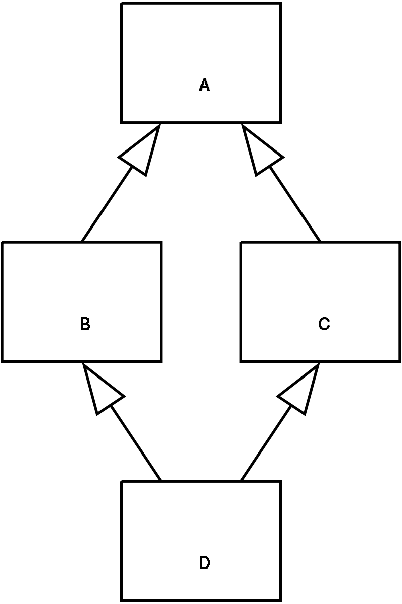
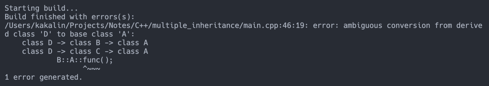

# Multiple Inheritance (多重繼承)

An object or class can inherit characteristics and features from more than one parent object or parent class.



## Virtual base classes

Virtual base classes are used in virtual inheritance, is a way of preventing multiple `"instance"` of a given class appearing in an inheritance hierarchy when using multiple inheritance.

### Explain

Consider the follow scenario:

```c
class A { public: void func() {} };
class B : public A {};
class C : public A {};
class D : public B, public C {};
```

The above class hierarchy results in the `"dreaded diamond"` which looks like below:

```bash
    A
  /   \
 B     C
  \   /
    D
(D has now 2 A, B's A and C's A)
```

Class `A` is inherited twice to class `D`. One is through class `B` and second is through class `C`.


When you want to access any data or function of class A by class D, ambiguity arises as to which data or function should be called? One inherited through and the other inherited through C. This confuses compiler, as below:



### Solution

Virtual inheritance is there to solve this problem. When a base class is specified as a virtual base, it can `acts as an indirect base more than once without duplication of its data members. A single copy of its data members is shared by all the base classes that use virtual base.`

```c
class B : virtual public A {};
class C : virtual public A {};
```

This means that there is only `"one instance"` of A included in the hierarchy.

### Example

```c
#include <iostream>

using namespace std;

class A
{
    public:
        virtual void func()
        {
            cout << "function form A" << endl;
        }
};

class B : virtual public A {};

class C : virtual public A {};

class D : public B, public C
{
    public:
        void func()
        {
            // use the func() of class A
            B::A::func();
        }
};

int main()
{
    D d;
    d.func();

    return 0;
}

```

Output

```
function form A
```
