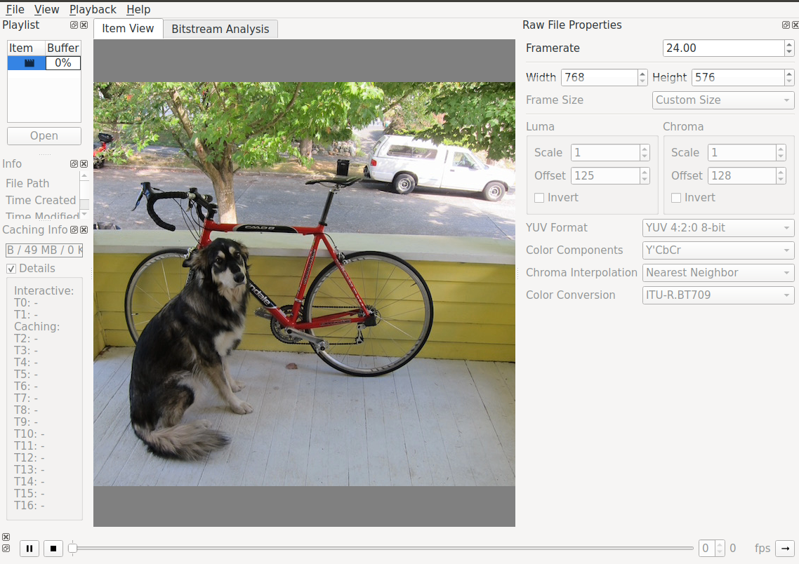

# Using OpenCV convert RGB to YUV and save it

Convert RGB to YUV format and save it.

## Usage

1. Build

```bash
$ chmod +x cmake-build.sh
$ ./cmake-build.sh
```

2. Run

```bash
$ cd build
$ ./rgb_yuv_example
```

and image save in `images` folder

## View YUV format image

I used the [YUView](https://github.com/IENT/YUView) to check the results.
Please go to [YUView](https://github.com/IENT/YUView) to check how to install it.
And when you install done, you can check the result as below:


