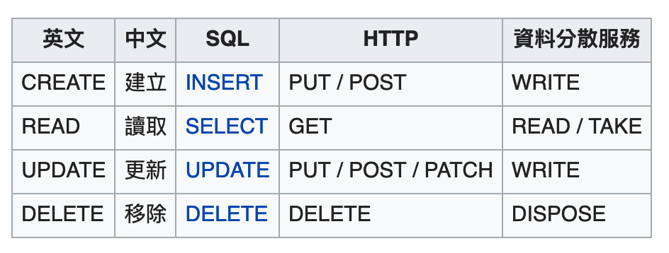

# Database Basics

SQL: Structured Query Language

- [SQL Tutorial](https://www.w3schools.com/sql/default.asp)

## CRUD

- C: Create
- R: Read
- U: Update
- D: Delete

## 資料庫分類

- SQL(關聯式資料庫)
    - MySQL
    - PostgreSQL
    - Microsoft SQL Server
    - Oracle
    - IBM DB2

- NoSQL(Not Only SQL, 非關聯式資料庫)
    - MongoDB
    - Firebase

## SQL與NoSQL差異

|   #   |  資料格式  |
| :---: | :------: | 
| SQL | 表格 |
| NoSQL | JSON |

## SQL Datatype

- [微軟-資料類型 (Transact-SQL)](https://docs.microsoft.com/zh-tw/sql/t-sql/data-types/data-types-transact-sql?view=sql-server-ver15)
