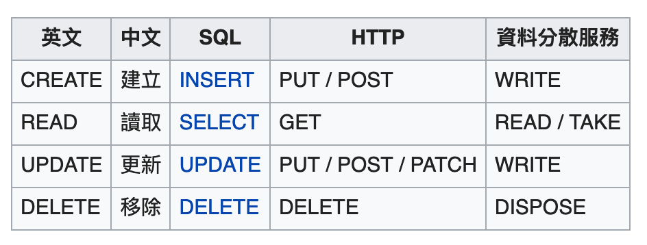
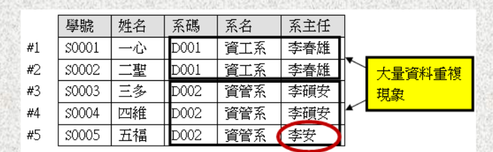
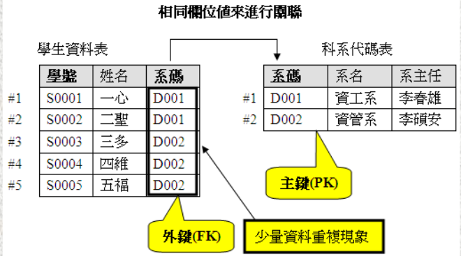

# Database Basics

- [Database Basics](#database-basics)
  - [What is a Database](#what-is-a-database)
    - [The basic functions for manipulating a database: CRUD](#the-basic-functions-for-manipulating-a-database-crud)
  - [Database Management System (DBMS)](#database-management-system-dbms)
  - [資料庫的類型](#%e8%b3%87%e6%96%99%e5%ba%ab%e7%9a%84%e9%a1%9e%e5%9e%8b)
    - [關聯式資料庫](#%e9%97%9c%e8%81%af%e5%bc%8f%e8%b3%87%e6%96%99%e5%ba%ab)
    - [非關聯式資料庫(NoSQL)](#%e9%9d%9e%e9%97%9c%e8%81%af%e5%bc%8f%e8%b3%87%e6%96%99%e5%ba%abnosql)
      - [SQL與NoSQL差異](#sql%e8%88%87nosql%e5%b7%ae%e7%95%b0)
  - [Database Transaction](#database-transaction)
  - [SQL](#sql)
    - [SQL語法](#sql%e8%aa%9e%e6%b3%95)
      - [SQL - 四種語言](#sql---%e5%9b%9b%e7%a8%ae%e8%aa%9e%e8%a8%80)
    - [SQL Datatype](#sql-datatype)
  - [Object Relational Mapping (ORM)](#object-relational-mapping-orm)

## What is a Database

[資料庫(Database)](https://zh.wikipedia.org/wiki/%E6%95%B0%E6%8D%AE%E5%BA%93)就是儲存資料的地方，使用者可以對資料庫中的資料執行新增、讀取、更新、刪除等操作。

正式定義：

    資料庫是一群相關資料的集合題

### The basic functions for manipulating a database: CRUD

- C: Create
- R: Read
- U: Update
- D: Delete



## Database Management System (DBMS)

資料庫是儲存資料的地方，但是如果資料只是儲存到電腦的檔案中，其效用並不大，因此我們需要一套能夠讓我們很方便的管理這些資料庫檔案的軟體，就是所謂的`資料庫管理系統(Database Management System, DBMS)`

```
Database System = Database + DBMS
```

## 資料庫的類型

資料庫管理系統可以依據所支援的`資料庫模型`來作分類

-  階層式(Hierarchical)資料庫

    ```
    是一種由上而下(Top-down)的結構，資料之間是一種樹狀的關係，所以又稱為樹狀結構(Tree)。
    ```

-  網路式(Network)資料庫
    
    ```
    結構和階層式類似，差別是提供多對多(M:N)的關係，就像一張網子一樣，每一個子節點可以有多個父節點相連，可以消除階層式的資料重覆問題。
    ```

-  關聯式(Relational)

    ```
    關聯式資料庫是以2維的矩陣來儲存資料(把資料儲存在表格的欄、列之中)，而儲存在欄、列裡的資料必會有所`關聯`，所以這種儲存資料的方式才會稱為關聯式資料庫，而儲存資料的表格稱為資料表。
    ```

   * 優點：可以從一個資料表中的欄位透過資料表的關聯，而找到另一個資料表中的資料

    

    

    * Image reference: [陳建成老師 - 資料庫系統](http://cc.cust.edu.tw/~ccchen/4_2.html)

而現今主流的資料庫類型為：

1. [關聯式資料庫(Relational Database Management System, RDBMS)](https://zh.wikipedia.org/zh-tw/%E5%85%B3%E7%B3%BB%E6%95%B0%E6%8D%AE%E5%BA%93)
2. [NoSQL(Not Only SQL)資料庫](https://zh.wikipedia.org/wiki/NoSQL)

### 關聯式資料庫

- SQLite
- MySQL
  - MariaDB (MySQL的代替品)
- PostgreSQL
- Microsoft SQL Server
- Oracle DB
- IBM DB2

### 非關聯式資料庫(NoSQL)

- MongoDB
- Redis
- Firebase Realtime Database

#### SQL與NoSQL差異

- SQL: 表格
- NoSQL: JSON

## Database Transaction

資料庫事務，包含一組資料庫操作的邏輯單元工作，在事務中包含的資料庫操作是不可分割的整體，這些操作要麼一起做，要麼一起回滾(Roll Back)到執行前的狀態。

事務的`ACID`特性:

- atomicity(原子性)：`事務不可分割，不可約簡`
    
    ```
    一個事務中的所有操作，或者全部完成，或者全部不完成，不會結束在中間某個環節。事務在執行過程中發生錯誤，會被回滾(Rollback)到事物開始前的狀態，就像這個事務從來沒有執行過一樣。
    ```

- consistency(一致性)

    ```
    在事務開始之前和事務結束以後，資料庫的完整性沒有被破壞。也就是若這次事務成功，整個資料庫都必須是事務結束後的狀態
    ```

- isolation(隔離性)

    ```
    資料庫允許多個並發事務同時對其數據進行讀寫和修改的能力，隔離性可以防止多個事務並發執行時由所交叉執行而導致數據的不一致。
    ```

    事務隔離分為不同等級:

    - Read uncommitted
    - Read committed
    - Repeatable read
    - Serializable

- durability(持續性)

    ```
    事務處理結束後，對數據的修改就是永久的，即使系統故障也不會丟失。
    ```

---

## SQL 

- SQL: 標準化程式語言(Structured Query Language)

    ```
    是一種資料庫查詢和程式設計語言，用於存取資料以及查詢、更新和管理關聯式資料庫系統
    ```

- [SQL Tutorial](https://www.w3schools.com/sql/default.asp)

### SQL語法

SQL主要是以關鍵字(keyword)和表格名稱(table)和欄位名稱(column)當作一段完整的語句。

SQL語法使用分號`;`當作結尾，英文不分大小寫，單字間使用空白間隔。

- 單行註解： `--`
- 多行註解： `/**/`

#### SQL - 四種語言

1. DDL(Data Definition Language)：資料定義語言
    
    能建立或刪除資料庫和表格等用來儲存的單位

    - CREATE
    - ALTER: 修改資料表結構，新增or刪除欄位
    - DROP

2. DML(Data Manipulation Language)：資料操作語言
    
    用於操縱表格裡資料

    - INSERT
    - UPDATE
    - DELETE

3. DQL(Data Query Language)：資料查詢語言

    負責進行資料查詢，不會對資料本身進行修改的語句

    - SELECT

4. DCL(Data Control Language)：資料控制語言

    用來控制資料表格、檢視表之存取權限，提供資料庫的安全性

    - COMMIT: 完成交易作業
    - ROLLBACK: 交易作業異常，將已變動的資料回復到交易開始的狀態
    - GRANT: 賦予使用者權限
    - REVOKE: 取消使用者的權限

### SQL Datatype

- [微軟-資料類型 (Transact-SQL)](https://docs.microsoft.com/zh-tw/sql/t-sql/data-types/data-types-transact-sql?view=sql-server-ver15)

---

## Object Relational Mapping (ORM)

Object Relational Mapping (ORM): 物件關聯對映

    
    將關聯式資料庫映射至物件導向的資料抽象化技術，
    讓程式開發人員可以用操作物件的方式對資料庫進行操作，
    而不是直接使用SQL語法對資料庫進行操作。

- 優點：
  - 通用性：可以不用管底層的資料庫是使用哪種，僅須使用同一套語法攥寫即可，靈活性與擴展性佳。
  - 安全性：可以防止SQL injection (SQL注入) 攻擊
    - 就是駭客在傳輸到網站Server的資料裡直接寫SQL，當我們網站某段SQL直接讀取駭客傳來的資料並執行時，如果傳來的是正常的資料就會沒事，如果傳來的是SQL語句，且包含惡意（如：DELETE）就會讓網站資料被移除。
  - 簡化性：使得我們資料庫結構化，如ORM可以將MySQL轉換成Python工程師可以讀懂的Class，可讀性高。

- 缺點：
  - 效能：自動化進行關聯式資料庫的Mapping一定需要消耗一定的效能。
  - 複雜的查詢上ORM仍然力不從心，如：多表聯查、where條件複雜的查詢時。
