# Array

## What is Array?

    可以想像成櫃子，櫃子上有某些連續的編號

--> 有編號的櫃子

### Memory is (Generally Viewed as) Array

`記憶體就是一個很大的Array`

    address就是index

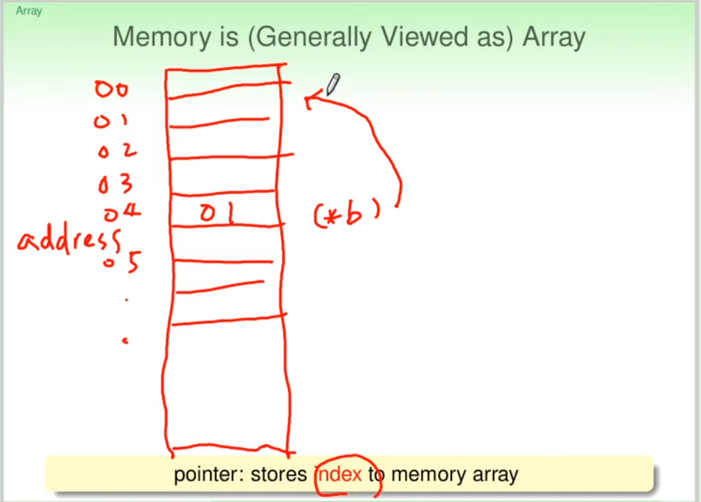

### Array as Memory Block in C/C++

`反過來說Array也是記憶體`

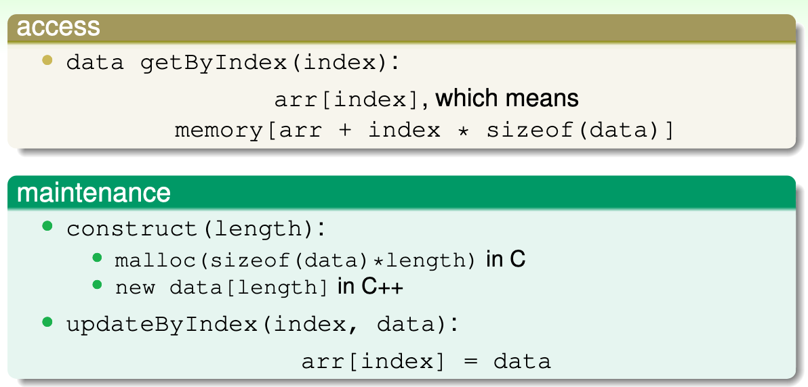

* Note: 一個 Data Structure 看的是如何`取用`與`維護`

## Array as Abstract Data Structure

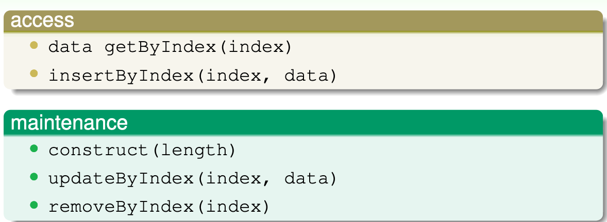

## C++ STL Vector: a Growing Array

完整的array implementation

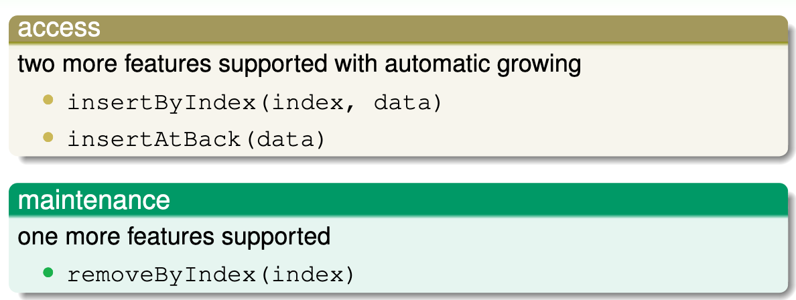

## Two Dimensional Array

最熟悉的 `Two Dimensional Array`: 圖片

### One Block Implementation of 2D Array

把2D展開成1D

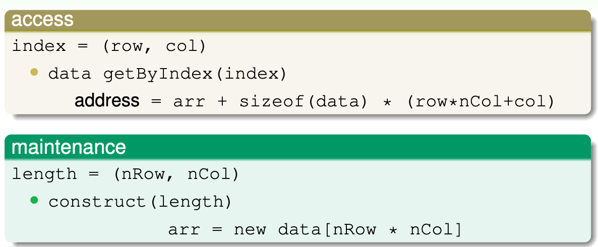

### Array of Array Implementation of 2D Array

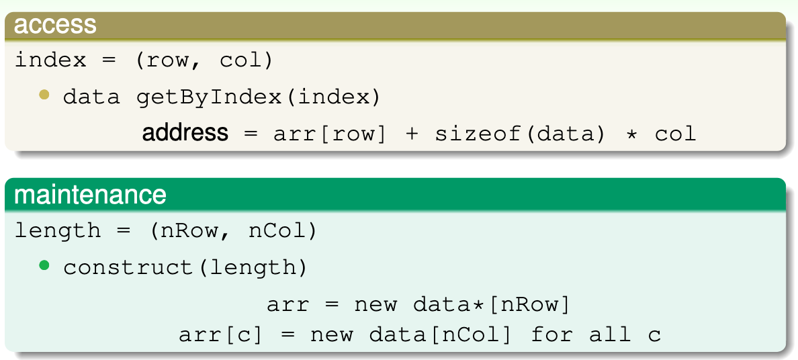

ex: 第一個raw與第二個raw分開放(每個raw有5個element)

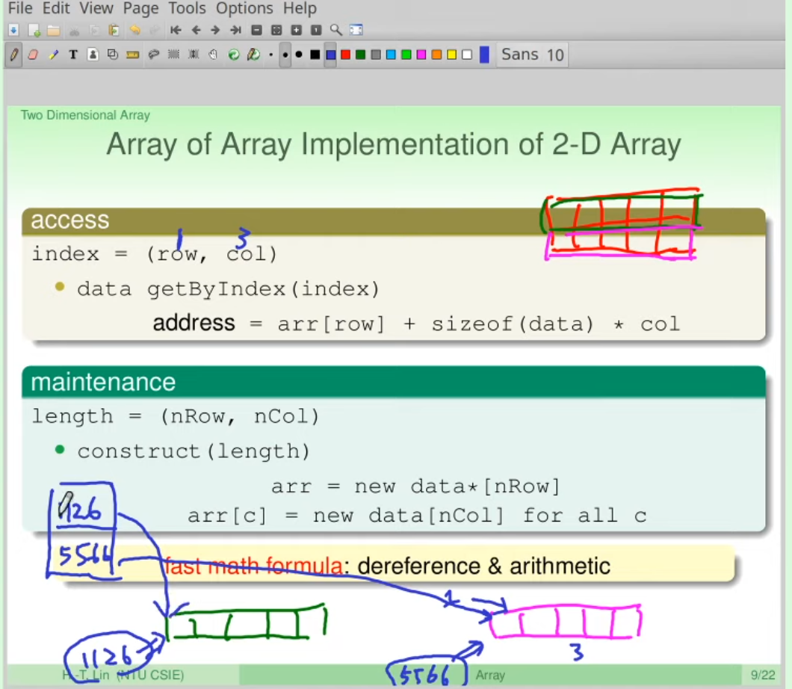

### Comparison of Two Implementations

| # | one block | array of array |
| -- | -- | -- |
| space | elements | elments & nRow pointers |
| construct | fixed | prop. nRow |
| get | one deref | two deref |

* tradeoff:
  - one block: faster & succinct
  - array of array: again easier for programmers

### A Table between Two Programs

以下兩種方式，哪種比較快？

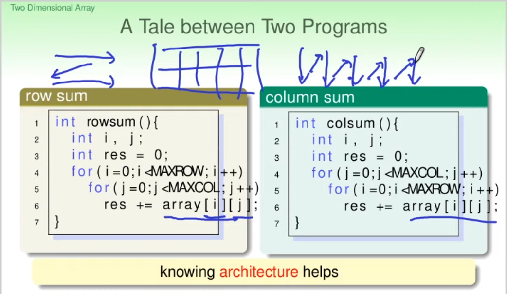

- Ans: `rowsum()`

    因為`快取機制`，rowsum() 是連續的記憶體，比較吃香

## Ordered Array

### Definition of Ordered Array

An array of `consecutive` elements with `ordered` values.

```
arr[0] <= arr[1] <= arr[2] <= ... <= arr[end-1]
```

### `insert` of Ordered Array

不能亂插，`需考慮值得大小`

- example:

    ```
    [2, 6, 7, 13]
             ^
             |
    10 -------

    Resutl: [2, 6, 7, 10, 13]
    ```

- Maintain `Ordered Array`

    以前在維護`Array`時只需要他的`開頭(Head)`的位置(因為其他位置都可以從開頭算出來)，現在如果要維護`Consecutive Array`時需要知道array的`尾巴(Tail)`，這樣才能知道下次要放新東西時該往哪邊繼續放下去(資料的地方到哪)

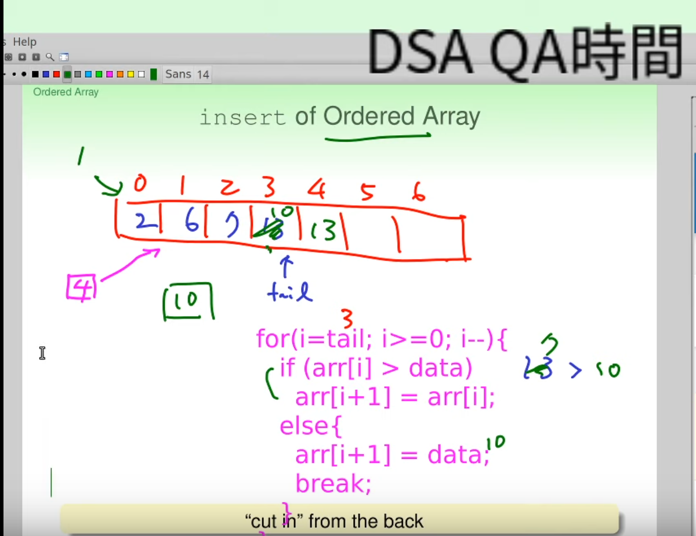

田神: 希望同學有機會想想，修正上面的程式碼～

### `construct` of Ordered Array

Example: 1, 3, 7, 4, 6, 5, 2

#### Method 1: `Selection sort`

其中一種方法是使用 `getMinIndex()`幫我們找出一個Array中最小的，每次叫出最小的，放到new array裡或是與原來的交換，依此類推就可以排出ordered array。
此方法叫做[選擇排序法(selection sort)](https://zh.wikipedia.org/zh-tw/%E9%80%89%E6%8B%A9%E6%8E%92%E5%BA%8F)。

    getMinIndex multiple times (selection sort)

#### Method 2: `Insertion sort`

假設array的`左邊是排好序`的array(一開始就是index 0)， `右邊是還沒排好`的的array(一開始就是index 1~end)，然後從右邊抽一個數字(右邊array的第一個位置)插到左邊，依此類推就可以排出ordered array。

    insert multiple times (insertion sort)

### `update` and `remove` of Ordered Array

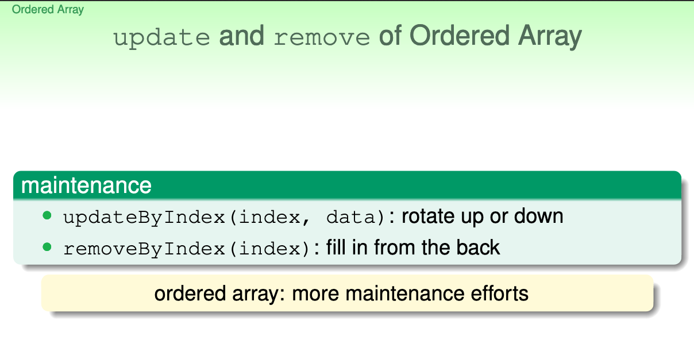

## Binary Search with Ordered Array

### Application: Book Search within (Digital) Library

數位圖書館，每一本書前面有索引(book ID number)，在同一個架子上時書會按照ID大小排序(Ordered Array)

#### Method 1: `Sequential Search Algorithm`

已經知道在某個架子上了，那就從左邊找到右邊

```c
for i from 0 to tail
    if (arr[i].ID == toFind.ID)
        return FIND
end for
eturn NOTFIND
```

此方法並沒有用到`ordered array`的優點，就算架子上的書沒按照順序排也沒差。

#### Method 2: `Sequential Search Algorithm with Cut` (Ordered Array)

Possibly easier to declare not found

```c
toFind.ID = 5566

for i from 0 to tail
    if (arr[i].ID == toFind.ID)
        return FIND
    if (arr[i].ID > toFind.ID)
        return NOTFIND
end for
eturn NOTFIND
```

#### Method 3: `Binary Search Algorithm` (Ordered Array)

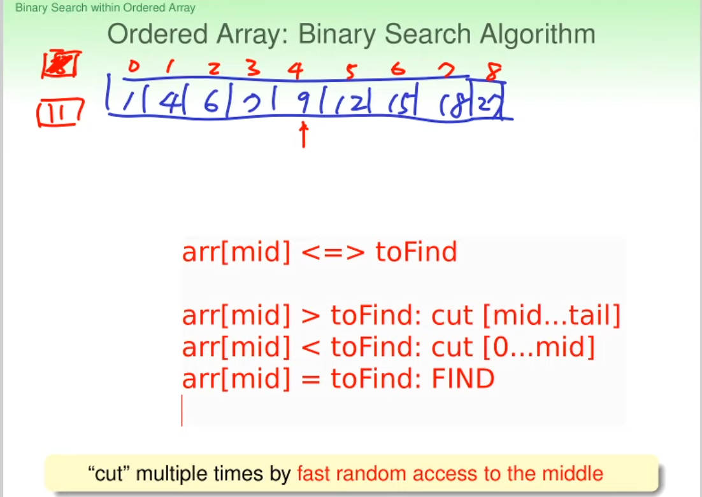

```c
begin = 0
end = tail
while (begin != end) {
    mid = (begin + end) / 2

    if (arr[mid] > toFind)
        end = mid - 1
    else if (arr[mid] < toFind)
        begin = mid + 1
    else if arr[mid] = toFind
        FIND
}
```
