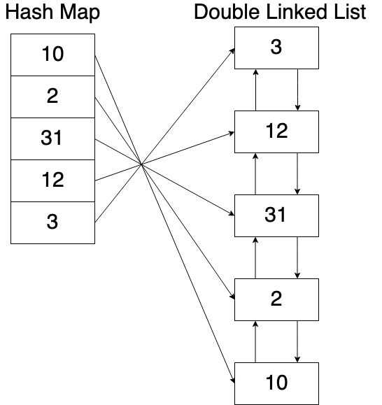
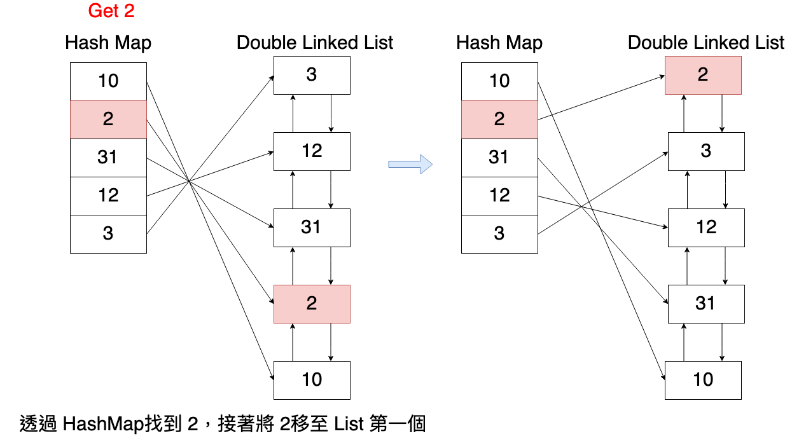
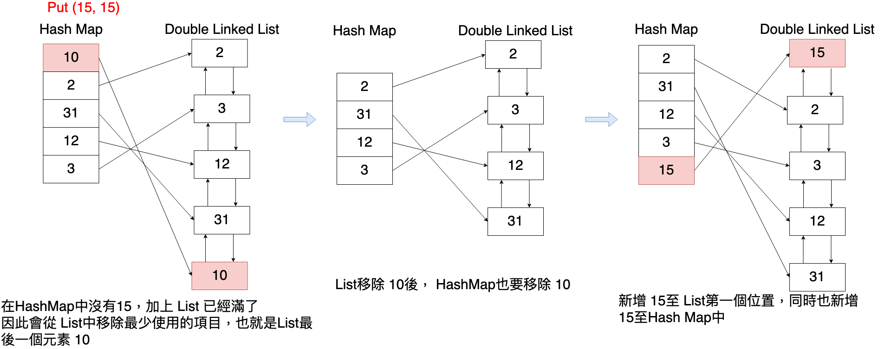

# Least Recently Used Cache (LRU Cache)

概念是會儲存最近用過的項目，如果 Cache 滿了會先丟棄最近最少使用的項目。通常會透過 `Hash Map` 與 `Double Linked List` 來搭配實做。如果欲常被使用，內容會被擺在 List愈前方的位置，如果快取滿了，則會從 List最末端元素開始移除。

## Implementation: Design an LRU Cache

Design and implement a data structure for LRU Cache, which support the following operations:

- `get(key)`

    Get the value of the `key` if the key exists in the cache, otherwise return `-1`.

- `put(key, value)`

    Set or insert the value if the key is not already present. When the cache reached its capacity, it should invalidate the `least recently used` item before inserting a new item.

---

如上所說，因為此演算法會需要一筆一筆查詢所有資料，來決定哪筆資料要被移除，所以`時間複雜度為 O(n)`。

- 降低查詢的時間複雜度: `get(key)`

    我們可以使用 `Hash Table` 來完成，可以在 `O(1)` 的時間內完成。

- 降低維護的時間複雜度: `put(key, value)`

    因為我們需要移除最近最少使用的資料，所以需要更新 cache，將最少被使用的資料放到 list 後面，以方便移除。

    這邊我們可以使用 `Double Linked List`，依照最近使用的順序來排序,可以在 `O(1)` 的時間內完成管理 cache 內資料順序。

    > 但在 linked list 上搜尋 key 需要 O(n) 的時間

所以會透過 `Hash Map` 與 `Double Linked List` 來搭配實做。如下所示:




### Get(key)

> Get the value of the `key` if the key exists in the cache, otherwise return `-1`.

查詢是否存在 key

- 存在的話: 更新該資料在 List 中的位置，包含
      1. 從 List 中移除 key
      2. 並新增 key 到 List 前端

    ```
    所以愈少被查詢的元素會放置在 List愈尾端的地方
    ```

- 不存在的話: 直接回傳 -1

如下所示:

Get(2): 透過 Hash Map 找到 2，並將 2 移至 list 第一個位置。



### Put(key, value)

查詢是否存在 key

- 存在的話:

    1. 更新 hash table 中對應的 value
    2. 更新該資料在 List 中的位置，包含
       1. 從 List 中移除 key
       2. 並新增 key 到 List 前端

- 不存在的話:
    1. 先確認 List 是否滿了，滿了則移除 List 最尾端資料 (最久未被使用得資料)
    2. 新增 hash table 中對應的 value
    3. 更新該資料到 List 的前端

如下所示:

Put(15, 15)，且 List 已滿: 移除 List 最尾端資料 10，並新增 15 置 List 最前端位置。



### Implementation in Python

```python
# Class for a Doubly LinkedList Node
class Node:
    def __init__(self, key: int, value: int):
        self.key = key
        self.value = value
        self.prev = None
        self.next = None


# LRU cache class
class LRUCache:
    def __init__(self, capacity: int):
        self.capacity = capacity
        self.map = {}
        self.head = Node(0, 0)  # dummy
        self.tail = Node(0, 0)  # dummy
        self.head.next = self.tail
        self.tail.prev = self.head
        self.count = 0

    def insertToHead(self, node: Node):
        node.next = self.head.next
        node.next.prev = node
        node.prev = self.head
        self.head.next = node

    def removeNode(self, node: Node):
        node.prev.next = node.next
        node.next.prev = node.prev
        node.prev = None
        node.next = None

    def get(self, key: int) -> int:
        if key in self.map:
            node = self.map[key]
            value = node.value
            self.removeNode(node)
            self.insertToHead(node)
            return value
        else:
            return -1

    def put(self, key: int, value: int) -> None:
        if key in self.map:
            node = self.map[key]
            node.value = value
            self.removeNode(node)
            self.insertToHead(node)
        else:
            # handles if capacity is reached
            if self.count >= self.capacity:
                tail_node = self.tail.prev
                self.removeNode(tail_node)
                del self.map[tail_node.key]
                self.count -= 1

            node = Node(key, value)
            self.map[key] = node
            self.insertToHead(node)
            self.count += 1
```

## Reference

- [Least recently used (LRU), wiki](https://en.wikipedia.org/wiki/Cache_replacement_policies#LRU)
- [資料結構與演算法：LRU 快取機制](https://josephjsf2.github.io/data/structure/and/algorithm/2020/05/09/LRU.html)
- [LeetCode #146 LRU cache – 陪你刷題](https://haogroot.com/2021/01/31/lc-146-lru-cache_leetcode/)
- [Design a data structure for LRU Cache](https://www.geeksforgeeks.org/design-a-data-structure-for-lru-cache/)
