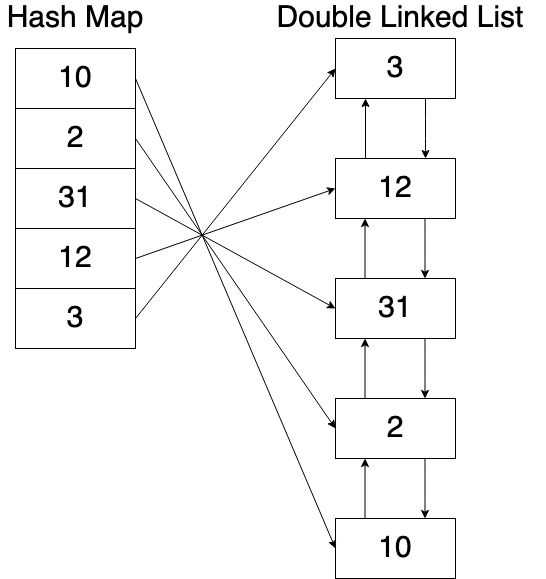

# Least Recently Used Cache (LRU Cache)

概念是會儲存最近用過的項目，如果 Cache 滿了會先丟棄最近最少使用的項目。會透過 `Hash Map` 與 `Double Linked List` 來搭配實做。

如果越常被使用，內容會被擺在 List 愈前方的位置，如果快取滿了，則會從 List最末端元素開始移除。

> This algorithm requires keeping track of what was used when, which is expensive if one wants to make sure the algorithm always discards the least recently used item.

如下所示:

訪問順序為: `A > B > C > D > E > D > F`

上圖就是，對於現在所有已經在記憶體裡面的資源，記錄他們最近一次被用到的時間。當要選擇丟掉誰的時候，選取最近使用時間距離當下最遠的那一個。

## Implementation

如上所說，因為此演算法會需要一筆一筆查詢所有資料，來決定哪筆資料要被移除，所以`時間複雜度為 O(n)`。

- 降低查詢的時間複雜度: `get()`

    我們可以使用 `Hash Table` 來完成，可以在 `O(1)` 的時間內完成。

- 降低維護的時間複雜度: `put()`

    因為我們需要移除最近最少使用的資料，所以需要更新 cache，將最少被使用的資料放到 list 後面，以方便移除。

    這邊我們可以使用 `Double Linked List`，依照最近使用的順序來排序,可以在 O(1) 的時間內完成管理 cache 內資料順序。

    > 但在 linked list 上搜尋 key 需要 O(n) 的時間

所以會透過 `Hash Map` 與 `Double Linked List` 來搭配實做。如下所示:

## Reference

- [Least recently used (LRU), wiki](https://en.wikipedia.org/wiki/Cache_replacement_policies#LRU)
- [資料結構與演算法：LRU 快取機制](https://josephjsf2.github.io/data/structure/and/algorithm/2020/05/09/LRU.html)
- [LeetCode #146 LRU cache – 陪你刷題](https://haogroot.com/2021/01/31/lc-146-lru-cache_leetcode/)
