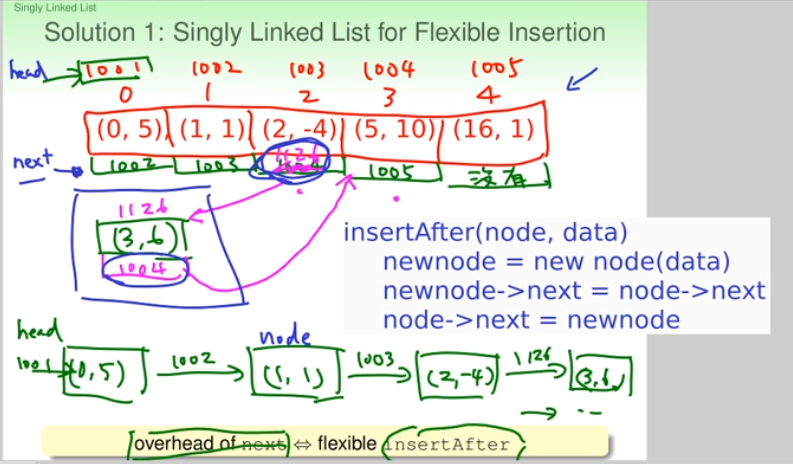
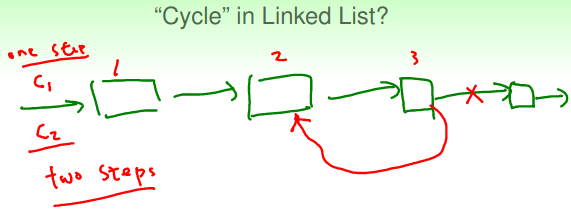

# Linked List

## Singly Linked List



### Singly Linked List as Abstarct Data Structure

#### Access


Compare with array:

- linked list: sequential access
- array: random access

#### Maintenance


##### Dummy Head Node


## Doubly Linked List

在 Singly Linked List 時，當你要移除特定node時會很麻煩，
因為你不知道他的前一個node是誰,所以只能從`Head`開始一直`next`直到找到為止


Soulution: 在每個`node`裡多放一個`prev`的小紙條


這就是所謂的 `Doubly Linked List`

## Iterator for Sequential Access

`開頭(head)`,`結尾(end)`,`下一個(node->next)`

```c
singly linked list;
for (node = head; node != end; node = node->next){
}

reverser doubly linked list;
for (node = tail; node != end; node = node->prev){
}

for (index = 0; index <= tail; index++){
}
```

只要結構差不多，都有這三個，那麼同樣的演算法就可以套用在不同data structure上

### C++ `STL List`: a `Doubly Linked List`


* 因為 List 是 Doubly Linked List，所以不能像`array`或`vector`一樣進行 random access

## Linked List for Sparse Vectors

### Application: Sparse Vector in Scientific Computing


* polynomial: can be viewed as special case of sparse vector

### Merging Sparse Vectors


Q: algorithm for "merging" sparse vectors

* `running cursors` algorithm

    ```c
    while (!c1.end() && !c2.end()) {
      if (c1->order < c2->order) {
        res.insert_back(c1); c1++;
      } else if (c1->order > c2->order) {
        res.insert_back(c2); c2++;
      } else {
        res.insert_back(c1 "+" c2);
        c1++; c2++;
      }
    }
    insert_back others;
    ````

## Linked List in Job interview

1. Linked List Reversal


2. Cycle in Linked List
    - `tortoise-hare (turtle-rabbit) algorithm`

       two pointers, one moving twice as fast (the hare) than the other (the tortoise).

        

3. Middle of Linked List
    - two pass algorithm (O(N+N/2))
    - tortoise-hare algorithm
