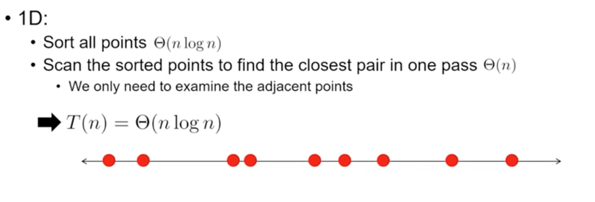
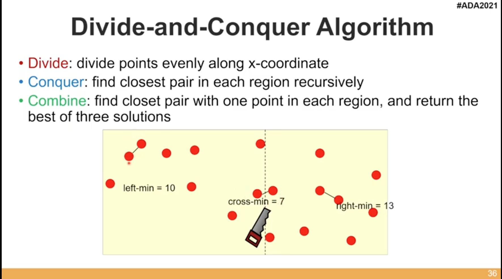
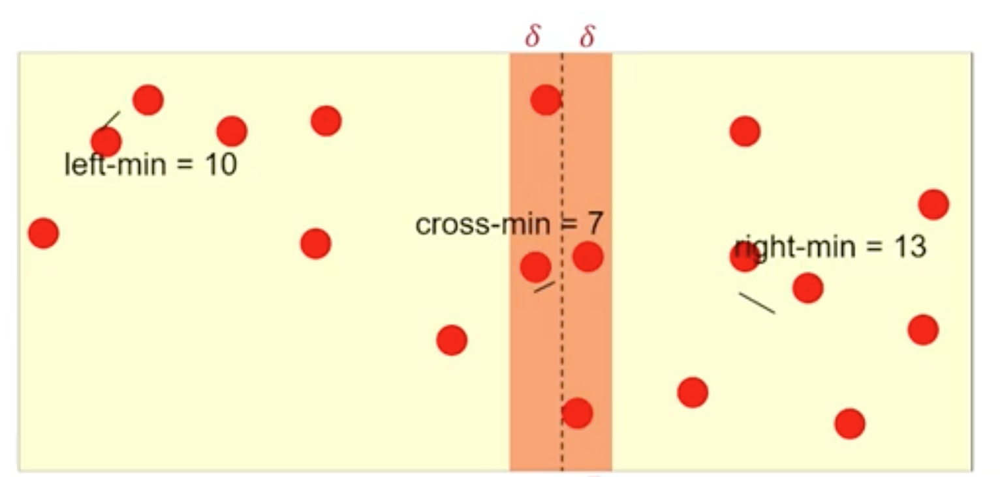
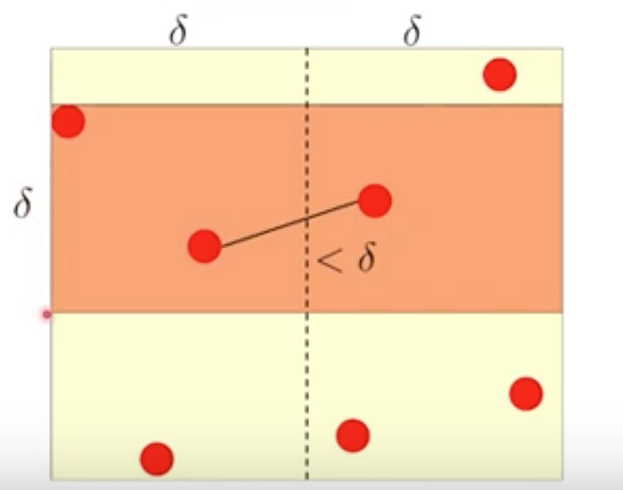
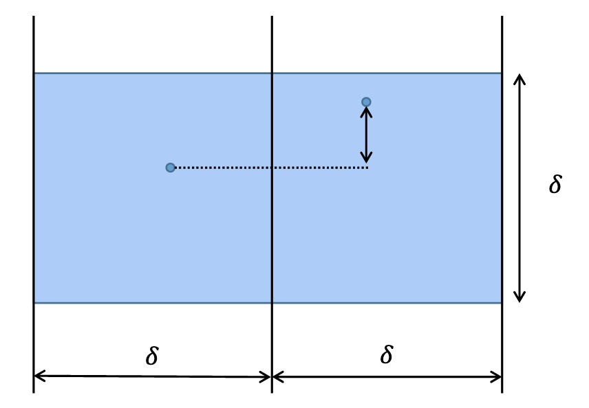
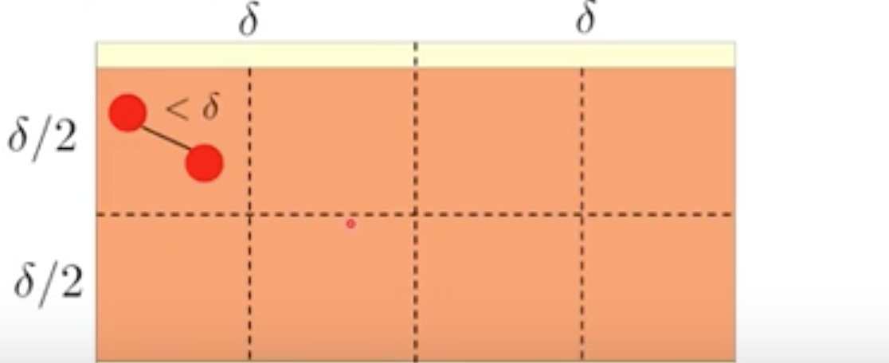
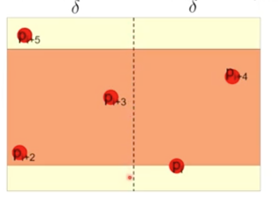
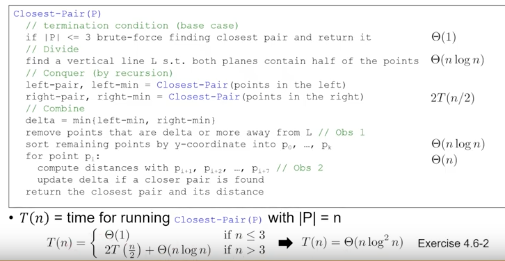
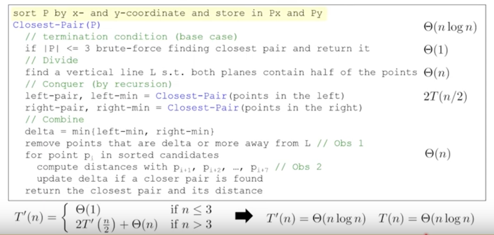

# Closest Pair of Points

問題:

- Input: n >= 2 points, where pi = (xi, yi) for 0 <= i < n
- Output: Two points pi and pj that are closest
    - `Closest`: smallest `Euclidean distance`

        $d = \sqrt{(x_i - y_i)^2 + (x_j - y_j)^2}$


## Solution 1. Brute-Force

```
算出每個點之間的距離
```

- Time Complexity: $O(n^2)$


## Solution 2. Divide and Conquer

Time Complexity: $O(nlogn)$

### 解法思路: 如果是一維的情況

1. Sort all the points $\theta(nlogn)$
2. 計算每個相鄰點的距離，並找到最小 $\theta(n)$

如下圖所示:



### 思路延伸: 2維情況

從中間切一半，左半邊與右半邊會分別去算並回傳最近的pair，最後在比較左右半邊回傳的距離看誰比較小，但也有可能出現在中間，如下圖所示:



- Combine:
    Closest Pair 有三種可能: `Left, right or cross two region`

#### Cross Two Regions

如何找出中間區域的 Closest Pair 呢？

- method 1: check all pairs that cross two regions

   -> n/2 * n/2 combinations

- method 2: `only consider pairs within δ x 2δ blocks`

    where `δ = min(left_min, right_min)`

    構成 closest pair 的兩點一定在 δ x 2δ 的長方形內，如下圖:

    
    
    

##### 重要: `δ x 2δ 的長方形內最多只能有 8 個點`

因為 δ 左半邊的最近點對與右半邊的最近點對中比較小的那一個，
所以說在左半邊的region裡面，是不可能出現他都在左半邊的region
然後他們距離小於 δ 的。

- 左半邊block中，所有的點對都必定大於 δ。左半邊最多只能存在 4 個點
- 右半邊同理也最多只能存在 4 個點。

=> `δ x 2δ 的長方形內最多只能有 8 個點`

如下圖所示:



```
因為點和點之間的距離不可以小於δ，
否則就矛盾了
```

#### Find closest pair at cross regions

1. Sort the points by y-values at every δ x 2δ block.

    ```
    對 y 進行 sorting 是因為
    因為我們是沿著 y 方向移動 δ x 2δ 區塊
    每次只需要看這個區塊內的點
    ```

2. For the sorted point pi, compute the distance with pi+1 ~ pi+7

    ```
    將其照Y大小排序後,
    只需要檢查它和它後面七個點的距離即可。
    ```
3. Return the smallest one.

```
At least 7 distance calculations need (every block)
```




### D&C Algorithm

- Base case:

    ```
    n <= 3, 直接暴力法求解
    -> 最多算 3 次
    ````

- Divide: find the vertical line `L`,
    both planes contain half of the points.

    ```
    sorting by x-values
    ```

- Conquer: recursion left and right part (Recursive case)
- Combine:
    1. delta = min(left_min, right_min)
    2. remove points that are delta or more away from `L`
    3. sorting remaining points by y-coordinate
    4. for every pi: compute distance with other 7 points, and update delta if a closer pair is found.

=> Time Complexity: $O(nlog^2n)$



#### 優化演算法: Preprocessing

Idea: 將 sorting 搬出 recursive part，在外面先做好 sorting，如下:

- Preprocessing: Sort P by x-axel and y-axel and stored in Px and Py

- Base case:
    ```
    n <= 3, 直接暴力法求解
    ````
- Divide: find the vertical line `L`,
    both planes contain half of the points.

    ```
    直接用 sorting 好的
    ```

- Conquer: recursion left and right part (Recursive case)
- Combine:
    1. delta = min(left_min, right_min)
    2. remove points that are delta or more away from `L`
    3. for piont pi in sorted candidates : compute distance with other 7 points, and update delta if a closer pair is found.



=> Time Complexity: $O(nlogn)$

## Reference

1. [台大資訊 演算法 | ADA 4.3: Closest Pair of Points (21/10/14)](https://www.youtube.com/watch?v=7hhj2owbdVQ)
2. [Divide and Conquer 3, Michael Tsai](https://www.csie.ntu.edu.tw/~hsinmu/courses/_media/dsa2_11spring/dc3.pdf)
