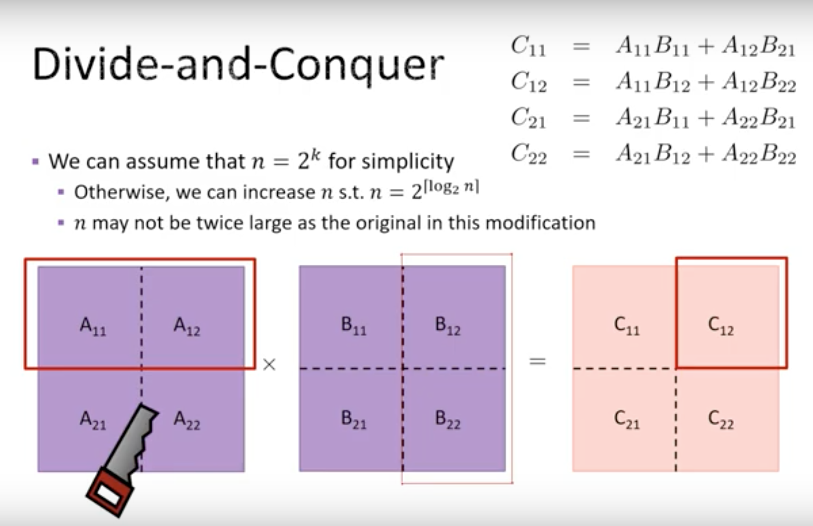
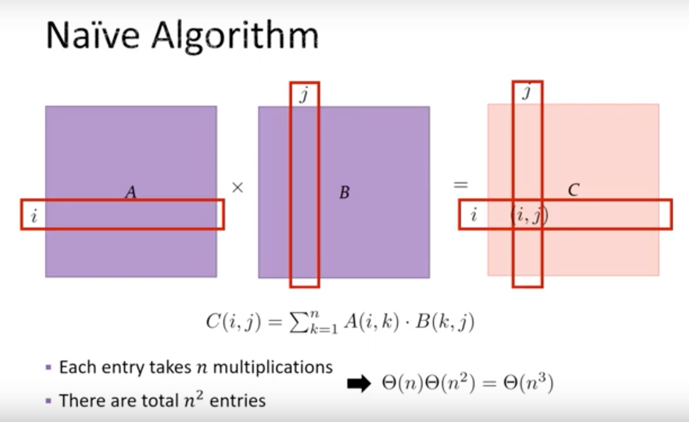
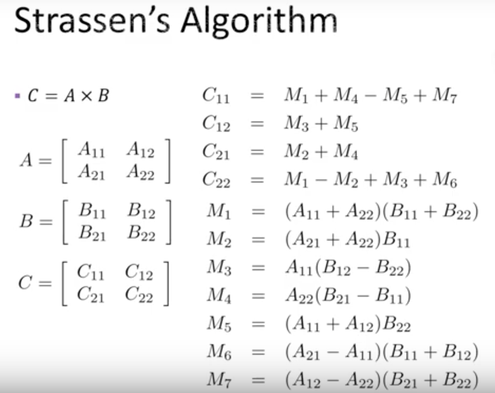

# Matrix Multiply



## Solution 1. Naive Algorithm

Time Complexity: $O(n^3)$



## Solution 2. Divide and Conquer

Time Complexity: $O(n^3)$

- Base case:

    ```
    n = 1, return A*B
    ````

- Recursive case:

    ```python
    # Divide A and B into n/2 by n/2 submatrices
    C11 = matrix_multiply(n/2, A11, B11) + matrix_multiply(n/2, A12, B21)
    C12 = matrix_multiply(n/2, A11, B12) + matrix_multiply(n/2, A12, B22)
    C21 = matrix_multiply(n/2, A21, B11) + matrix_multiply(n/2, A22, B21)
    C22 = matrix_multiply(n/2, A21, B12) + matrix_multiply(n/2, A22, B22)
    ```

## Solution 3. Strassen's Algorithm

Time Complexity:

$O(n^{\log_2 {7}})$ ~ $O(n^{2.807})$


