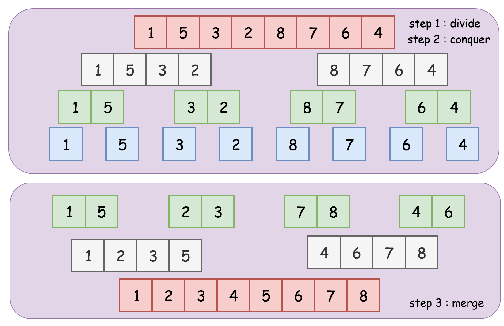

# 合併排序法 (Merge Sort)

> [Merge sort](https://en.wikipedia.org/wiki/Merge_sort) is a classical `divide-and-conquer` algorithm for sorting.

合併排序法 (Merge sort）是建立在合併操作上的一種高效的排序演算法。該演算法是採用`分治法 (Divide and Conquer)` 的一個非常典型的應用。其步驟如下:


1. `Divide`:  Divide the given unsorted list into several sublists

   將含有 n 個元素的序列分割成含有 n // 2 個子序列。

2. `Conquer`: Sort each of the sublists recursively

   排序分割後的兩個子序列。

3. `Combine`: Merge the sorted sublists to produce new sorted list

   合併排序完成的兩子序列，成為一個排好序的序列。

如下所示:

<p>
    
    <br>
    <center><em>Fig.1  Top-down Merge Sort</em></center>
</p>

## Performance

- `時間複雜度 (Time Complexity)`

    | # | Performance  |
    | :- | :-: |
    | Worst case | $O(nlogn)$ |
    | Average case| $O(nlogn)$ |
    | Best case | $O(nlogn)$ |

- `空間複雜度 (Space Complexity)`: $O(n)$
- `穩定性 (stability)`: stable

## Implementation

There are two apporaches to implement the merge sort algorithm: [top-down](#topdown) or [bottom-up](#bottomup).

The merge sort algorithm can be divided into three steps, like all `divide-and-conquer` algorithms.

    1. Divide the given unsorted list into several sublists. (Divide)
    2. Sort each of the sublists recursively. (Conquer)
    3. Merge the sorted sublists to produce new sorted list. (Combine)

<span id="topdown">

### Method 1. Top-down Approach (Recursion):

    1. We divide the list into two sublists. (Divide)
    2. We recursively sort the sublists in the previous step. (Conquer)
    3. Finally, we merge the sorted sublists in the above step repeatedly to obtain the final list of sorted elements. (Combine)

<p>
    
    <br>
    <center><em>Fig.1  Top-down Merge Sort</em></center>
</p>

We demonstrate an example of the merge process as following:


Other gifs of merge sort:


#### Python

```python
def merge_sort(nums):
    # bottom case: empty or list of  a single element.
    if len(nums) <= 1:
        return nums

    mid = len(nums) // 2
    left = merge_sort(nums[:mid])
    right = merge_sort(nums[mid:])

    return merge(left, right)


def merge(left, right):
    result = []
    while left and right:
        if left[0] <= right[0]:
            result.append(left.pop(0))
        else:
            result.append(right.pop(0))

    if left:
        result += left
    if right:
        result += right

    return result
```

<span id="bottomup">

## 2. Bottom-up Approach (Iteratively)

In the `bottom-up` approach

    1. We divide the list into the sublists of a single element. (Divide)
    2. Each of the sublists is then sorted already. (Conquer)
    3. Finally, we merge the sublist two at a time until a single list remains. (Combine)

<p>
    
    <br>
    <center><em>Fig.2  Bottom-up Merge Sort</em></center>
</p>

#### Python

```python
def merge_sort(nums):
    length = len(nums)
    size = 1
    result = nums

    while size < length:
        for index in range(0, length, size * 2):
            left = result[index : index + size]
            right = result[index + size : index + size * 2]
            result[index : index + size * 2] = merge(left, right)

        size *= 2

    return result


def merge(left, right):
    result = []
    while left and right:
        if left[0] <= right[0]:
            result.append(left.pop(0))
        else:
            result.append(right.pop(0))

    if left:
        result += left
    if right:
        result += right

    return result
```

## Reference

- [DSA 20200609: Sorting / Summary](https://www.youtube.com/watch?v=cxbabnqtWsk&feature=youtu.be)
- [ADA, NTU CSIE](https://www.youtube.com/watch?v=ke1mILIEs3A)
- [wiki: Merge Sort](https://en.wikipedia.org/wiki/Merge_sort)
- [LeetCode learn - Recursion II, Divide and Conquer](https://leetcode.com/explore/learn/card/recursion-ii/470/divide-and-conquer/2868/)
- [初學者學演算法｜排序法進階：合併排序法](https://medium.com/appworks-school/初學者學演算法-排序法進階-合併排序法-6252651c6f7e)
- [[演算法] 合併排序法(Merge Sort)](http://notepad.yehyeh.net/Content/Algorithm/Sort/Merge/Merge.php)
- [Rust Algorithm Club: 合併排序 Mergesort](https://rust-algo.club/sorting/mergesort/index.html)
- [【Day25】[演算法]-合併排序法Merge Sort](https://ithelp.ithome.com.tw/articles/10278179)
