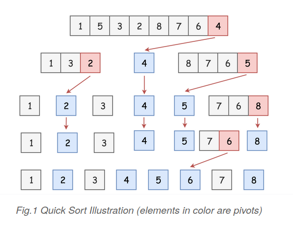
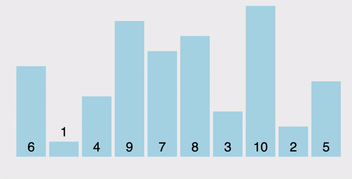
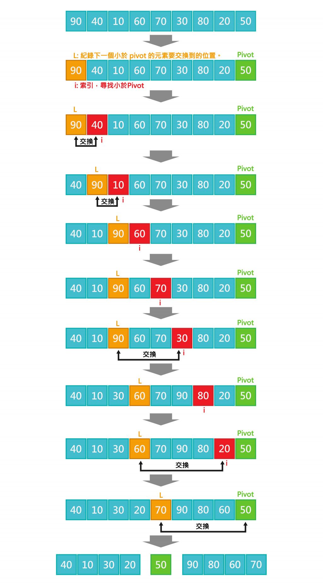

# 快速排序法 (Quick Sort)

> [Quick sort](https://en.wikipedia.org/wiki/Quicksort) is another classical `divide-and-conquer` algorithm for sorting.

快速排序法 (Quick Sort) 是`分治法 (Divide and Conquer)` 的一個非常典型的應用。其不斷遞迴下列三個步驟，如下:

1. 選擇 `基數 (Pivot)`:

    在序列中任意選擇一個元素，稱為 Pivot。

2. `分割序列 (Partition)`:

    將序列重新排序，分為兩部分:
    - 將比 pivot 小的數放到它的左邊，形成左子序列
    - 將比 pivot 大的數放到它的右邊，形成右子序列

3. 遞迴:

    分別將「比 pivot 小」及「比 pivot 大」兩部分重複上述步驟，直到新序列的長度小於等於 1，無法繼續分割為止，此時排序完成。

如下所示:

<p>
    
</p>



## Performance

- `時間複雜度 (Time Complexity)`

    | # | Performance  |
    | :- | :-: |
    | Worst case | $O(n^2)$ |
    | Average case| $O(nlogn)$ |
    | Best case | $O(nlogn)$ |

- `空間複雜度 (Space Complexity)`: $O(logn)$ ~ $O(n)$

    ```
    快速排序法的空間複雜度依實作方式而不同
    ```

- `穩定性 (stability)`: unstable

## Implementation

Quicksort 僅有「選擇 Pivot」與「分割序列」兩步驟，不同的實作的效能各異，也影響 Quicksort 的時間複雜度。

Quicksort 有許多不同的`分割序列實作方案（partition scheme`，其中以 `Lomuto partition` 最易理解，如下介紹。

### Lomuto partition scheme

原理為，當索引的資料小於 Pivot 時，索引的資料與指標位置資料交換。步驟如下:

1. 以序列最後一個元素當做 pivot
2. 使用兩個指標 i、j，其中 `i` 為紀錄小於 Pivot 的資料位置，`j` 表從頭疊代整個序列的索引。
    - 如果第 j 個元素小於 pivot，則與第 i 個元素置換。
    - 第 i 個元素已落在小於 pivot 的範圍，將 i 指標往後移一個，處理下個元素。

3. 疊代完成後，小於 pivot 的元素全都置換至序列前端，此時將 pivot 與第 i 個元素置換，pivot 會剛好在最終正確位置上。
4. 重覆步驟 1~3，直到剩下1筆分割交換完成，不須合併。

如下所示:



#### Python

```python
def partition(nums, lo, hi):
    """ Lomuto Partition Scheme

    Picks the last element hi as a pivot
    and returns the index of pivot value in the sorted array.
    """

    # Choose the last element as the pivot
    pivot = nums[hi]

    # 遍歷陣列，將小於等於 pivot 的元素和 i 位置的元素交換
    i = lo
    for j in range(lo, hi):
        if nums[j] < pivot:
            nums[i], nums[j] = nums[j], nums[i]
            i += 1

    # 將 pivot 和與第 i 個元素交換: 就切成兩半邊
    nums[i], nums[hi] = nums[hi], nums[i]
    return i
```

基於這個 partition 的 quick sort 實作如下：

```python
def quick_sort(nums, lo, hi):
    if lo < hi:
        p = partition(nums, lo, hi)
        qsort(nums, lo, p - 1)
        qsort(nums, p + 1, hi)
    return nums

quick_sort(nums, 0, len(nums) - 1)
```

### 選擇 Pivot 的方法

選擇 pivot 的方法大致上有以下幾種:

1. `Naive`:

    Choose the first element in the list as the pivot

2. `Random`:

    Randomly pick an element from the list as the pivot

3. `三數中位數 (Median-of-three)`:

    第一、中間、最後筆資料，排序之後取中間的值。例如:

    ```
    1,5,9,6,3，取出1,9,3，排序後1,3,9，取3為基準點。
    ```

#### Using random pivot

```python
def partition(nums, lo, hi):
    # Choose random pivot
    index = random.randint(0, len(nums) - 1)
    nums[index], nums[hi] = nums[hi], nums[index]
    pivot = nums[hi]

    # 遍歷陣列，將小於等於 pivot 的元素和 i 位置的元素交換
    i = lo
    for j in range(lo, hi):
        if nums[j] < pivot:
            nums[i], nums[j] = nums[j], nums[i]
            i += 1

    # 將 pivot 和與第 i 個元素交換: 就切成兩半邊
    nums[i], nums[hi] = nums[hi], nums[i]
    return i
```

## Reference

- [DSA 20200609: Sorting / Summary](https://www.youtube.com/watch?v=cxbabnqtWsk&feature=youtu.be)
- [wiki: 快速排序](https://zh.wikipedia.org/wiki/快速排序)
- [[演算法] 快速排序法(Quick Sort)](http://notepad.yehyeh.net/Content/Algorithm/Sort/Quick/Quick.php)
- [Rust Algorithm Club: 快速排序 Quicksort](https://rust-algo.club/sorting/quicksort/index.html)
- [【Day26】[演算法]-快速排序法Quick Sort ](https://ithelp.ithome.com.tw/articles/10278644)
- [Comparison Sort: Quick Sort(快速排序法))](https://alrightchiu.github.io/SecondRound/comparison-sort-quick-sortkuai-su-pai-xu-fa.html)
- [快速排序（二）](https://openhome.cc/zh-tw/algorithm/sort/quick2/)
- [[教學] Quick Sort 演算法原理與實作](https://shubo.io/quick-sort/)
