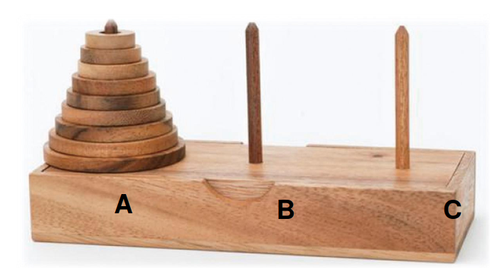

# Tower of Hanoi (河內塔)

- Problem: move n disks from A to C
- Rules:
    - Move one disk at a time.
    - Cannot place a large dosk onto a smaller disk.

## Solution (解題思路)

### 1. Hanoi(1)

=> `Base case`

.png)

### 2. Hanoi(2)

.png)

### 3. Hanoi(n)

=> `Recursive case`

.png)

## Further QUestion

- Double-color Hanoi problem
  - input: 2 interleaved-color towers
  - output: 2 same-color towers

## Reference

1. [ADA, NTU CSIE](https://www.csie.ntu.edu.tw/~yvchen/f108-ada/doc/190919_Divide-and-Conquer-1.pdf)
