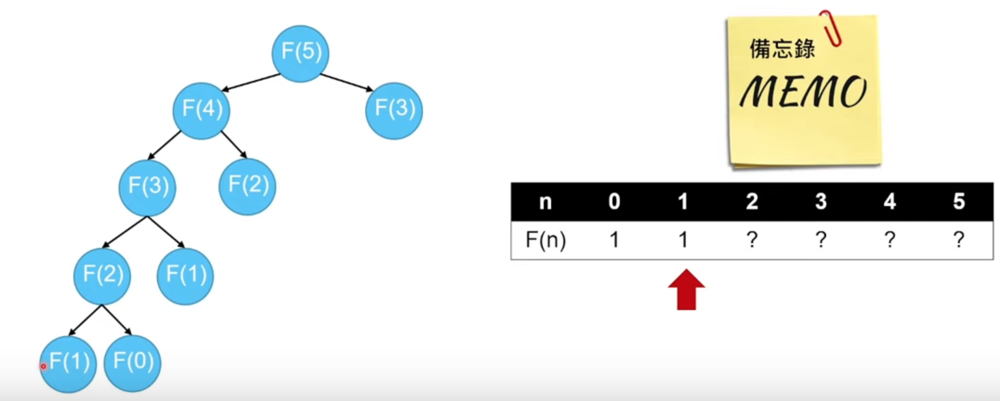
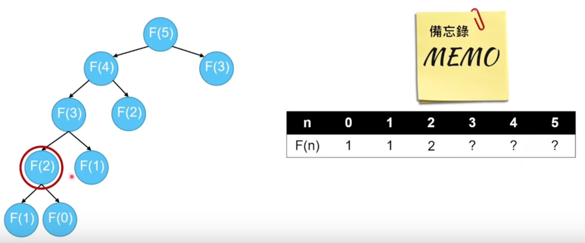
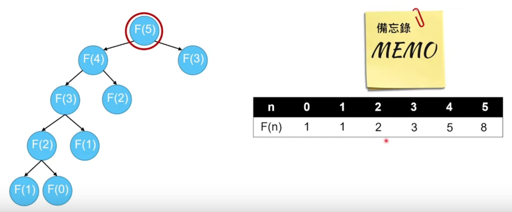
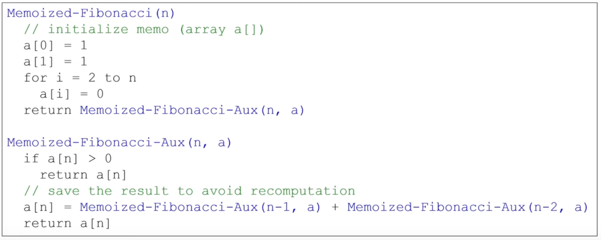
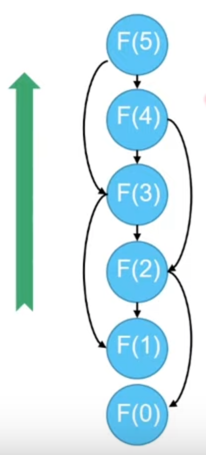
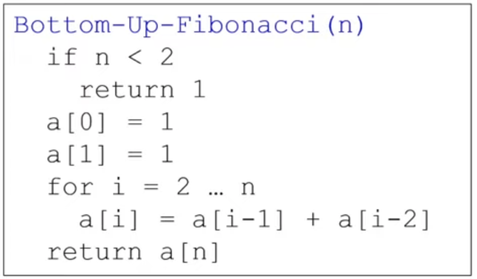
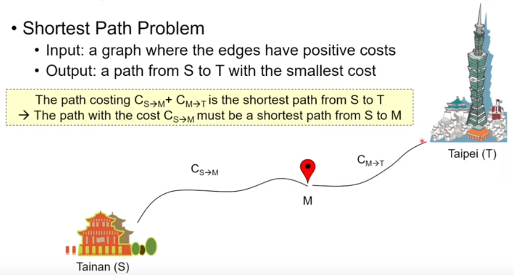

# Dynamic Programming (DP)

DP is a technique in computer programming that helps to efficiently solve a class of problems that have `overlapping subproblems` and `optimal substructure property`.

## What is Dynamic Programming

Dynamic Programming like the [divide-and-conquer](https://github.com/kaka-lin/Notes/tree/master/DSA/Divide%20and%20Conquer) method, solves problems by `combining the solutions to subproblems`

- 用空間換取時間
- 讓走過得留下痕跡

##### Dynamic: time-varying
##### Programming: a tabular method

## Divide and Conquer (DC) v.s. Dynamic Programming (DP)

| # | Divide and Conquer | Dynamic Programming |
| - | - | - |
| subproblem | independent<br>disjoint | dependent<br>overlapping |
| computation | repeatedly solving<br>the common subproblems | aviod recomputation |

- Divide and Conquer
  - partition the problem into `independent` or `disjoint` subproblems
  - repeatedly solving the common subproblems

    ```
    more work than necessary
    ```

- Dynamic Programming
  - partition the problem into `dependent` or `overlapping` subproblems
  - avoid recomputation
    - `Top-down` with memoization
    - `Bottom-up` method (更常用一點)

## Dynamic Programming Procedure

Apply four steps

1. Characterize the structure of an *optimal solution*
2. `Recursively` define the value of an *optimal solution*
3. Compute the value of an *optimal solution*, typically in a `bottom-up` fasion
4. Construct an *optimal solution* from computed information

### Top-Down with Memoization

Solve the overlapping subproblems recursively with memoization

- Check the memo before making the calls







Code:



### Bottom-Up Method

Building up solutions to larger and larger subproblems



Code:




## Optimization Problem

Dynamic Programming 最主要就是被用在 Optimization 的問題上

- Principle of Optimality
  - Any subpolicy of an optimum policy must itself be an optimum policy with regard to the initial and terminal states of the subpolicy

    ```
    一個 optimal 的 solution ，
    他的一部份也要是 subproblem 的 optimal solution 才可以
    這樣它才符合這個 Principle of Optimality
    ```

    ##### Note: Principle of Optimality 成立才能使用 DP

- Two key properties of DP for optimization
  - `Overlapping subproblems`
  - `Optimal substructure`:

    an optimal solution can be constructed from optimal solutions to subproblems

    - Reduce search space (ignore non-optimal solutions)


```
if the optimal substructure (principle of optimality) does not hold,
the it is incorrect to use DP
```

### Optimal Substructure Example


