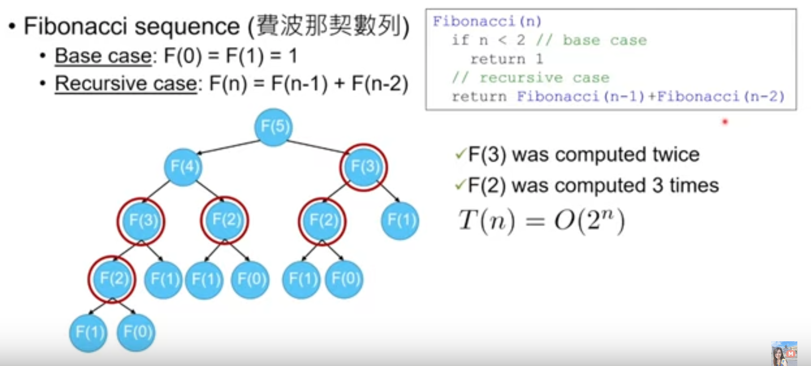

# Fibonacci Sequence

[費波那契數列定義](https://en.wikipedia.org/wiki/Fibonacci_number):

- `Base case`: F(0) = F(1) = 1
- `Recursive case`: F(n) = F(n-1) + F(n-2)

## Rethink Fibonaci Sequence (Recursive)



## DP: Bottom-Up Method

```python
def fibonacci(n):
    table = {0: 1, 1: 1}
    for i in range(2, n+1):
        table[i] = table[i-1] +  table[i-2]
    return table[n]
```

## DP: Top-Down with Memoization

```python
def fibonacci(n):
    table = {0: 1, 1: 1}
    for i in range(2, n+1):
        table[i] = 0
    return recur_fib(n, table)


def recur_fib(n, table):
    if table[n] > 0:
        return table[n]

    # save the result to aviod recomputation
    table[n] = recur_fib(n-1, table) + recur_fib(n-2, table)
    return table[n]
```
