# Matrix Chain Multiplication

- Input: a sequence of n matries $(A_1, ..., A_n)$

- Output: the product of $A_1A_2 ... A_n$

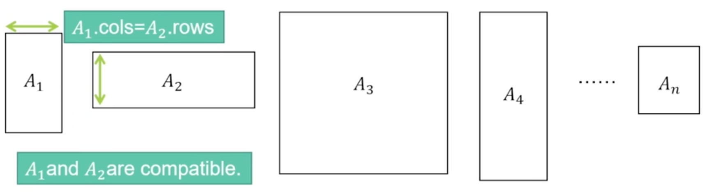

根據 `Associative (結合律)` 可以將問題重新定義為: [Matrix Chain Multiplication Problem](#matrix-chain-multiplication-problem)

> 相關說明可參考: [Observation](#observation)

## Observation

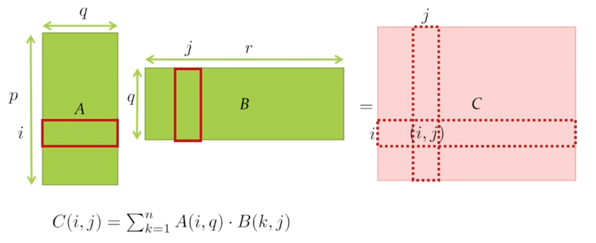

- Each entry takes $q$ multiplications
- There are total $pr$ entries

Time-Complexity: $\Theta(q)\Theta(pr) = \Theta(pqr)$

### Associative (結合律)

矩陣相乘是有結合律的，如: `A(BC) = (AB)C`

> 在一個包含有二個以上的可結合運算子的表示式，只要運算數的位置沒有改變，其運算的順序就不會對運算出來的值有影響

#### 思考: 能不能找到有效率的乘的方式，減少花的時間

Example:

```
矩陣相乘為: (nx1) (1xn) (nxn)
```

如果按照左至右順序相乘，如下圖:


- Overall time is $\theta(n^2) + \theta(n^3) = \theta(n^3)$

但如果我們先將右邊相乘再乘左邊，如下圖:

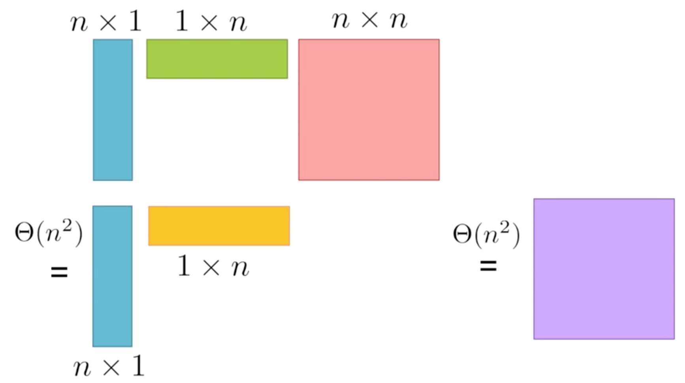

- Overall time is $\theta(n^2) + \theta(n^2) = \theta(n^2)$

##### > 可以找到一個好的相乘順序，來有效的降低我們的時間複雜度。

## Matrix Chain Multiplication Problem

所以我們可以將問題改寫成:

- Input: a sequence of integers $l_0,l_1,...,l_n$
  - $l_{i-1}$ is the number of rows of matrix $A_i$
  - $l_i$ is the number of columns of matrix $A_i$

- Output: an `order` of performing `n-1` matrix multiplication in the minimum number of operations to obtain the product of $A_1A_2...A_n$


## Brute-Force Algorithm

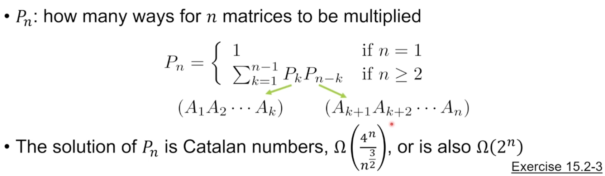

## Dynamic Programming

### Step 1. Characterize an OPT Solution

- Subproblems
  - `M(i, j)`: the min #operations for obtain the product of `Ai ... Aj`
  - Goal: M(1, n)
- Optimal substructure: suppose we know the OPT to `M(i, j)`, there k cases:

    

    - Case k: there is cut right after $A_k$ in OPT

        ```
        左右花的運算量是 M(i, k), M(k+1, j) 的最佳解
        ```

### Step 2: Recursively Define the Value of an OPT Solution

- Suppose we know the OPT to `M(i, j)`, there k cases:
  - Case k: there is cut right after $A_k$ in OPT

    $$M_{i,j} = M_{i,k} + M_{k+1,j} + l_{i-1}l_jl_k$$

    where:

    - $M_{i,k}$: 左半邊的 optimal solution 所花的相乘時間
    - $M_{k+1,j}$: 右半邊的 optimal solution 所花的相乘時間
    - $l_{i-1}l_jl_k$: 左右半邊乘起來所花的時間。$A_{i...k}A_{k+1...j}$

        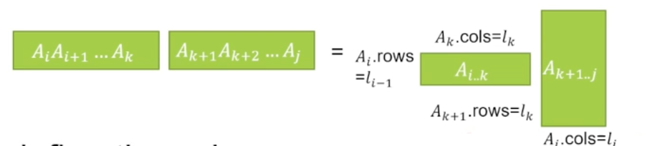

- Recursively define the value:

    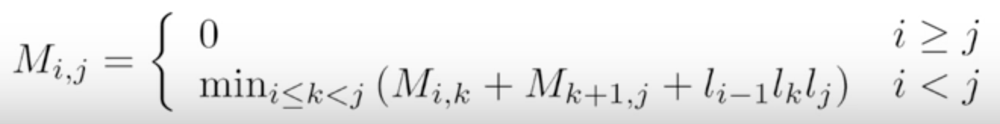

### Step3: Compute Value of an OPT Solution

#### Bottom-Up method

How many subproblems to solve:

- $combination of the values i and j s.t. $1\leq i\leq j\leq n$

    $$T(n) = C_{2}^n + n = \Theta(n^2)$$

    - $C_{2}^n$: $i\neq j$
    - $n$: $i = j$

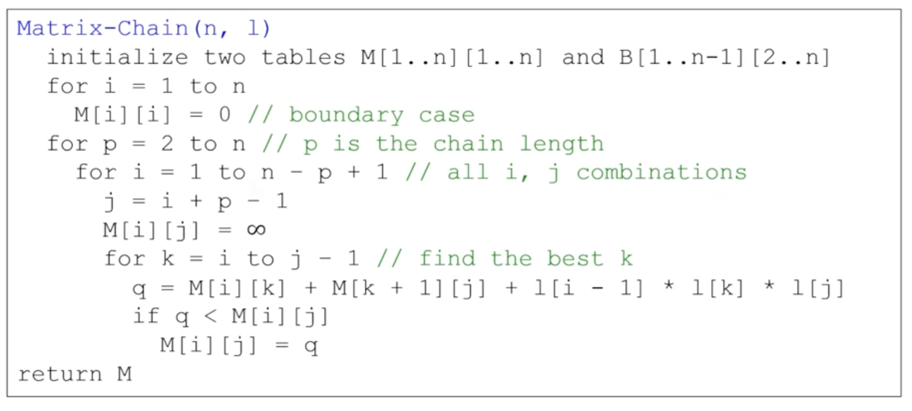

- $T(n) = \Theta(n^3)$

##### 如何建立及填表格

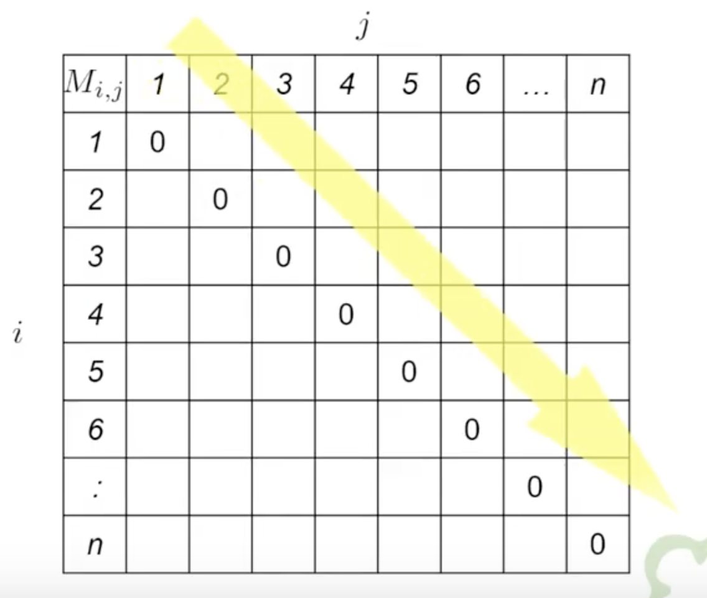

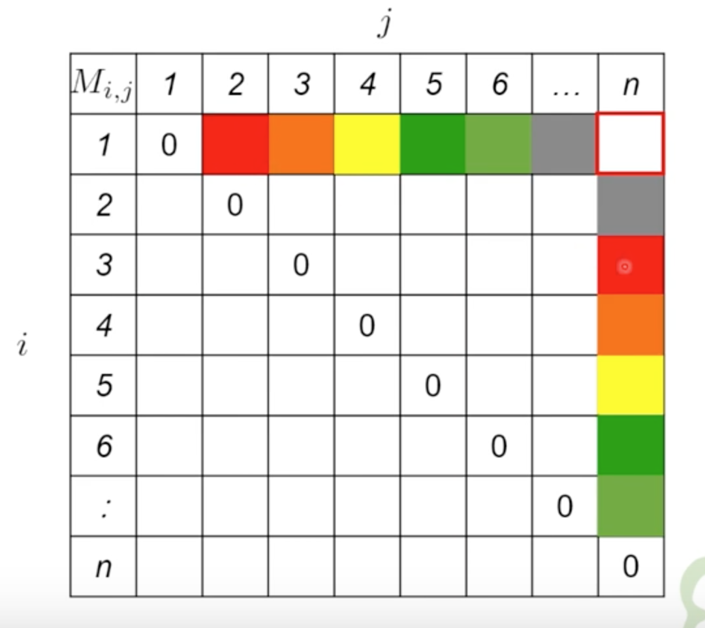

以紅色舉例說明:

```
M(1, 2), M(3, n)
-> 代表切在 A2，所以 A1A2 要先處理，A3..An要先處理
-> 然後再將兩個相乘
```

Example:

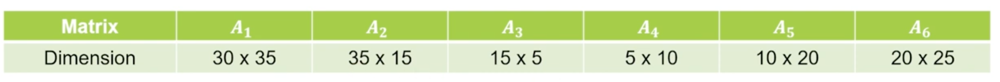

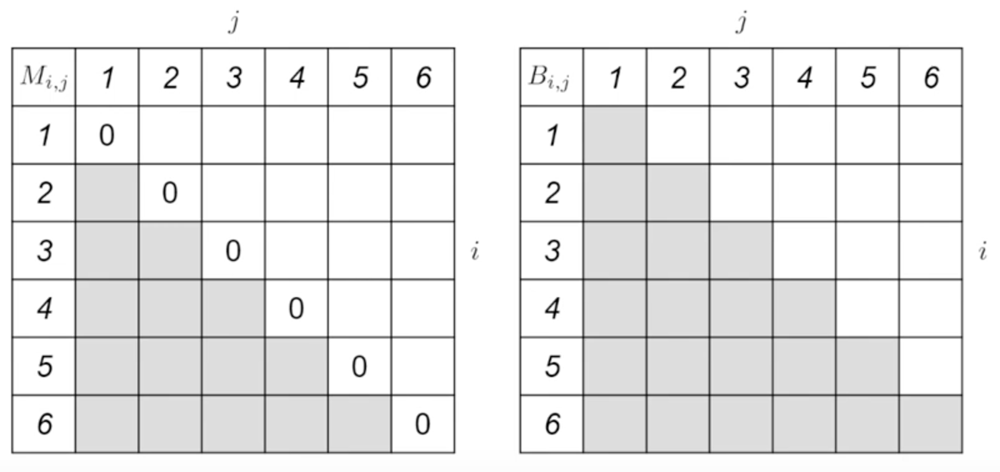

首先第一條斜線就是左右相乘，如:

```
A1 x A2 = (30x35) x (35x15)
=> T(pqr) = 30 x 35 x 15 = 15750
```

依此類推，如下圖所示:

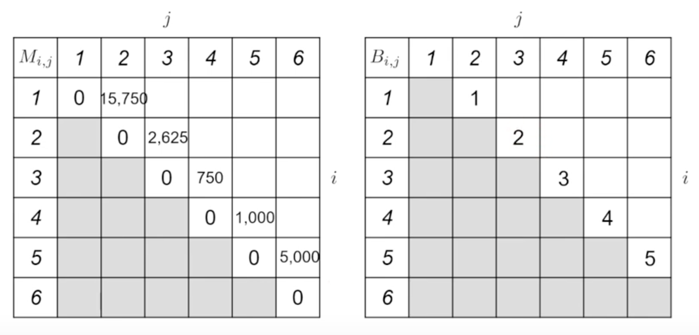

第二條斜線則是要根據左邊與下面的表格來判斷，如:

$M_{1,3}$ 有兩種方式:

1. $M_{1,2}$ + $M_{1,2} * A_3$ 的時間 (從左邊)

```
M(1,2) x A3 = (30x15) x (15x5)
=> T(pqr) = 30 x 15 x 5 = 2250

M(1,2) + M(1,2) x A3 = 15750 + 2250
                     = 18000
```

2. A1 * $M_{2,3} + $M_{2,3}$  的時間 (從下面)

```
A1 x M(2,3) = (30x35) x (35X5)
=> T(pqr) = 30 x 35 x 5 = 5250

A1 x M(2,3) + M(2,3) = 5250 +2625
                     = 7875
```

可得 $M_{1,3}$:
- `切點為 1 (A1)`: B(1,3) = 1
- 計算花費時間為 `7875`: M(1, 3) = 7875

    ```
    先乘 A2, A3 最後再乘 A1 (切點為A1)
    ```

如下所示:

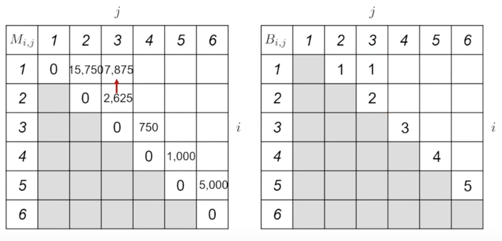


依此方法依序完成表格，如下所示:

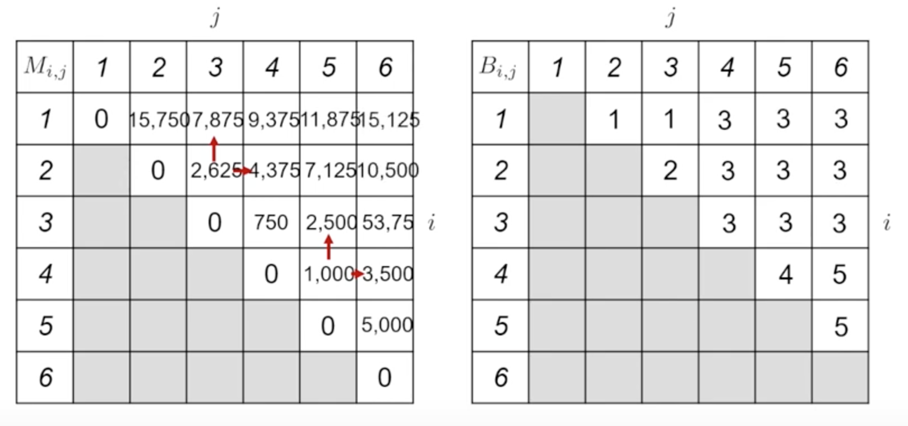

所以最後根據表格可得:

```
M(1,6) = M(1,3) x M(4,6)
       = (A1(A2A3)) x ((A4A5)A6)
```

如下圖所示:

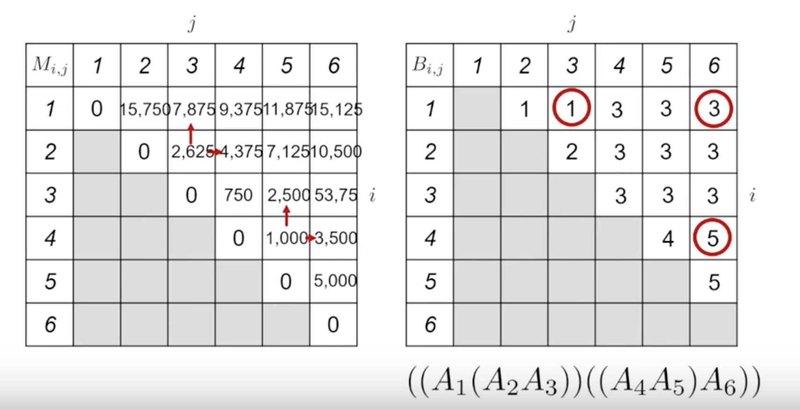


### Step4: Construct an OPT Solution by Backtracking


