# Rod Cutting Problem

- Input: A rod of length $n$ and a table of price $p_i$ for $i = 1, ..., n$

    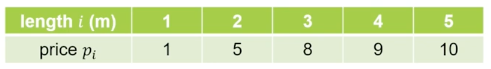

    ```
    長度為 n ，最多只有 n-1 個切點
    ```

- Output: the `maximum revenue` $r_n$ obtainble by cutting up the rod and selling the pices

    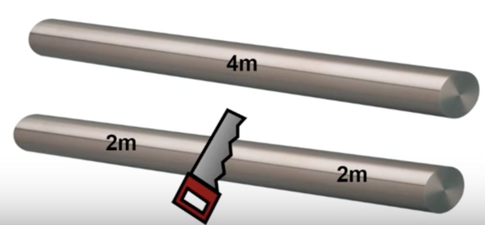

## Brute-Force Algorithm

假設 Rod 長度為 4m，有一下切法:

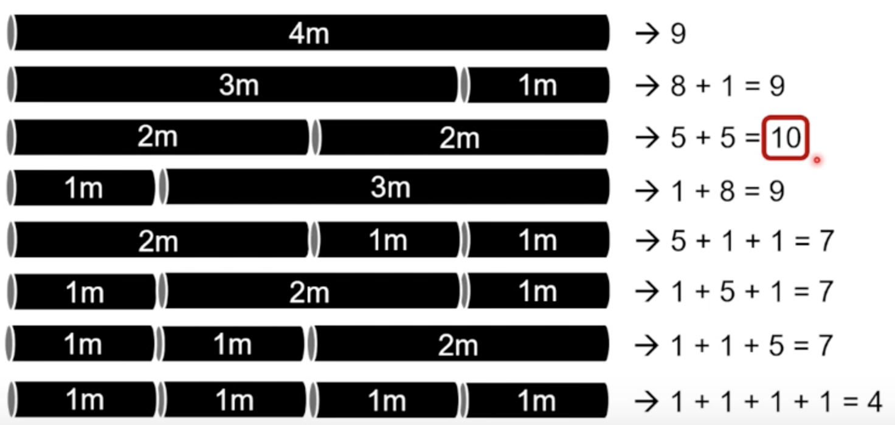

### Time-Complexity

假設 Rod 長度為 n:


- 對於每個(整數)切點，可以選擇切或不切
- 有 n-1 個位置需要考慮

=> 時間複雜度為: $\theta(2^{n-1})$

## Recursive Thinking

We use a `recursive` function to solve the subproblems.

- If we know the answer to the subproblem, can we get the answer to the original problem?


可得公式為:

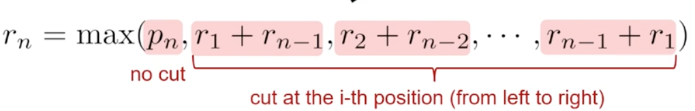

- Optimal substructure:

    an optimal solution can be constructed from optimal solutions to subproblems

### Recursive Algorithms

- Version 1:

    

    沒有比較有效率。

- Version 2:

    try to reduce the number of subproblems -> focus on `left-most` cut

    ```
    只 fucus 在最左點的切點。
    -> 左半邊就是完整要賣掉的棍子
    ```

    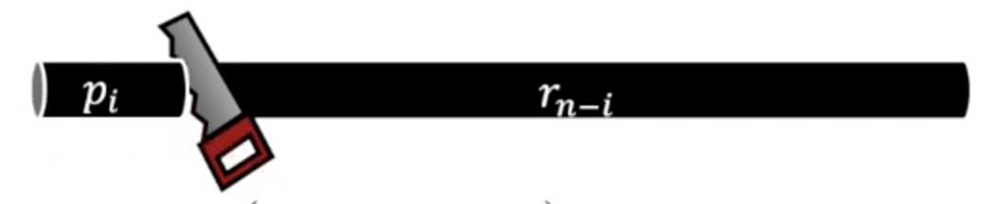

    公式:

    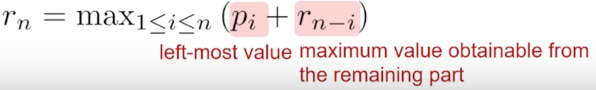

### Recursive Procedure

Focus on `left-most` cut

- assume that we always cur `from left to right` -> the `first cut`

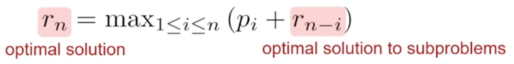

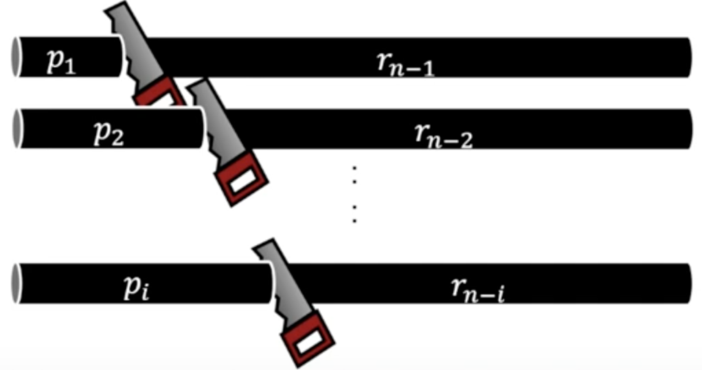

- Optimal substructure:

    an optimal solution can be constructed from optimal solutions to subproblems

### Naive Recursive Algorithm

$$ r_n = max_{1\leq i \leq n}(p_i+r_{n-i}) $$

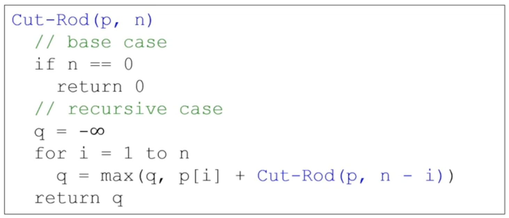

=> 時間複雜度為: $\theta(2^{n})$

但我們可以發現有很多會重覆計算到，如下圖所示:

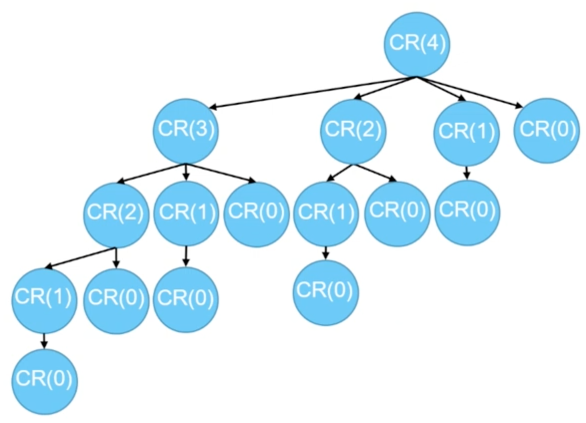

- have overlapping subproblems

    ```
    所以我們可以使用 DP 來解決它。
    ```

## Dynamic Programming

- Idea: use space for better time efficiency

    `Rod cutting problems have overlapping subproblems and optimal substructures -> Can be solved by DP`

- When the number of subproblems is polynomial, the time complexity is polynomial using DP

- DP algorithm
  - Top-Down: solve overlapping subproblems recursively with memoization
  - Bottom-Up: build up solutions to larger and larger subproblems

### Top-Down with Memoization

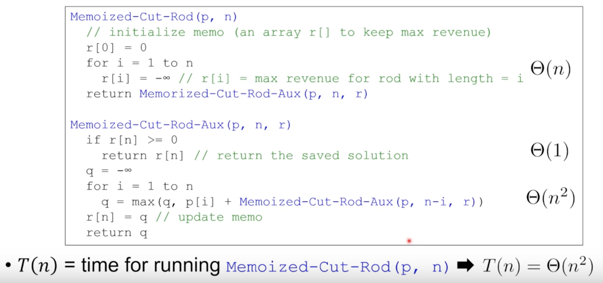

### Bottom-Up with Tabulation

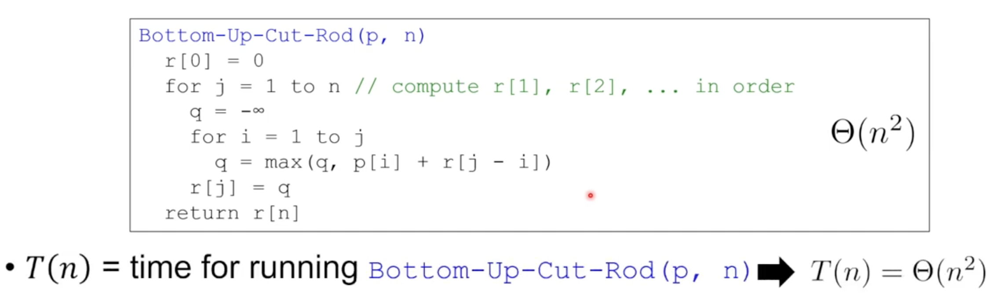

Python: [rod_cutting_bottomup.py](https://github.com/kaka-lin/Notes/blob/master/DSA/Dynamic%20Programming/rod_cutting/rod_cutting_bottomup.py)
