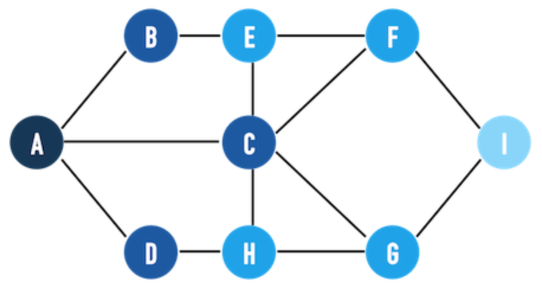
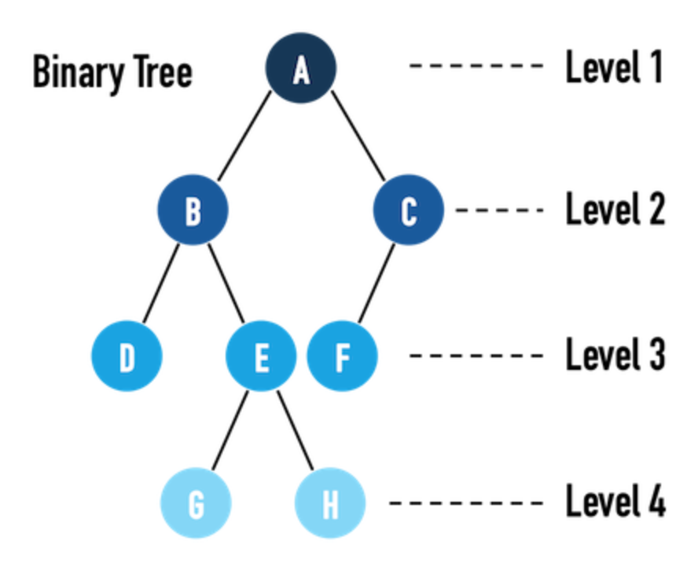

# 廣度優先搜尋 (Breadth-First Search, BFS)

`Breadth-First search (BFS)` is an algorithm to `traverse or search` in data structures like a tree or a graph.



We can use BFS:

- `level-order traversal` in a tree.

    

    ```
    BFS是從根節點開始，沿著樹的寬度遍歷樹的節點。
    如果所有節點均被存取，則演算法中止。
    ```

- `traverse a graph`
    - find a path, especially the `shortest path`, from a start node to a target node.
-  traverse `all the possible statuses`

## BFS Example

One common application of Breadth-first Search (BFS) is to find the shortest path from the root node to the target node.

以下提供 BFS Template:

1. Tree

    ```python
    def BFS(root: TreeNode, target: TreeNode) -> int:
        queue = [] # store all nodes which are waiting to be processed
        visited = set() # store all the nodes that we've visited
        step = 0 # number of steps neeeded from root to current node

        # initialize
        queue.append((root, step))
        visited.add(root)

        while queue:
            # iterate the nodes which are already in the queue
            cur, step = queue.pop(0)
            if cur.val == target.val:
                return step

            if cur.left and cur.left not in visited:
                queue.append((cur.left, step + 1))
                visited.add(cur.left)

            if cur.right and cur.right not in visited:
                queue.append((cur.right, step + 1))
                visited.add(cur.right)

        return -1 # there is no path from root to target
    ```

   - Python: [bfs.py](bfs.py)

2. Graph

    ```python
    def BFS(n: int, edges: List[List[int]], start: int, end: int):
        # Graph: Adjacency List
        # graph = [[] for _ in range(n)]
        graph = collections.defaultdict(list)
        for u, v in edges:
            graph[u].append(v)
            graph[v].append(u)

        # initialize
        queue = [start]
        visited = set([start])

        while queue:
            # Get the current node.
            curr_node = queue.pop(0)

            # Check if we have reached the target node.
            if curr_node == end:
                return True

            # Add all neighbors to the queue.
            for neighbor in graph[curr_node]:
                # Check if neighbor has been added to the queue before.
                if neighbor not in visited:
                    visited.add(neighbor)
                    queue.append(neighbor)

        # Our queue is empty and we did not reach the end node.
        return False
    ```

## Reference

- [ADA, NTU CSIE](https://www.youtube.com/watch?v=l8VG83k3b6g&list=PLOAQYZPRn2V7lSunztJ4h0Sb0ejUA4Juq&index=40)
- [Graph: Breadth-First Search(BFS，廣度優先搜尋)](http://alrightchiu.github.io/SecondRound/graph-breadth-first-searchbfsguang-du-you-xian-sou-xun.html)
