# Linked List 介紹

## Singly Linked List

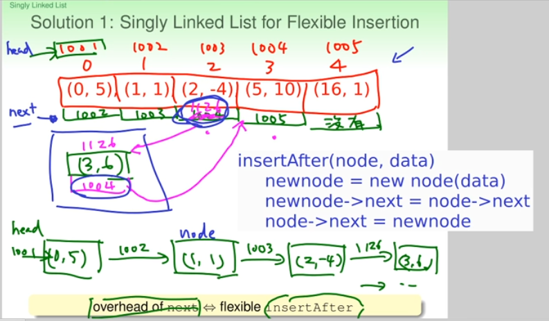

### Access

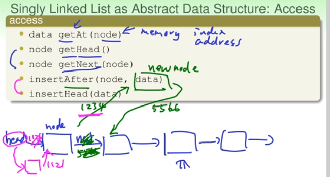

Compare with array:

- linked list: sequential access
- array: random access

### Maintenance

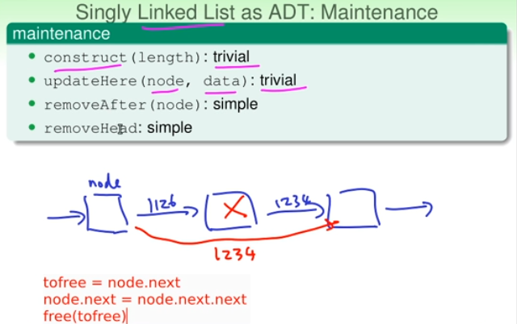

#### Dummy Head Node


Python code

```python
dummy = ListNode(None)
dummy.next = head
curr = dummy
```

## Doubly Linked List

在 Singly Linked List 時，當你要移除特定node時會很麻煩，
因為你不知道他的前一個node是誰,所以只能從`Head`開始一直`next`直到找到為止

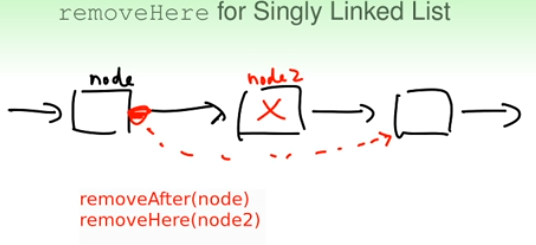

Soulution: 在每個`node`裡多放一個`prev`的小紙條

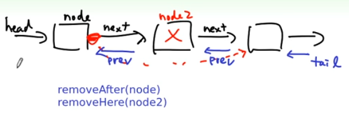

這就是所謂的 `Doubly Linked List`

## Iterator for Sequential Access

`開頭(head)`,`結尾(end)`,`下一個(node->next)`

```c
singly linked list;
for (node = head; node != end; node = node->next){
}

reverser doubly linked list;
for (node = tail; node != end; node = node->prev){
}

for (index = 0; index <= tail; index++){
}
```

只要結構差不多，都有這三個，那麼同樣的演算法就可以套用在不同data structure上

### C++ `STL List`: a `Doubly Linked List`

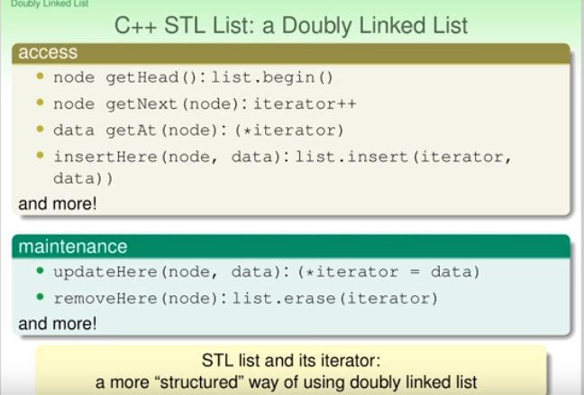

* 因為 List 是 Doubly Linked List，所以不能像`array`或`vector`一樣進行 random access

## Linked List for Sparse Vectors

### Application: Sparse Vector in Scientific Computing

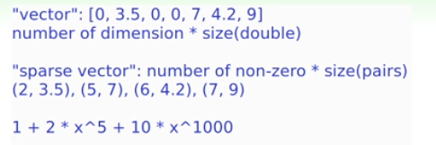

* polynomial: can be viewed as special case of sparse vector

### Merging Sparse Vectors

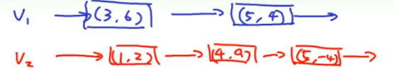

Q: algorithm for "merging" sparse vectors

* `running cursors` algorithm

    ```c
    while (!c1.end() && !c2.end()) {
      if (c1->order < c2->order) {
        res.insert_back(c1); c1++;
      } else if (c1->order > c2->order) {
        res.insert_back(c2); c2++;
      } else {
        res.insert_back(c1 "+" c2);
        c1++; c2++;
      }
    }
    insert_back others;
    ````

## Linked List in Job interview

1. Linked List Reversal

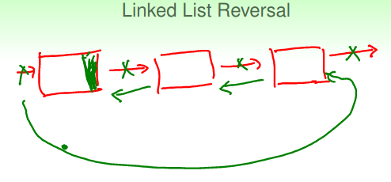

2. Cycle in Linked List
    - `tortoise-hare (turtle-rabbit) algorithm`

       two pointers, one moving twice as fast (the hare) than the other (the tortoise).

        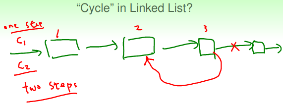

3. Middle of Linked List
    - two pass algorithm (O(N+N/2))
    - tortoise-hare algorithm

### Binary search in Linked List: `Skip List`

一般在 Linked List 中 search 非常慢，因為它是 sequence search。那麼如何在 Linked List 中使用 binart search 來提升 search 速度呢？

#### The Tortoise-Hare Algorithm to find Middle element of Linked List

首先我們先來看看如何找 Linked List 的 中點 (middle)，如下所示:

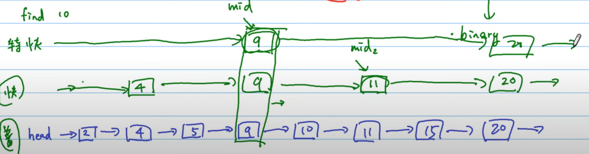

上面就是所謂的`"龜兔賽跑演算法(tortoise-hare algorithm)"`

> 想成: 一個是區間車每站都停，另一個是快車只停大站。

Python code

```python
# find the middle of the linked list
slow = fast = head
while fast and fast.next:
    slow = slow.next
    fast = fast.next.next

# return the slow pointer,
# which is the middle node.
return slow
```

#### Skip list

所以在原來的 Linked List 上再加上幾個"快車"的 Linked List 就是 `"Skip list"`，如下所示:

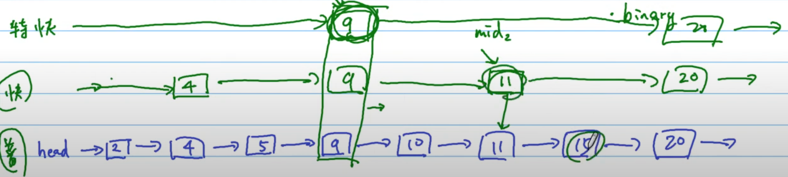

```
要找 15:

特快: 15 > "9", 15 < 20
快: 15 > 9, 15 > "11", 15 < 20
一般: 15 > 9, 15 > 11 -> find "15"
```

Other Example:


## Reference

- [NTU: Data Structures and Algorithms, Hsuan-Tien Lin](https://www.csie.ntu.edu.tw/~htlin/course/dsa20spring/)
- [Skip list](https://en.wikipedia.org/wiki/Skip_list)
