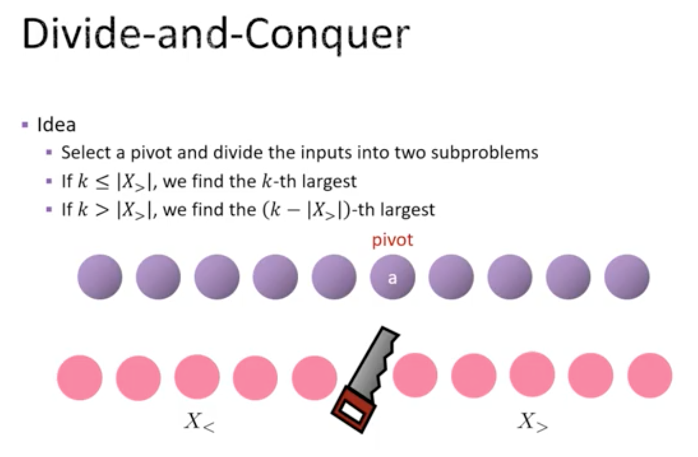

# Selection Problem

Leetcode: [215. Kth Largest Element in an Array](https://leetcode.com/problems/kth-largest-element-in-an-array/)

kaka's leetcode: [00215_kth-largest-element-in-an-array](https://github.com/kaka-lin/leetcode/tree/main/leetcode/00215_kth-largest-element-in-an-array)

- Input:
  - An array A of n distinct integers.
  - An index k with 1 <= k <= n

- Output: The k-th largest number of k

```
Selection Problem <= Sorting Problem
```

## Solution 1. Sorting

Time Complexity: $O(nlogn)$

- Step 1: sort A into increasing order
- Step 2: output A[n-k+1]

Merge Sort: [merge_sort.py](https://github.com/kaka-lin/Notes/tree/master/DSA/Recursion/Divide%20and%20Conquer/merge_sort)
```python
def findKthLargest(nums, k):
    nums = merge_sort(nums)
    return nums[-k]
```

or Built-in sorted method
```python
def findKthLargest(nums, k):
    nums = sorted(nums)
    return nums[-k]
```

## Soltion 2. Divide and Conquer

此方法為: [Quick Select](https://en.wikipedia.org/wiki/Quickselect), 如下圖:



- Step 1: 選一個基準點，根據這個基準點切成兩個 subproblems
- Step 2: 根據基準點 `a`, 大於 `a` 的放右邊，小於 `a` 的放左邊
- Step 3:
  - 如果 `k < 右半邊的數量`: 答案就在右半邊: 第 `k` 個大的
  - 如果 `k > 右半邊的數量`: 答案就在左半邊: 第 `k - 右半邊數量` 大的

    Example:

    ```
    找第 5(k) 大的, 右半邊 3 個 element
    那麼就是找左半邊第 2 大的 (k - 右半邊數量)
    ```

其中: Step 1. and 2. 為 `Quick Sort` 之 [Partition](https://github.com/kaka-lin/Notes/tree/master/DSA/Recursion/Divide%20and%20Conquer/quick_sort#1-lomuto-partition-scheme) part.

### 實作

```python
def quick_select(nums, k):
    pos = partition(nums, 0, len(nums)-1)

    # k < 右半邊的數量 (k < len(nums) - pos): 答案就在右半邊: 第 k 個大的
    # k > 右半邊的數量 (k > len(nums) - pos): 答案就在左半邊: 第 k - 右半邊數量
    if k > len(nums) - pos:
        return quick_select(nums[:pos], k-(len(nums)-pos))
    elif k < len(nums) - pos:
        return quick_select(nums[pos+1:], k)
    else:
        return nums[pos]

# Lomuto partition scheme
def partition(self, nums, lo, hi):
    # Choose the last element as the pivot
    pivot = nums[hi]

    # 遍歷陣列，將小於等於 pivot 的元素和 i 位置的元素交換
    i = lo
    for j in range(lo, hi):
        if nums[j] < pivot:
            nums[i], nums[j] = nums[j], nums[i]
            i += 1

    # 將 pivot 和與第 i 個元素交換: 就切成兩半邊
    nums[i], nums[hi] = nums[hi], nums[i]
    return i
```

### 進階問題: pivot 兩邊 subarray size

因為是透過基準點將 Array 分成兩半邊，但我們不知道兩邊的 size 是多少。

- 最佳切法: 我們希望這兩邊的 size 很接近，最好就是剛好切一半，就是 Array 的中位數

所以問題就變成是怎麼找一個好的基準點(中位數)。

#### Method 1. Using random pivot

```python
def partition(self, nums, lo, hi):
    # Choose random pivot
    index = random.randint(0, len(nums) - 1)
    nums[index], nums[hi] = nums[hi], nums[index]
    pivot = nums[hi]

    # 遍歷陣列，將小於等於 pivot 的元素和 i 位置的元素交換
    i = lo
    for j in range(lo, hi):
        if nums[j] < pivot:
            nums[i], nums[j] = nums[j], nums[i]
            i += 1

    # 將 pivot 和與第 i 個元素交換: 就切成兩半邊
    nums[i], nums[hi] = nums[hi], nums[i]
    return i
```
