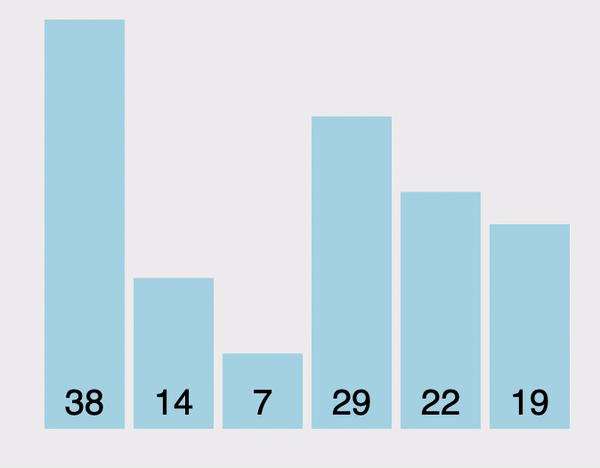

# 泡沫排序法 (Bubble Sort)

泡沫排序法 (Bubble Sort) 是一種簡單直觀的排序演算法。

從陣列的最前面開始，一次比較陣列中兩兩相鄰的元素，然後根據大小將它們調換順序，重複地進行直到沒有再需要交換。如下:

- 比較相鄰的元素。如果第一個比第二個大，就交換它們兩個。
- 對每一對相鄰元素作同樣的工作，從開始第一對到結尾的最後一對。這步做完後，最後的元素會是最大的數。
- 接著扣掉陣列中的最後一個元素（因為已經確定它是最大的）重複上面的步驟進行兩兩比較，直到排序完畢。

如下所示:



圖片來源：[Visualgo](https://visualgo.net/en/sorting)

> 這個演算法的名字由來是因為越小的元素會經由交換慢慢「浮」到數列的頂端。

## Performance

- `時間複雜度 (Time Complexity)`

    | # | Performance  |
    | :- | :-: |
    | Worst case | $O(n^2)$ |
    | Average case| $O(n^2)$ |
    | Best case | $O(n)$ |

- `空間複雜度 (Space Complexity)`: $O(1)$ "in-place"
- `穩定性 (stability)`: stable
- `適應性 (Adaptability)`: adaptive

    ```
    can early stop
    ```

## Implementation

Python:

```python
def bubble_sort(data):
    # loop to access each array element
    for i in range(len(data)):
        # loop to compare array elements
        for j in range(0, len(data) - i - 1):
            # compare two adjacent elements
            if data[j] > data[j+1]:
                data[j], data[j+1] = data[j+1], data[j]
    return data
```

```python
def bubble_sort_2(data):
    n = len(data)
    while n > 1:
        n -= 1
        for i in range(n):
            if data[i] > data[i+1]:
                data[i], data[i+1] = data[i+1], data[i]
    return data
```

## Note:

A deprecated choice except in very specific applications with a few disordered neighbors or if swapping neighbors is cheap.

- old tape days

## Reference

- [DSA 20200609: Sorting / Summary](https://www.youtube.com/watch?v=cxbabnqtWsk&feature=youtu.be)
- [wiki: 泡沫排序](https://zh.wikipedia.org/zh-tw/冒泡排序)
- [[演算法] 氣泡排序法(Bubble Sort)](http://notepad.yehyeh.net/Content/Algorithm/Sort/Bubble/1.php)
- [Rust Algorithm Club: 氣泡排序 Bubble sort](https://rust-algo.club/sorting/bubble_sort/index.html)
- [【Day21】[演算法]-排序Sort & 氣泡排序法Bubble Sort](https://ithelp.ithome.com.tw/articles/10276184)
