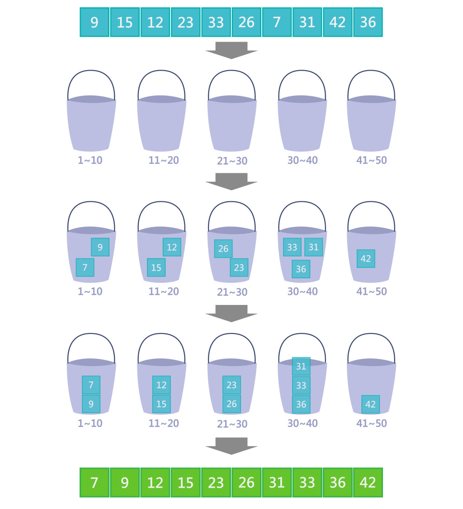

# Bucket Sort Algorithm

Bucket Sort (桶子排序法) 是屬於`非比較排序法`。

`比較排序法`: 是透過資料兩兩比較進行排序，而且它在效能上有根本的限制，在最差的情況下，任何一種比較排序法至少需要 `O(nlogn)` 比較操作。

`非比較排序法`: 沒有效能上的限制，通過非比較操作性能最好可以在`O(n)完成，但它缺少了靈活性，比較排序法能對各種數據型態進行排序，而非比較排序則不能，這種靈活性也導致了比較排序被更多的應用在大多數實際工作中。

## Intuition

桶子排序法，它的原理是將資料(n)，分散到有限數量(k)的桶子中，然後每個桶子再個別進行排序，其中每個桶子的個別排序可以運用其它的演算法來進行排序，再依照桶子的順序把桶子中的資料串接再一起。

基本流程如下:

1. 設定定量的空桶子
2. 將資料分配到對應桶子中
3. 個別桶子進行排序
4. 然後在依順序把排序好資料收集回來

如下圖所示:

桶子排序法有三個特點:

1. 桶子排序法是穩定的。
2. 它是常見的排序法中最快的一種，大多數的情況下。
3. 它非常快，但缺點是非常的耗空間。
   - 如果記憶體更大的話，可以使用增加桶子的數量來降低區間，這樣將可以減少排序的次數，所以桶排序是一種可以用`空間來換時間的排序法`。

## Performance

|  | Performance  |
| :- | :-: |
| Worst | O(n^2) |
| Average | O(n + n^2 / k + k) |
| Best | O(n), where k ≈ n |

### Best Case:

時間複雜度為: 遍歷處理每個資料 O(n) + 每個桶內排序的時間複雜度

假設條件如下:

- 資料有 n 個， k 個桶子，則每個桶內有 m = n / k。
- 資料分布均勻
- 假設每個桶內部使用的排序演算法為`快速排序 (quick sort)`

排序的時間複雜度為: `O(k * (n/k) * log(n/k)) = O(n * log(n/k))`

所以最終時間複雜度為: `O(n) + O(n * (logn/k))`
                  = `O(n + n * log(n/k))`

* 當 k ≈ n 時，log(n/k) 就是一個非常小的常數，此時 `bucket sort`的時間複雜就趨近於 `O(n)`。

## Reference

1. [[演算法]-桶排序法Bucket Sort](https://ithelp.ithome.com.tw/articles/10279536?sc=iThelpR)

2. [桶排序 Bucket sort](https://rust-algo.club/sorting/bucket_sort/)
