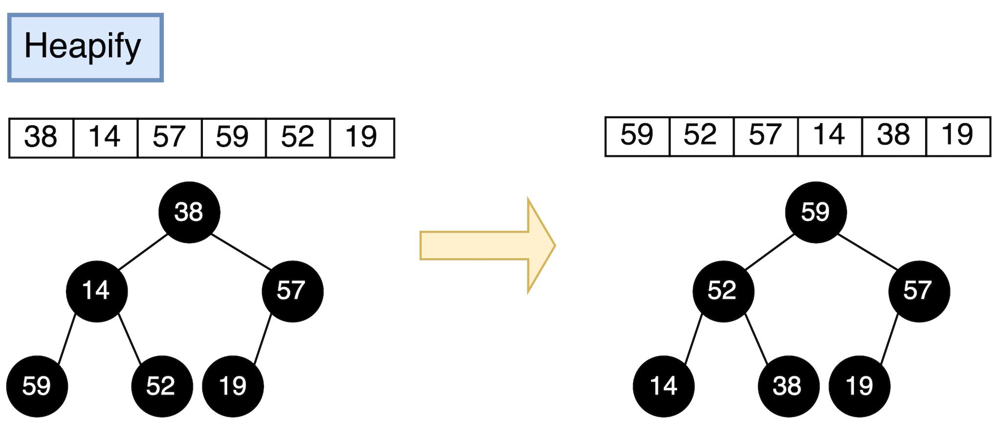
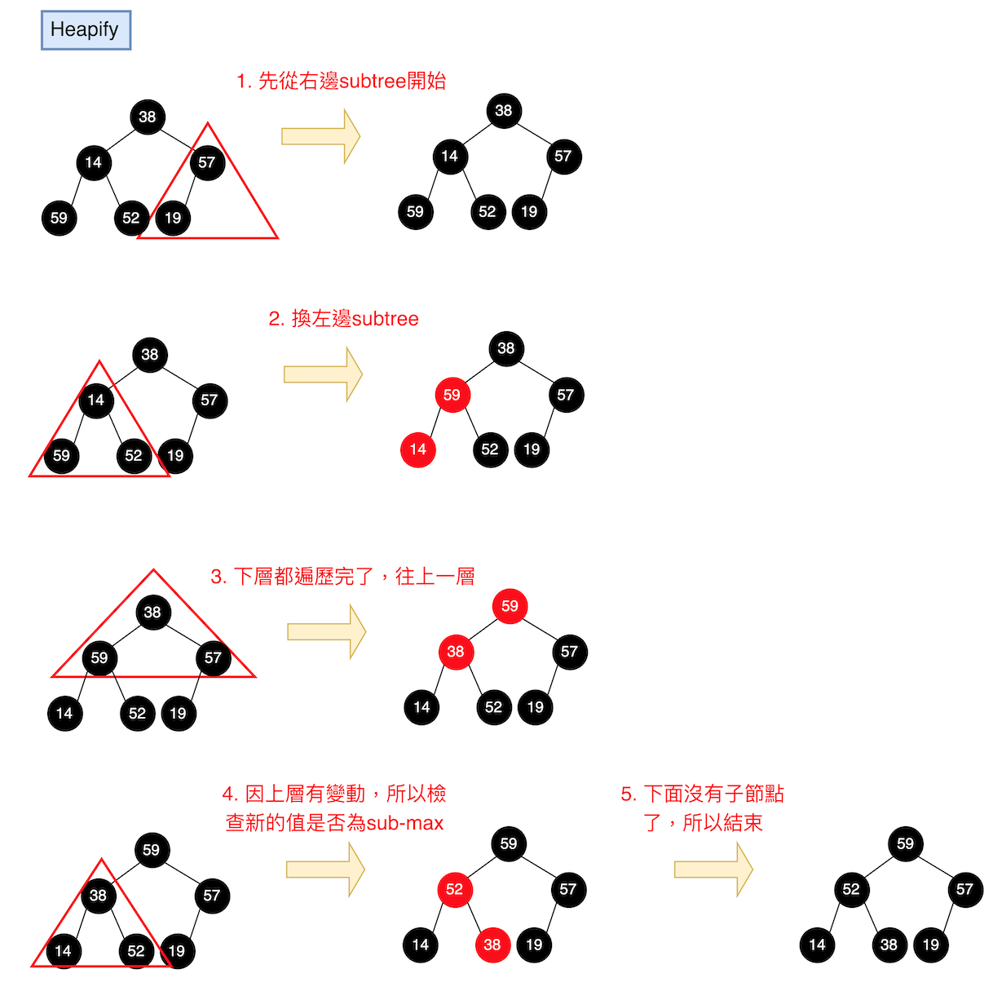
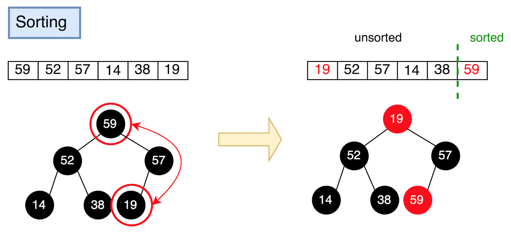
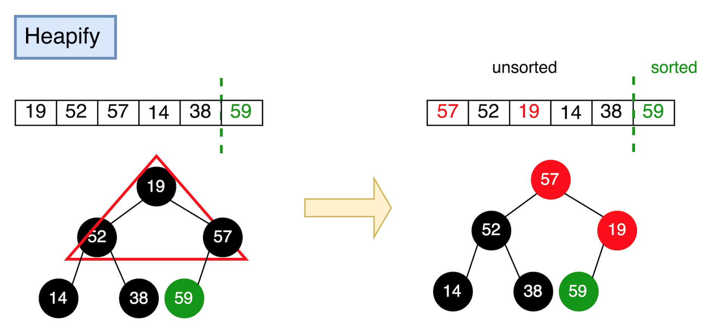
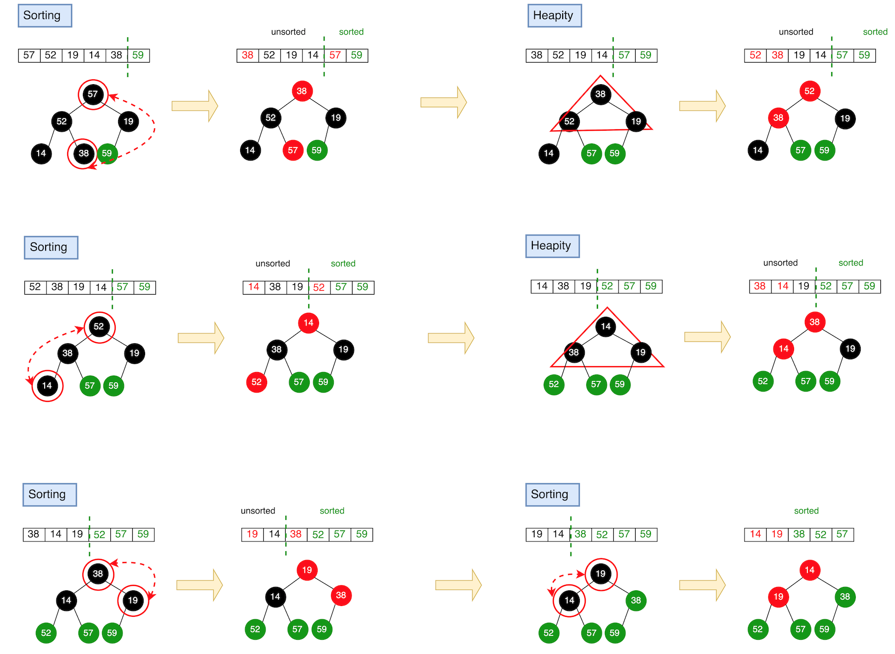
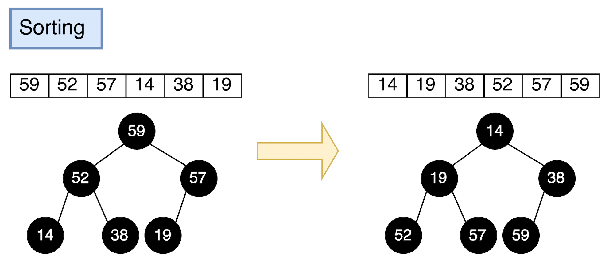

# 堆積排序法 (Heap Sort)

`堆積排序法 (Heap Sort)` 為`選擇排序法 (Selection Sort)` 的變形。同樣會將資料分為 sorted pile 與 unsorted pile，並在 unsorted pile 中尋找最大值（或最小值），加入 sorted pile 中。

和 Selection Sort 不同的地方在於 Heap sort 使用[堆積 (heap)](https://github.com/kaka-lin/Notes/tree/master/DSA/Tree/Binary%20Tree/Heap%20Tree) 這種`半排序 (partially sorted)`的資料結構來加速排序。

```
Selection sort with a max-heap in original array
rather than unordered pile
```

## Performance

- `時間複雜度 (Time Complexity)`

    | # | Performance  |
    | :- | :-: |
    | Worst case | $O(nlogn)$ |
    | Average case| $O(nlogn)$ |
    | Best case | $O(nlogn)$ |

- `空間複雜度 (Space Complexity)`: $O(1)$ "in-place"
- `穩定性 (stability)`: untable

## 演算法分析

Heap sort 演算法分為兩大步驟:

1. `Heapify`: 將資料轉換為 heap 資料結構（max-heap or min-heap）
2. `Sorting`:

    逐步取出最大／最小值，並與最後一個元素置換。如下:

    1. 將 root (最大／最小值) 與最後一個 node 調換，將最後一個節點(原樹根)取出，並加入已排序數列

        ```
        相當於對 Heap Tree 作 Delete Node
        ```

    2. 更新剩下的資料，使其滿足 heap 的特性，稱為 `heap ordering property`。
    3. 重複前兩個步驟，直到 heap 中剩最後一個未排序的資料。

如下所示:


### Example

有一資料為:

```
[38, 14, 57, 59, 52, 19]
```

#### Heapity

首先，將資料轉換為 heap 資料結構，即為 `Heapify`。
我們這邊採用 `max-heap` 說明，如下:



詳細步驟如下:



#### Sorting

再來就是排序的部分，我們先將最後一個 node 與 root 進行交換，將最後一個節點加入 sorted part，如下所示:



接下來，將未排序的資料區塊重整為符合 max-heap 的結構。



再來就只要重覆上面兩個步驟，直到結束，就完成排序了。如下所示:



排序結果:



## 實作範例

### Python

```python
def heap_sort(arr):
    def max_heaptify(start, end):
        root = start
        while True:
            child = 2 * root + 1
            # 若子節點指標超出範圍則結束
            if child > end:
                break

            # 先比較左右兩個子節點大小，選擇最大的那個子節點
            if child + 1 <= end and arr[child] < arr[child + 1]:
                child += 1

            # 如果 root 的值小於 child 最大值，則交換 (符合 max-heap 的特性)
            if arr[root] < arr[child]:
                arr[root], arr[child] = arr[child], arr[root]
                root = child
            else:
                break

    # 首先將資料轉換為 heap 資料結構
    n = len(arr)
    for start in range(n // 2 - 1, -1, -1):
        max_heapity(arr, start, n-1)

    # 我們將第一個元素(root)和已經排好的元素前一位(unsorted part)做交換
    # 再重新調整 unsorted part 使其符合 max-heap 特性
    # 直到排序完畢。
    n = len(arr)
    for i in range(n - 1, 0, -1):
        arr[0], arr[i] = arr[i], arr[0]
        max_heapity(arr, 0, i-1)
```

## Reference

- [DSA 20200609: Sorting / Summary](https://www.youtube.com/watch?v=cxbabnqtWsk&feature=youtu.be)
- [wiki: 堆積排序](https://zh.wikipedia.org/zh-tw/堆排序)
- [[演算法] 堆積排序法(Heap Sort)](http://notepad.yehyeh.net/Content/Algorithm/Sort/Heap/Heap.php)
- [Rust Algorithm Club: 堆積排序 Heapsort](https://rust-algo.club/sorting/heapsort/)
- [Day21:[排序演算法]Heap Sort - 堆積排序法 ](https://ithelp.ithome.com.tw/articles/10266206)
- [Comparison Sort: Heap Sort(堆積排序法)](https://alrightchiu.github.io/SecondRound/comparison-sort-heap-sortdui-ji-pai-xu-fa.html)
