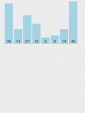

# 插入排序法 (Insertion Sort)

插入排序法 (Insertion Sort) 是一種簡單直觀的排序演算法。比起 `Quick Sort` 等高效的排序法，對大資料的處理效能較不理想。

```
Insert a card from the unsorted pile to its place in the sorted pile
```

原理為是一將原始資料加入已排序好資料中，並逐一與已排序好的資料作比較，找到對的位置插入。如下:

- 將資料分成已排序、未排序兩部份
- 依序由未排序中的第一筆(正處理的值)，插入到已排序中的適當位置

    比較為`由右而左比較`:
    - 若遇到的值比正處理的值`大`: 則將值`往右移`。
    - 若遇到得值比正處理的值`小或相等`: 則`直接插入`。

如下所示:



> 其演算法是將欲排序元素直接插入正確位置，因而得名。

## Performance

- `時間複雜度 (Time Complexity)`

    | # | Performance  |
    | :- | :-: |
    | Worst case | $O(n^2)$ |
    | Average case| $O(n^2)$ |
    | Best case | $O(n)$ |

- `空間複雜度 (Space Complexity)`: $O(1)$ "in-place"
- `穩定性 (stability)`: stable
- `適應性 (Adaptability)`: adaptive

## Implementation

一般來說，插入排序都採用 "in-place" 在陣列上實現。具體演算法描述如下：

1. 取第一個元素，將該元素視為已排序 (sorted)。
2. 取出下一元素，在已經排序的元素序列中從後向前掃描，
   若該元素（已排序）大於新元素，則該元素移到下一個位置。
3. 並重複上面步驟，直到找到已排序的元素小於或者等於新元素的位置。
4. 將新元素插入到該位置後
5. 重複步驟 2 - 4，直到排序完成。

### Python:

```python
def insertion_sort(data):
    n = len(data)
    for i in range(1, n):
        # key: 現在要插入的元素
        key = data[i]
        j = i-1 # sorted part
        # 沒有超出範圍且遇到的值大於要插入的值，則往右移
        while j >= 0 and key < data[j]:
            data[j+1] = data[j]
            j -= 1
        data[j+1] = key
    return data
```

## Reference

- [DSA 20200609: Sorting / Summary](https://www.youtube.com/watch?v=cxbabnqtWsk&feature=youtu.be)
- [wiki: 插入排序](https://zh.wikipedia.org/zh-tw/插入排序)
- [[演算法] 插入排序法(Insertion Sort)](http://notepad.yehyeh.net/Content/Algorithm/Sort/Insertion/1.php)
- [Rust Algorithm Club: 插入排序 Insertion Sort](https://rust-algo.club/sorting/insertion_sort/index.html)
- [【Day23】[演算法]-插入排序法Insertion Sort](https://ithelp.ithome.com.tw/articles/10277360?sc=iThomeR)
- [Comparison Sort: Insertion Sort(插入排序法)](http://alrightchiu.github.io/SecondRound/comparison-sort-insertion-sortcha-ru-pai-xu-fa.html)
