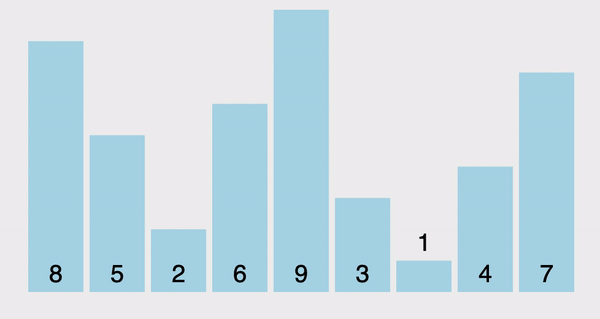

# 選擇排序法 (Selection Sort)

選擇排序（Selection sort）是一種簡單直觀的排序演算法。他的工作原理如下:

- 將資料分成已排序、未排序兩部份
- 依序由未排序中找最小值(or 最大值)，加入到已排序部份的末端

> linear select the minimum/maximum one from "unsorted" part, then put it to the end of the "sorted" part.

如下所示:



其中: 紅色表示當前最小值，黃色表示已排序序列，藍色表示當前位置。

## Performance

- `時間複雜度 (Time Complexity)`

    | # | Performance  |
    | :- | :-: |
    | Worst case | $O(n^2)$ |
    | Average case| $O(n^2)$ |
    | Best case | $O(n^2)$ |

- `空間複雜度 (Space Complexity)`: $O(1)$ "in-place"
- `穩定性 (stability)`
  - commom implementation (swap): untable
  - linked-list/insertion(rotate): stable

## Implementation

Python:

```python
def selection_sort(data):
    n = len(data)
    for i in range(n):
        min_idx = i
        # 找出未排序資料中的最小值的index
        for j in range(i+1, n):
            if data[j] < data[min_idx]:
                min_idx = j
        if min_idx != i:
            # 交換兩個變數
            data[i], data[min_idx] = data[min_idx], data[i]
    return data
```

## Reference

- [DSA 20200609: Sorting / Summary](https://www.youtube.com/watch?v=cxbabnqtWsk&feature=youtu.be)
- [wiki: 選擇排序](https://zh.wikipedia.org/zh-tw/選擇排序)
- [[演算法] 選擇排序法(Selection Sort)](http://notepad.yehyeh.net/Content/Algorithm/Sort/Selection/1.php)
- [初學者學演算法｜排序法入門：選擇排序與插入排序法](https://medium.com/appworks-school/初學者學演算法-排序法入門-選擇排序與插入排序法-23d4bc7085ff)
- [Rust Algorithm Club: 選擇排序 Selection sort](https://rust-algo.club/sorting/selection_sort/)
