# 2-3-4 Tree

> 是一種 self-balancing tree (Balanced Tree)。
> 比紅黑樹容易了解，但不容易 implement，所以不實用。

> 與 AVL Tree 相比: `用暫存維持平衡性`，不會 rebalance immediately

所謂的 2-3-4 tree 就是每個節點可以有`2, 3 或 4`個子節點。如下:

- `滿足二元搜索樹的基本性質` - 左小右大，但不是二元樹 (因為可以有很多個子節點)。
- 節點可以放 1, 2 或 3 個元素 (有 2, 3, 或 4 個 children)如下:
  - `2-節點`: 它包含 1 個元素和 2 個子節點

    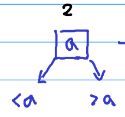

  - `3-節點`: 它包含 2 個元素和 3 個子節點

    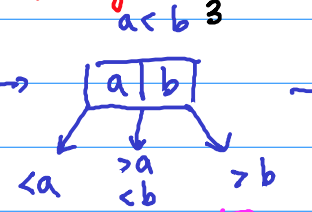

  - `4-節點`: 它包含 3 個元素和 4 個子節點

    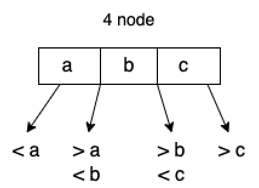

- `是一棵絕對平衡的樹`: `h = O(log n)`

    ```
    左右子樹高度一定相同，所有葉節點(leaf)皆在同一level
    ```

    > 嚴格定義: null 節點皆在同一個 level。(蟑螂腳都要一樣高)

Example:

```
      5   |   16
     /    |     \
   3   7,11,14   18,21
```

## 2-3-4 Tree: Insertion

當要新增資料時:

- `directly insert`: 還有空間
- `upper insert and split`: node 的 element 已經滿了

    ```
    取所有元素的中間值，upper insert，
    剩下的元素分家(split)，依照所選的中間值，分左右子節點。
    ```

#### Example:

原本有一個 2-3-4 Tree 如下:

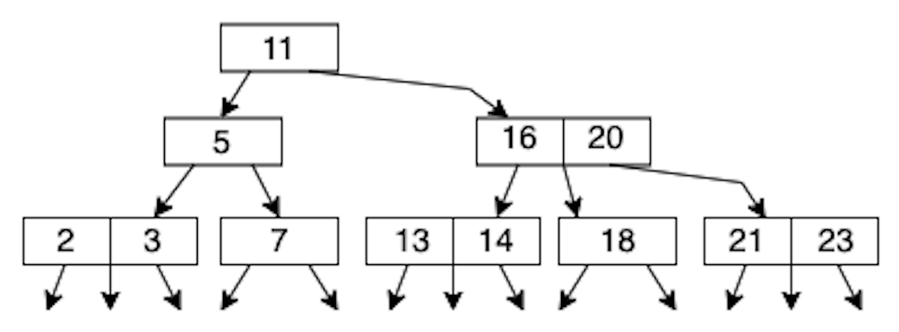

##### Step 1. insert 2 and 20

節點 element 尚未滿，所以 `directly insert`

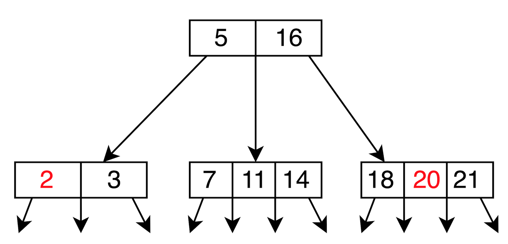

##### Step 2. insert 13

節點的 element 已滿，所以 `upper insert and split`

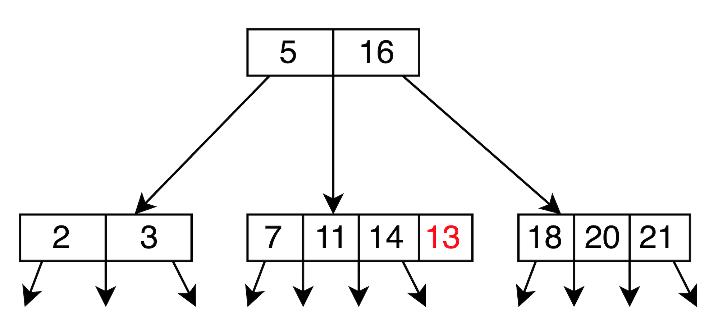

處理方式如下:

```
insert 13 -> [7, 11, 13, 14] -> Overflow!

upper insert and split: 選中間值 11

    11  <- upper insert
   /  \
  7   13, 14
   split
```

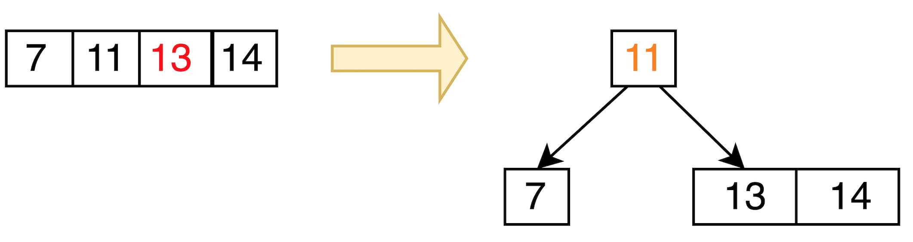

所以變成


##### Step 3. insert 23

節點的 element 已滿，所以 `upper insert and split`

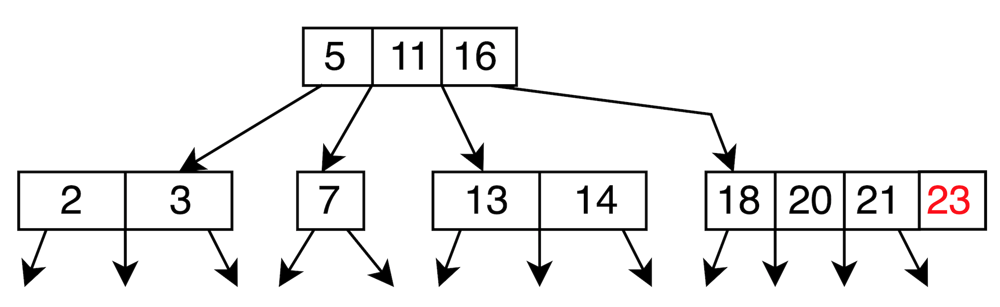

處理方式如下:

```
insert 23 -> [18, 20, 21, 23] -> Overflow!

upper inser and split: 選中間值 20

    20  <- upper insert
   /  \
  18   21, 23
   split
```

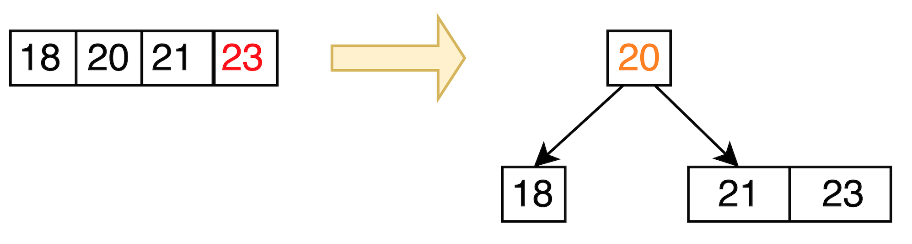

所以變成

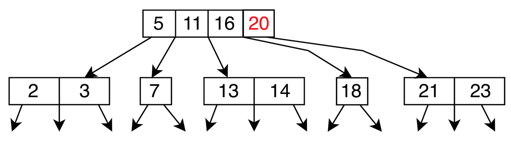

```
但此時發現上一層也發生 overflow: [5, 11, 16, 20]
所以再一次 upper inser and split: 選中間值 11

    11  <- upper insert
   /  \
  5   16, 20
   split
```

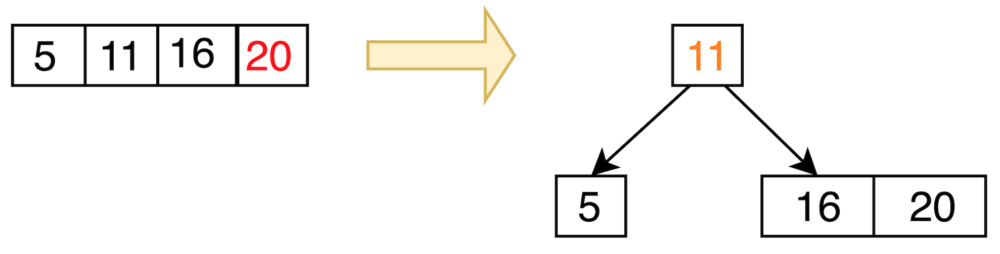

所以變成:

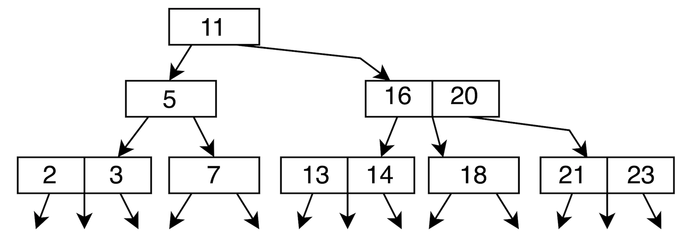

#### Exercise

1 ~ 10 依照順序插入 2-3-4 Tree，答案如下:

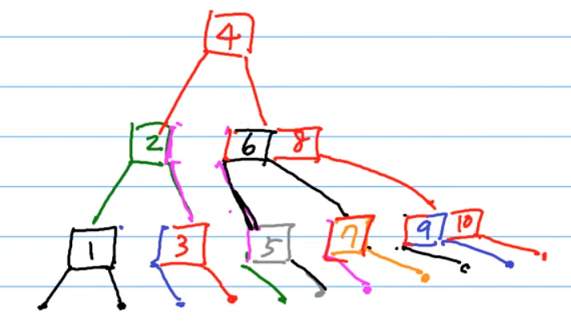

## Reference

- [NTU: DSA, Hsuan-Tien Lin](https://www.csie.ntu.edu.tw/~htlin/course/dsa20spring/)
- [wiki: 2-3-4樹](https://zh.wikipedia.org/zh-tw/2-3-4%E6%A0%91)
- [【資料結構】平衡搜索樹 - 紅黑樹、B樹(2-3,2-3-4樹)、B+樹](https://z1nhouse.github.io/post/5lQAWUQWk/)
- [2-3 樹/紅黑樹（red-black tree）學習筆記](https://www.796t.com/content/1544501883.html)
