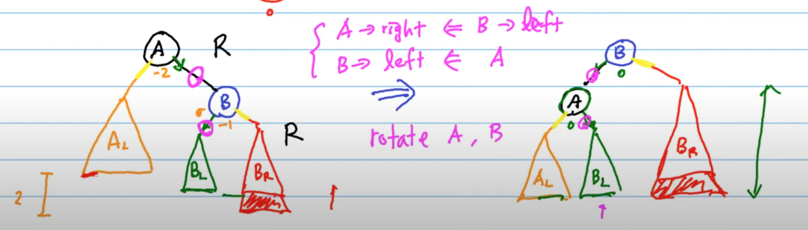
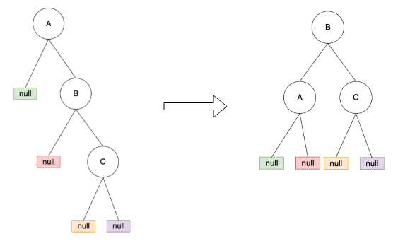
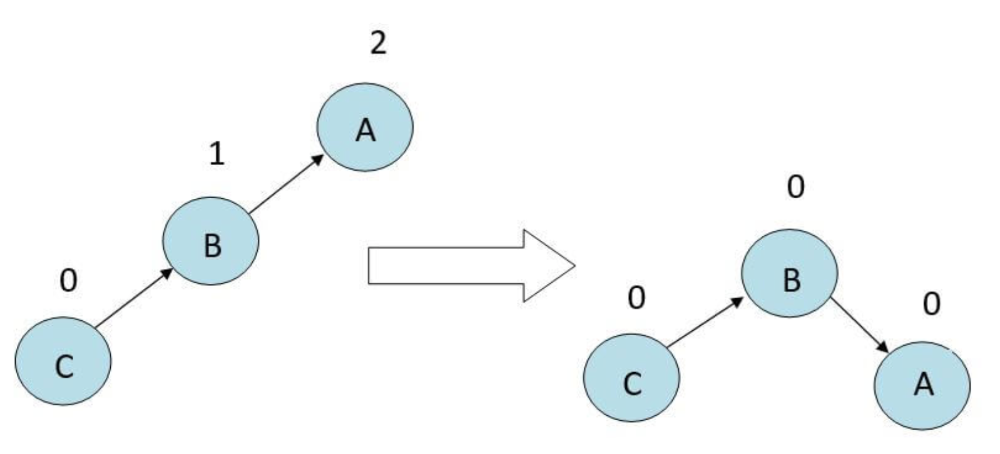
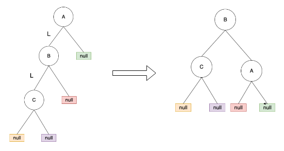
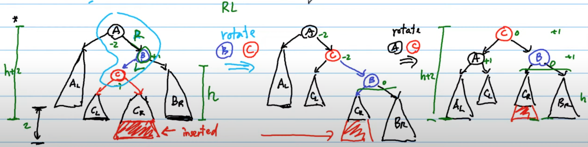
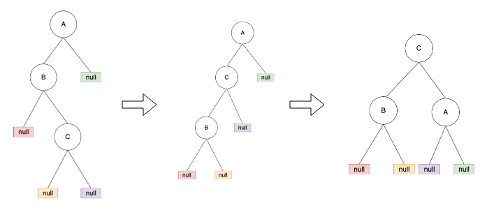
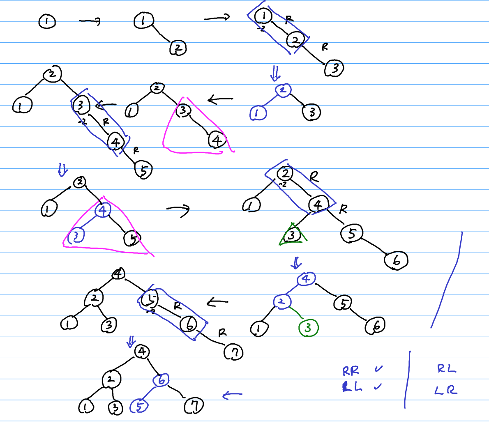

# AVL Tree

> 是 Balanced BST 的一種實作方式

> 與2-3-4樹及紅黑樹的差異: `rebalance almost immediately`

`Adelson-Velsky and Landis Tree (AVL Tree)` is a `Binary Search Tree (BST)` such that:

- The `difference` between the height of the left and right subtree is either -1, 0, or +1.

    公式: $|heighted(T_L) -  heighted(T_R)| \leq 1$

    ```
    Balanced Factor (BF): 1, 0, -1
    ```

從上性質可得:

```
AVL Tree: BST + Balanced Binary Tree
```

## 實作 AVL Tree: Rebalancing (Rotation)

在遇到不平衡情況時，為維持樹的平衡，需要調整樹的節點，這邊稱為 `Rotation`。如下所示:

Example:

1. 有三個點 3, 5, 8 (`RR`)

    ```sh
    3 BF: -2                             5
     \              AVL maintain        / \
      5 BF: -1     ==============>     3   8
       \
        8 BF: 0
    ```

2. 有三個點 3, 5, 4 (`RL`)

    ```sh
        3 BF: -2                     3                          4
         \           rotate 4, 5      \      rotate 3, 4       / \
          5 BF: 1   ==============>    4    ==============>   3   5
         /                              \
        4 BF: 0                          5
    ```

- Rotation 有個很重要的目的: rotation 前與後的樹的 `in-order traversal` 相同 。

### 插入 (Insertion)

```
1. Binary Search Trees 的 insertion
2. 向上檢查高度是否符合AVL限制。(算 BF)
3. 如果符合，結束。
4. 如果不符合，旋轉。
```

- 如發現該節點的`BF>1`時，請往下找兩層，並根據這兩層的左右方向，進旋轉。且旋轉類型有四種:
    - `LL型`：當插入的點在該節點的左邊的左邊
    - `RR型`：當插入的點在該節點的右邊的右邊
    - `LR型`：當插入的點在該節點的左邊的右邊
    - `RL型`：當插入的點在該節點的右邊的左邊

### RR型:當插入的點在該節點的右邊的右邊

> Rotating the node in the `anti-clockwise` direction.

"C" sub-tree 被新增到 "A" 的右節點的右節點。如下所示:





```
只跟 A, B 點有關，就是把 B 抓起來當頭，然後
- B 的左邊接 A
- A 的右邊接 B 的 左邊
```

- `逆時針旋轉`，B 變新的 root
  - B.left -> A
  - A.right -> B.left

##### *** 只要找到第一個不平衡的地方，調整完即可。 (一次調整)

### LL型:當插入的點在該節點左邊的左邊

> Rotating the node in the `clockwise` direction.

"C" sub-tree 被新增到 "A" 的左節點的左節點。如下所示:





```
只跟 A, B 點有關，就是把 B 抓起來當頭，然後
- B 的右邊接 A
- A 的左邊接 B 的 右邊
```

- `順時針旋轉`，B 變新的 root
  - B.rigth -> A
  - A.left -> B.right

##### *** 只要找到第一個不平衡的地方，調整完即可。 (一次調整)

### RL型:當插入的點在該節點的右邊的左邊

> `Right-left Rotation` is the combination of `RR rotation` and `LL rotation`.

```
RL = RR + LL
```

所以我們:

1. 先處理 susbtree 的 LL rotation
2. 再處理 full tree 的 RR rotation

如下所示:




### LR型:當插入的點在該節點的左邊的右邊

> `Right-left Rotation` is the combination of `LL rotation` and `RR rotation`.

```
RL = LL + RR
```

所以我們:

1. 先處理 susbtree 的 RR rotation
2. 再處理 full tree 的 LL rotation

如下所示:



### Example

1. RR or LL

    data: {1, 2, 3, 4, 5, 6, 7}

    

## Reference

- [NTU: DSA, Hsuan-Tien Lin](https://www.csie.ntu.edu.tw/~htlin/course/dsa20spring/)
- [資料結構與演算法：AVL Tree](https://josephjsf2.github.io/data/structure/and/algorithm/2019/06/22/avl-tree.html)
- [[資料結構] CH8. AVL Trees](https://hackmd.io/@Zero871015/rJksqh83X?type=view)
- [AVL-高度平衡二元搜尋樹](https://www.notes-hz.com/post/128)
- [AVL Tree Rotation](https://www.educba.com/avl-tree-rotation/)
