# 紅黑樹 (Red-Black Tree)

> `紅黑樹 (Red-Black Tree)` 是一種`自平衡二元搜尋樹 (self-balancing binary search tree)`:
>
> - 比 [2-3-4 樹](https://github.com/kaka-lin/Notes/tree/master/DSA/Tree/Binary%20Tree/Binary%20Search%20Tree/2-3-4%20Tree)好 implement。
> - 平衡性要求比 [AVL Tree](https://github.com/kaka-lin/Notes/tree/master/DSA/Tree/Binary%20Tree/Binary%20Search%20Tree/AVL%20Tree) 還寬鬆。

紅黑樹是利用節點顏色來檢視二元樹每條延展的路徑高度是否差不多，因此發明者訂立了以下幾點規則:

- 樹上的每個節點 (node) 只能是紅色或黑色
- 根節點 (root) 一定要是黑色
- 葉節點 (leaf) 一定要是黑色的空值 (NULL)
- 紅色節點的兩個子節點 (child) 一定要是黑色

    ```
    亦即不能有兩個紅色節點相連
    ```
    > 注意：黑色節點的子節點顏色沒有限制

- 從任何節點出發，其下至葉節點所有路徑的黑色節點數目要相同

    ```
    保持黑平衡的二元樹，嚴格來說不是平衡二元樹。
    ```

我們從 [2-3-4 Tree](https://github.com/kaka-lin/Notes/tree/master/DSA/Tree/Binary%20Tree/Binary%20Search%20Tree/2-3-4%20Tree) 出發來學習理解 Red-Black Tree (紅黑樹)。

## Mapping 2-3-4 Trees into Red-Black Trees

從 2-3-4 Tree 的結構我可以發現，太複雜很難 implement，
我們想要一個 binary 的形式，因為他很好寫很好實作，

所以我們`用 binary tree 來表示 2-3-4 Tree`:

    2-3-4 Tree 的每一種 node 都對應到 binary search tree 的一種每一種 node

如下所示:

- 2 node:

    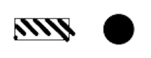
    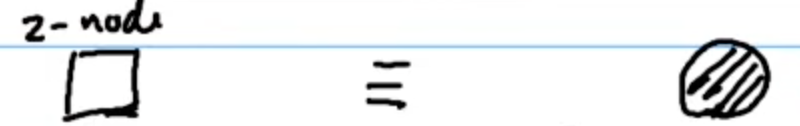

    ```
    自己就是這個 node 的代表，把他塗成黑色的
    ```

- 3 node:

    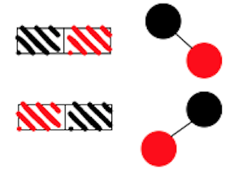
    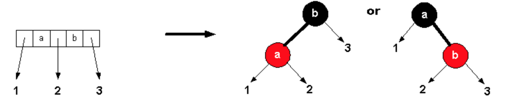

    ```
    可以小的當代表，也可以大的當代表。
    ```

- 4 node:

    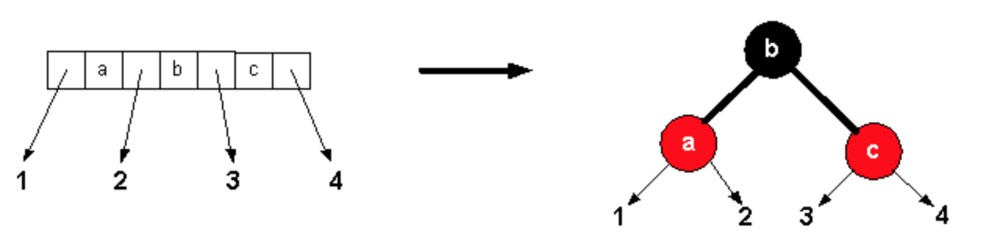
    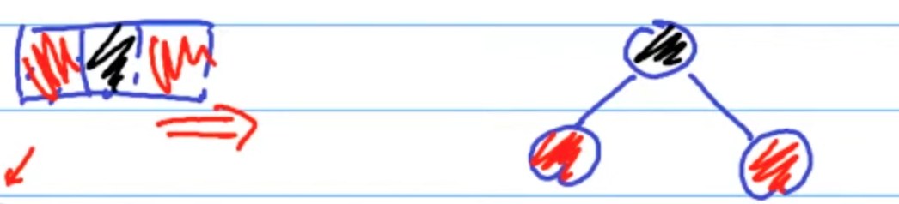

    ```
    中間的當代表，把他塗成黑色的。
    其他不是代表的，把它塗成紅色。
    ```

從上可知: `一個2-3-4樹可以轉換成不止一種型態的紅黑樹，但一個紅黑樹僅能轉換成一種2-3-4樹。`

### Example

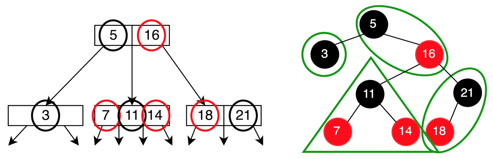

## Insertion

1. 在新增節點時，新插入的節點一律都為紅色
2. 往上檢查是否符合紅黑樹各項規則，如果不符合則執行下列操作:
    - Recolor
    - Rotation
    > 通常都是 `Rotation + Recolor` => `Restructure`

插入口訣:

```
新生先為紅
紅父不能融
黑叔逼爺退
紅叔變色龍
```

插入情境如下所示。

### 1. 紅黑樹為空，插入節點後成為根節點

一開始插入都預設為紅色，但因為根節點須為黑色，
所以 Recolor 為黑色。

> 規則: 根節點 (root) 一定要是黑色

### 2. 在黑色節點下插入節點

一開始插入都預設為紅色，但沒違反規則，所以不用變色。

> 規則: 黑色節點的子節點顏色沒有限制

### 3. 在紅色節點下插入節點 (最重要！)

一開始插入都預設為紅色，此時違反規則，需調整。

> 規則: 紅色節點的兩個子節點 (child) 一定要是黑色

此時可得口訣:

```
新生先為紅
紅父不能融
```

此情景又可分為兩種情況，如下所示。

#### Case 1: Uncle 節點是黑色節點 or Null 節點

此種情況就是 AVL Tree 的 RR/LL/RL/LR 型。
需進行 `Restructure (旋轉 + 變色)` 操作。

以下用 RR 舉例:

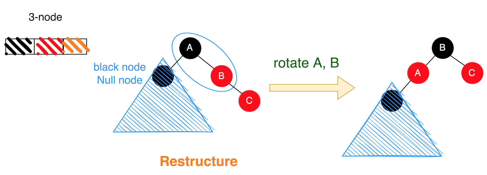

> 口訣: 黑叔逼爺退 -> Restructure (旋轉 + 變色)

#### Case 2: Uncle 節點是紅色節點

此情境在紅黑樹中較簡單，只需進行`變色(Recolor)`動作即可。如下:

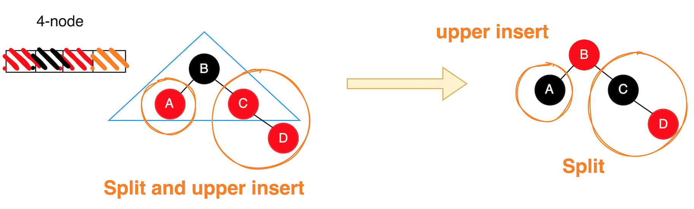

> 口訣: 紅叔變色龍 -> Recolor (變色)

##### 分析

- 在 AVL Tree 中: 需進行 `split (分家) and upper insert` 的動作
- 在 Red-Black Tree 中: 只需進行 `Recolor (變色)` 的動作

所以，`Red-Black Tree 比 AVL Tree 好實作`。

> - Change color: easy (且只需要一個 bit 即可解決)
> - Split: hard

### Example

有一個紅黑樹如下:

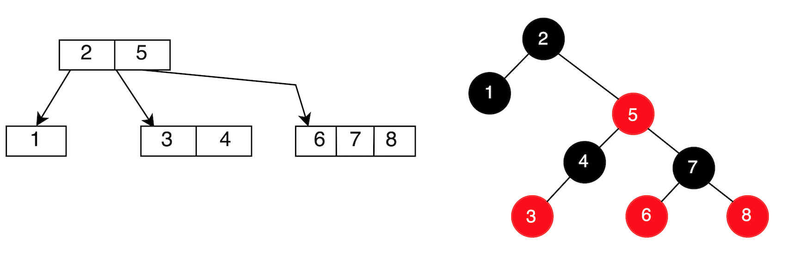

Step 1: 插入 1.5 及 4.5

因為都是在黑色節點下插入，所以不用作任合處理。如下:

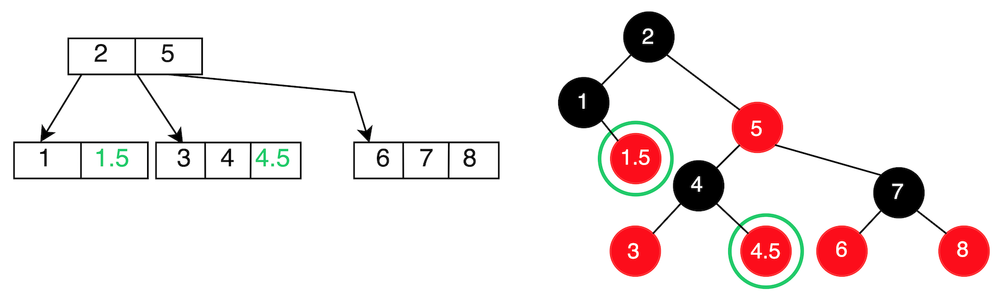

Step 2: 插入 1.8 及 9

此時會碰到在紅色節點下插入的情境，我們分開來看:

1. 插入 1.8:

    此時碰到 `Uncle 節點是黑色節點 or Null 節點`，且為 `RR` 型，於是直接 `Rotate + Recolor`，如下:

    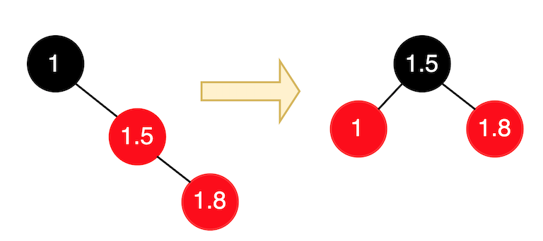

    > 口訣: 黑叔逼爺退 -> Restructure (旋轉 + 變色)

2. 插入 9:

    此時碰到 `Uncle 節點是紅色節點`，直接`變色(Recolor)`，如下:

    

所以紅黑樹變為:

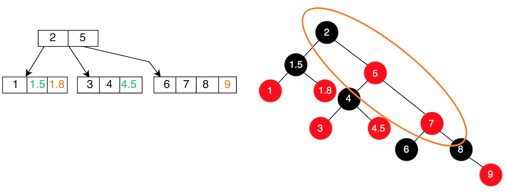

發現此時又遇到 `Uncle 節點是黑色節點 or Null 節點`的情境，且為 RR 型，於是再進行一次`Rotate + Recolor`，如下:

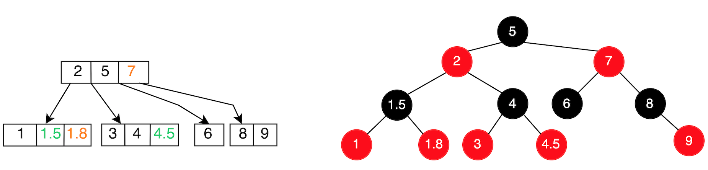

檢查了一下，發現都符合紅黑樹規則，於是就完成了。

## 紅黑樹 v.s. AVL Tree

雖然紅黑樹和AVL樹的時間複雜度都為 `O(logn)`，但:

  - 紅黑樹的高度: `2logn`
  - AVL樹高度: `logn`

紅黑樹 vs AVL Tree:

  - 紅黑樹「查找」較AVL樹: `慢`
  - 紅黑樹「添加與刪除」較AVL樹: `快`

若光只查詢，AVL樹查詢的速度快於紅黑樹；若需要頻繁的新增與刪除元素，紅黑樹則優於AVL樹。

> 常常用紅黑樹來實作 set 和 dictionary，C++ 中的 `std::set` 和 `std::map` 背後正是紅黑樹。

## Reference

- [NTU: DSA, Hsuan-Tien Lin](https://www.csie.ntu.edu.tw/~htlin/course/dsa20spring/)
- [wiki: 紅黑樹](https://zh.wikipedia.org/zh-tw/紅黑樹)
- [Mapping 2-3-4 Trees into Red-Black Trees](https://azrael.digipen.edu/~mmead/www/Courses/CS280/Trees-Mapping2-3-4IntoRB.html)
- [【資料結構】平衡搜索樹 - 紅黑樹、B樹(2-3,2-3-4樹)、B+樹](https://z1nhouse.github.io/post/5lQAWUQWk/)
- [Red-Black Tree / 紅黑樹](https://medium.com/@imprld01/red-black-tree-%E7%B4%85%E9%BB%91%E6%A8%B9-8d793e692d70)
- [紅黑樹（Red Black Tree）介紹 ](https://tigercosmos.xyz/post/2019/11/algorithm/red-black-tree/)
- [資料結構與演算法：Red Black Tree 紅黑樹 part 1](https://josephjsf2.github.io/data/structure/and/algorithm/2020/04/28/red-black-tree-part-1.html)
