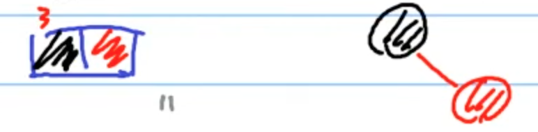
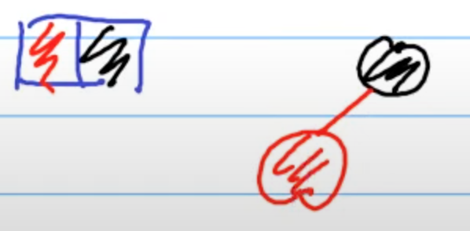

# 紅黑樹 (Red-Black Tree)

> `紅黑樹 (Red-Black Tree)` 是一種`自平衡二元搜尋樹 (self-balancing binary search tree)`:
>
> - 比 [2-3-4 樹](https://github.com/kaka-lin/Notes/tree/master/DSA/Tree/Binary%20Tree/Binary%20Search%20Tree/2-3-4%20Tree)好 implement。
> - 平衡性要求比 [AVL Tree](https://github.com/kaka-lin/Notes/tree/master/DSA/Tree/Binary%20Tree/Binary%20Search%20Tree/AVL%20Tree) 還寬鬆。

紅黑樹是利用節點顏色來檢視二元樹每條延展的路徑高度是否差不多，因此發明者訂立了以下幾點規則:

- 樹上的每個節點 (node) 只能是紅色或黑色
- 根節點 (root) 一定要是黑色
- 葉節點 (leaf) 一定要是黑色的空值 (NULL)
- 紅色節點的兩個子節點 (child) 一定要是黑色

    ```
    亦即不能有兩個紅色節點相連
    ```
    > 注意：黑色節點的子節點顏色沒有限制

- 從任何節點出發，其下至葉節點所有路徑的黑色節點數目要相同

    ```
    保持黑平衡的二元樹，嚴格來說不是平衡二元樹。
    ```

我們從 [2-3-4 Tree](https://github.com/kaka-lin/Notes/tree/master/DSA/Tree/Binary%20Tree/Binary%20Search%20Tree/2-3-4%20Tree) 出發來學習理解 Red-Black Tree (紅黑樹)。

## Mapping 2-3-4 Trees into Red-Black Trees

從 2-3-4 Tree 的結構我可以發現，太複雜很難 implement，
我們想要一個 binary 的形式，因為他很好寫很好實作，

所以我們`用 binary tree 來表示 2-3-4 Tree`:

    2-3-4 Tree 的每一種 node 都對應到 binary search tree 的一種每一種 node

如下所示:

- 2 node:

    
    

    ```
    自己就是這個 node 的代表，把他塗成黑色的
    ```

- 3 node:

    
    
    

    ```
    可以小的當代表，也可以大的當代表。
    ```

- 4 node:

    
    

    ```
    中間的當代表，把他塗成黑色的。
    其他不是代表的，把它塗成紅色。
    ```

從上可知: `一個2-3-4樹可以轉換成不止一種型態的紅黑樹，但一個紅黑樹僅能轉換成一種2-3-4樹。`

### Example


## 紅黑樹 v.s. AVL Tree

雖然紅黑樹和AVL樹的時間複雜度都為 `O(logn)`，但:

  - 紅黑樹的高度: `2logn`
  - AVL樹高度: `logn`

紅黑樹 vs AVL Tree:

  - 紅黑樹「查找」較AVL樹: `慢`
  - 紅黑樹「添加與刪除」較AVL樹: `快`

若光只查詢，AVL樹查詢的速度快於紅黑樹；若需要頻繁的新增與刪除元素，紅黑樹則優於AVL樹。

## Reference

- [NTU: DSA, Hsuan-Tien Lin](https://www.csie.ntu.edu.tw/~htlin/course/dsa20spring/)
- [wiki: 紅黑樹](https://zh.wikipedia.org/zh-tw/紅黑樹)
- [Mapping 2-3-4 Trees into Red-Black Trees](https://azrael.digipen.edu/~mmead/www/Courses/CS280/Trees-Mapping2-3-4IntoRB.html)
- [【資料結構】平衡搜索樹 - 紅黑樹、B樹(2-3,2-3-4樹)、B+樹](https://z1nhouse.github.io/post/5lQAWUQWk/)
- [Red-Black Tree / 紅黑樹](https://medium.com/@imprld01/red-black-tree-%E7%B4%85%E9%BB%91%E6%A8%B9-8d793e692d70)
- [紅黑樹（Red Black Tree）介紹 ](https://tigercosmos.xyz/post/2019/11/algorithm/red-black-tree/)
