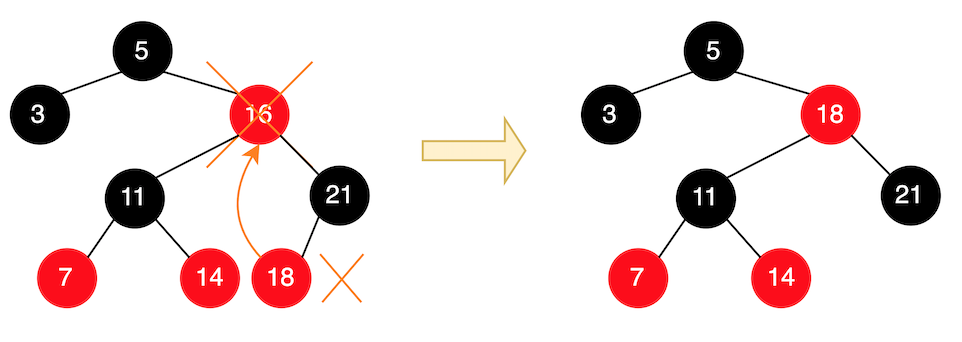
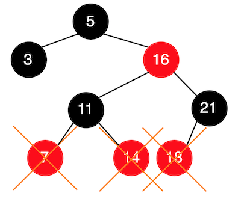
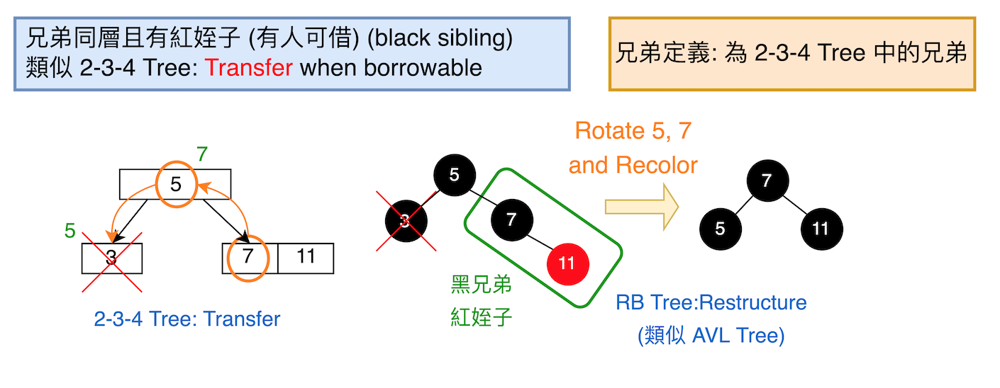
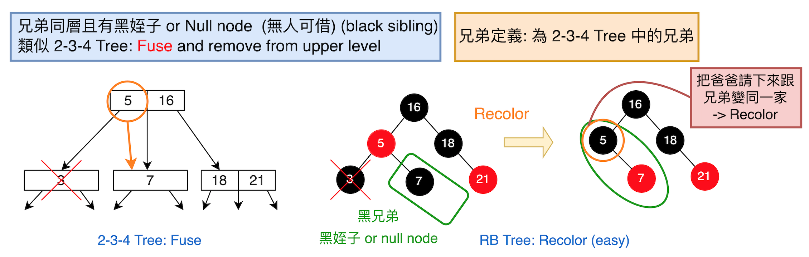
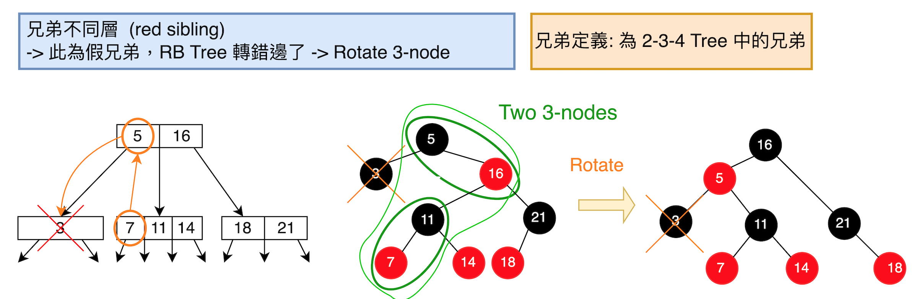
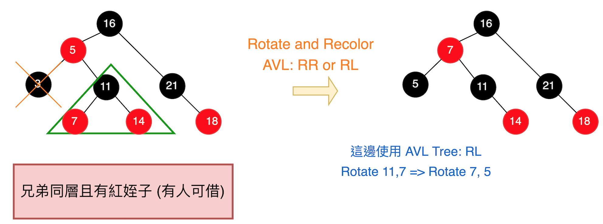
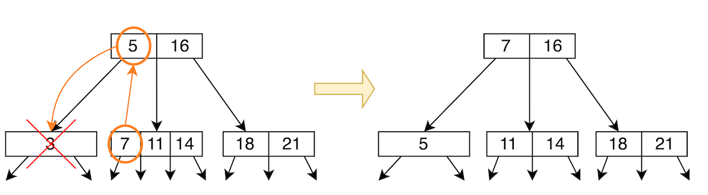

# 紅黑樹 (Red-Black Tree) 介紹 - Part 2: Removal

> BST 重要概念: 我們希望 Removal 發生在 leaf node。

刪除節點有兩種: `刪除葉節點`與`刪除非葉節點`。但我們希望 Removal 發生在 leaf node，因為從中間砍掉在組合回來是很麻煩的一件事。如下所示:



從上圖可知，我們想要`刪除非葉節點`，我們可以:

- `將其左子樹中最大的點提上來補`
- `將其右子樹中最小的點提上來補`

```
範例為 remove 16，然後 18 上去補 16 的位置。
```

> 於是我們`可以將任何 remove node 改成 remove leaf node`

且 Remove leaf 有三種情境:

- Remove `red node`: easy
- Remove `black node`
  - `Black sibling and has red child`: restructure
  - `Black sibling and has black/null child`: recolors
  - `Red sibling`: rotate 3-node

    ```
    找不到真兄弟，需要重新旋轉
    ```

## Case 1: Remove `Red node`: easy

```
直接移除即可。
```

如下所示:



## Case 2: Remove `Black` node: easy

有三種情形，如下。

### Case 2-1. `Black sibling and has red child`

```
類似 2-3-4 Tree 中的 Transfer
> Transfer when borrowable
```

有黑色的兄弟跟紅色的姪子，需 `Rotate and Recolor`，
如下圖所示:



### Case 2-2: `Black sibling and has black child`

```
類似 2-3-4 Tree 中的 Fuse
> Fuse and remove from upper level
```

有黑色的兄弟跟黑色的姪子或是沒有姪子(Null node)，直接 `Recolor`，如下圖所示:



- 注意: 因為這邊操作是把爸把往下移跟兄弟變成新家，還需判斷:
  - 原本為紅色節點:

    ```
    改成黑色節點，結束。
    ```
    > 因為他在原本那層本來就是小弟，往下移不會有影響

  - 原本為黑色節點:

    ```
    則需在判斷 upper level 移掉這個點後
    會有什麼影響，直到結束。
    ```
    > 因為他在原本那層是大哥，往下移則會少一層，
    > 需要重新調整，如: 看有無兄弟可借等等的。

### Case 2-3: Red sibling

此 Red sibling 為假兄弟，需 `Rotate 3-node` 後，再進行相關處理，看他是 [2-1. 有人可以借](#2-1-black-sibling-and-has-red-child) 或是 [2-2. 無人可借](#2-2-black-sibling-and-has-black-child) 的情形，如下所示:



轉完後發現:
- `黑色的兄弟跟紅色的姪子`，所以有人可借
- 為 `AVL RL` 型

所以我們操作如下:



對照 2-3-4 Tree



## Reference

- [DSA 20200602: 2-3-4 Tree / Red-Black Tree](https://youtu.be/gqphGLSGyQ4)
- [wiki: 紅黑樹](https://zh.wikipedia.org/zh-tw/紅黑樹)
- [Red-Black Tree / 紅黑樹](https://medium.com/@imprld01/red-black-tree-%E7%B4%85%E9%BB%91%E6%A8%B9-8d793e692d70)
- [1.4.3.3 RB Tree Delete](https://clu.gitbook.io/data-structure-note/1.4.3.3-rb-tree-delete-implementation)
- [Red Black Tree: Delete(刪除資料)與Fixup(修正)](http://alrightchiu.github.io/SecondRound/red-black-tree-deleteshan-chu-zi-liao-yu-fixupxiu-zheng.html)
- [資料結構與演算法：Red Black Tree 紅黑樹 part 2](https://josephjsf2.github.io/data/structure/and/algorithm/2020/04/28/red-black-tree-part-2.html)
