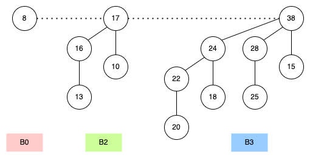

# Binomial Heap

## 前言: 均攤 (Amortization) 介紹

在開始介紹 Binomial Heap 前，我們先來看看 Heap (Min Heap or Max Heap) 的 operation 時間複雜度:

- insert: O(log n)
- remove/delete: O(log n)

思考: 我們能不能減少 insert 的時間複雜度 -> O(1)，但一樣保持很快的 remove？

Ans:

```
hard if every operation O(1)
possible if "amortized (均攤)" O(1)
```

- `amortized(均攤)`:

    有時候花多一些時間，有時候花少一些時間，平均起來會是固定的時間

    example: Dynamic Array (extendable)

### Amortized on Heap Tree

- `Cheap insertion usually`:

    insert to "small tree" usually

- `Expensive insertion sometimes`:

    insert to "big tree" sometimes

這邊就有小樹跟大樹同時存在。一個 data structure 有很多棵樹就稱為 `Forest (森林)`。

## Binomial Tree (二項式樹)

`Binomial Tree` 定義如下:

- A binomial tree of order 0 is a single node
- A binomial tree of order k has a root node whose children are roots of binomial trees of orders  k-1, k-2, ..., 2, 1, 0 (in this order).

如下圖所示:


圖片來源: [Url](https://hackmd.io/@Zero871015/DSNote-19)

由上圖我們可以得知:

- $B^k$ node 數: $2^K$ nodes
- $B^k$ 高度為: k
- Degree of root: k

## Binomial Heap (二項式堆積)

Binomial Heap 就是由 Binomial Tree 組合而且，
且每一個 Binomial Tree 都是 Heap Tree。

> Binomial Heap is a collection of binomial trees,
> and each binomial tree is heap tree.

Example:

- n = 10: 8 (B3) + 2 (B1)
- n = 13: 8 (B3) + 4 (B2) + 1 (B0)

如下圖所示，以下用 Max Heap 舉例:



Example of a binomial heap containing 13 nodes. The heap consists of three binomial trees with orders 0, 2, and 3.

### Binomial Heap: Sequence of Inserts

現在來看一下如何插入 node 到 Binomial Heap 裡，
假設現在有一個空的 Binomial Heap，如下:

```
binomial heap: {}

Step 1.
  insert 5 into {} => { B0 }

  => { 5 }

Step 2.
  insert 7 into { 5 } => { B1 }

  *** 7 也是一個小的 binomal heap { B0 }
     => merger { B0, B0 } => { B1 }

  =>  7
      |
      5

Step 3.
  insert 3 into { B1 } => { B0, B1}

  => 3, 7
        |
        5

Step 4.
  insert 2 into { B0, B1 } => { B2 }

  => merge { B0, B0 } to { B1 }, merge { B1, B1 } to { B2 }

  => 3  7    =>      7
     |  |          / |
     2  5         3  5
                  |
                  2
```

由上可知, insert N nodes 時:

1. erevry one insertation: add B0, O(n)
2. 每 2 輪要 merge { B0, B0 }, n/2
3. 每 4 輪要 merge { B1, B1 }, n/4
4. 每 8 輪要 merge { B2, B2 }, n/8

After n insertions (insert + merge):

$$ \frac{n}{2^k} + \frac{n}{2^{k-1}} + \frac{n}{2^{k-2}} + ... + n = O(n) $$

- time complexity: `O(n), amortized O(1)`

### Find Maxmum/Minimum

- time complexity: `O(log n)`

### Delete Maxmum/Minimum

- time complexity: `O(log n)`

## Reference

- [DSA 20200505: Heap/Hash Table](https://www.youtube.com/watch?v=SBQLkYIDAZI)
- [wiki: Binomial heap](https://en.wikipedia.org/wiki/Binomial_heap)
- [[資料結構] CH19. Heaps](https://hackmd.io/@Zero871015/DSNote-19)
