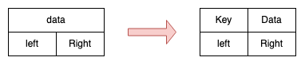
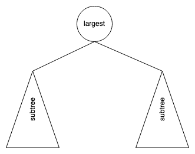
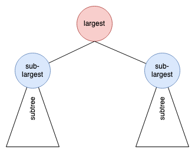

# Heap Tree

> 用 Tree 了解他，用 Array 實作相關的 operation

從 Binray Tree 的觀念出發，首先將原本 Tree 的 node 加上 `Key (檢索鍵)`，如下:



- `key:` `priority` or weights or others
- `data`: original data (like: `todo`)

有分:

- `Min Heap`(最小堆積):

    A min heap is a complete binary tree that is also a min tree.

- `Max Heap`(最大堆積):

    A max heap is a complete binary tree that is also a max tree.

    又稱 `complete binary max tree)`

概念類似 `priority queue (heap on array)`。

以下假設為沒有 priority queue 的年代，
用 Tree 的特性來設計 priority queue。

## 設計思路

- 需求: 最大的 Key 可以很快被找到
- 限制: 使用 Binary Tree 來實現
- 目標: `Max Heap` / priority queue, 降序 descending)

可簡單分為3個步驟1個限制:

1. 把最大的放在 root
2. 如何很快的找到下一個最大的值 (繼承人)

> 這兩步驟為第一步的設計，又被稱為`binary max tree`。

3. 用 Complete Binary Tree 來壓 tree 的高度
  - 限制: `先維持 complete binary tree 的性質`

> 要求 tree 的長相，稱為 `complete binary max tree`

各步驟詳細如下面介紹。

### 1. 把最大的放在 root

想法: 就直接把 Key 最大的放在 root。如下圖:



Exmaple:

```sh
      14
    /    \
   6      8
  / \    / \
 12  5  7   9
```

問題: 當把目前最大的 14 拿到後，需 traversal 剩下的所有 node 後，才能得到下一個最大的 node: 12

=> `超花時間`

### 2. 如何很快的找到下一個最大的值 (繼承人)

Subtree 的 root 也都分別各自 subtree 中最大的 (sub-largest)，如下圖:



當 largest 被拿走後，就是兩個 subtree 的 sub-largest 比較一下就知道下一個是誰要補位上去。

Example:

```sh
      14
    /    \
   12     9
  / \    / \
 6  5   7   8
```

### Binary Max Tree

上面兩步驟為第一步的設計，其又被稱為`binary max tree`。

- `root key >= other node's key`
- `every subtree is binary max tree`

操作步驟如下:

```sh
      14
    /    \
   12     9
  / \    / \
 6   5  7   8
```

1. Get  Largest: root, 14
2. Remove Largest and get sub-largest

    12 跟 9 比大小，但因為 12 補上去了，
    他的那個 subtree 也要再補一個 sub-largest

    => 6 跟 5 比較，6上去補位

```sh
      12
    /    \
   6      9
    \    / \
     5  7   8
```

如此循環下去。

> replace with largest of sub-root recursively

#### Worst time complexity

如果遇到 tree 是 `skewed binary tree (歪斜樹)` 時，

- time complexity O(h): `O(n)`

```sh
   50
  /
 48
  \
   30
  /
 21
  \
   10
   /
  3
```

binary max tree maintain 時要花很大力氣。

下一個思考思路就是:

-> `壓低 tree`，讓 `time complexity O(h) 從 O(n) 變為 O(log n)`

### 3. 用 Complete Binary Tree 來壓 tree 的高度

要求 tree 的長相，稱為 `complete binary max tree`

> 不用 perfect (full) binary tree 的原因是因為 node 數量都是奇數

我們要如合結合 complete binary tree 與 binary max tree 呢？

Example:

```sh
      14
    /    \
   12     9
  / \    /
 4   8  5
```

1. Get  Largest: root, 14
2. Remove Largest and get sub-largest

    12 跟 9 比大小，但因為 12 補上去了，
    他的那個 subtree 也要再補一個 sub-largest

    => 8 跟 4 比較，8上去補位

```sh
      12
    /    \
   8     9
  /     /
 4     5
```

> Note: 可能會想說把 5 往左移。但如果不是 5 是 8.5 呢？

這樣變成不是 complete binary tree 了，
事情變麻煩了，不好做。

> 換個思路思考!

#### 先維持 complete binary tree 的性質

```
缺位時，先維持 complete binary tree 的性質
```

當 remove node 時，先讓最尾把的 node 補上來

=> `維持 complete binary tree`

然後再讓 root 去跟 sub-largest 去比。

Example:

```sh
      14
    /    \
   12     9
  / \    /
 4   8  8.5
```

先讓最尾把的 node 補上來:

```sh
      8.5
    /    \
   12     9
  / \
 4   8
```

然後再去跟 sub-largest 比:

```sh
      12
    /    \
   8.5    9
  / \
 4   8
```

然後 8.5 再去跟他的 sub-tree 去比，如此循環。

### 結論

`Complete binary max tree` 就是一般所稱的 `Max Heap`。

操作步驟如下:

```
Remove:
   1. move last node to root (complete binary tree)
   2. sink down to keep binary max tree
        time complexity: O(log n)
```

#### Insertion node

如果要新增 node，一樣先插在最後面，維持 complete binary tree，再去檢查 binary max tree 性質。

```
insertion:
   1. insert at last (com plete binary tree)
   2. floot up to keep binary max tree
        time complexity: O(log n)
```

範例如下，插入 node 17:

1. 放在最後面，維持 complete binary tree

```sh
      14
    /    \
   12     9
  / \    /  \
 4   8  8.5  17
```

2. 逐項比大小，維持 binary max tree 性質

```sh
      14
    /    \
   12     17
  / \    /  \
 4   8  8.5  9
```

```sh
      17
    /    \
   12     14
  / \    /  \
 4   8  8.5  9
```

## Heap v.s Array

- Complete binary tree -> array
- Heap tree -> partially ordered array

    ```sh
          14
        /    \
       12     9   -> 14, 12, 9, 4, 8, 8.5
      /  \   /
     4    8 8.5
    ```

## Heap sort

假設已經有 array 與 heap

- select sort on array: O(n^2)

    ```
    n^2: O(n)次 * O(n)找
    ```

- select sort on heap: O(n*log n)

    ```
    n*log n: O(n)次 * O(1)找 + O(log n)排
    ```

那建好一個 heap 要花多少力氣？

```
利用 insertion 建立 heap
建立力氣: O(n)insertion * O(log n) -> O(nlog n)
```

所以:

1. 從 unordered arry 變成 heap: O(nlog n)
2. 再從 heap 去 sort: O(nlog n)

Heap sort time complexity: `O(nlog n)`

## Reference

- [DSA 20200421: Tree/Heap](https://www.youtube.com/watch?t=3340&v=RjvhXL0WTrY&feature=youtu.be)
