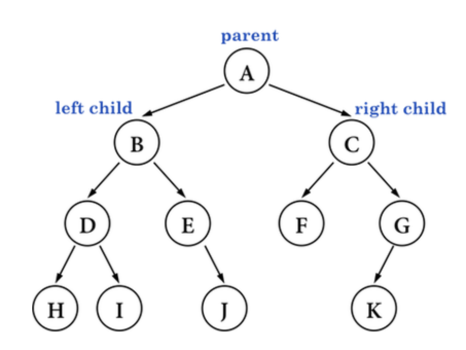
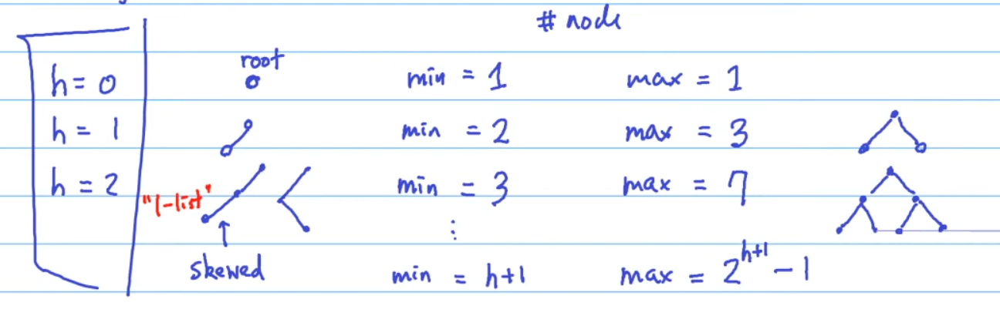
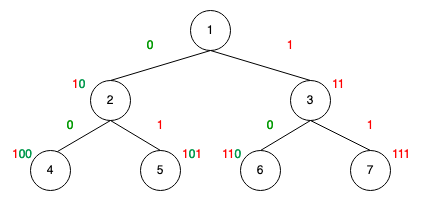
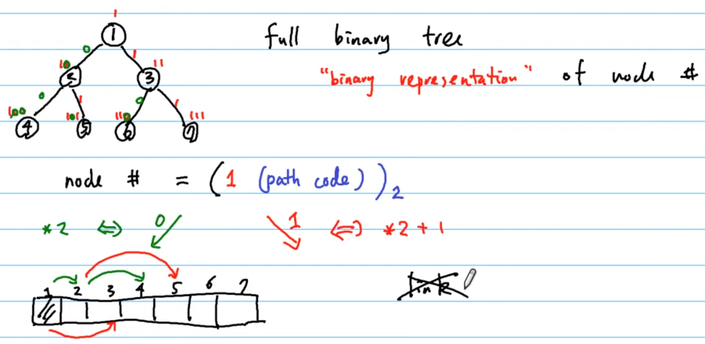

# Binary Tree (二元樹)

每個 node 最多就是只有 2 個 child node，並起稱兩個 child node 為 left child 和 right child。

> A binary tree is a tree data structure in which `each node has at most two children`, which are referred to as the `left child` and the `right child`.

如下圖所示:



## The height of the tree and amount of nodes

我們樹的高度與裡面能裝的node的數量有什麼關係？

在樹裡面我們在意的是某種程度的階層關係或是樹能長多高。從樹的高度會影響node的數量，這是很重要的，如: 現在有10萬筆資料，樹的最高與最矮差多少？

如下所示:



可得:

$$ h+1 \leq n \leq 2^{h+1} - 1 $$

假設今天是給定多少筆資料(n)，那今天樹的高度(h)是多少，如下:

$$ log_2(n+1) - 1 \leq h \leq n-1 $$

- lg(n): binary search -> 好的

    ```
    樹很矮，很接近 lon(n) 的高度，可以找很快
    ```

- n: sequence search -> 不好的

    ```
    樹很歪斜(skewed)，長得很像 Linked List
    需花 linear 的力氣
    ```

> 在做 tree 相關 data structure 與演算法設計時
> 目標都是努力的壓低樹的高度
> 且讓每一層找的次數是一次或不要太多次
> 這樣 search 的效率就會接近 log(n) -> binary search

## Types of Binary Trees

- `Full Binary Tree`

    Every node has either 0 or 2 children.

    > All nodes except leaf nodes have two children.

    ```sh
             1
          /     \
         2       3
        / \     / \
       4   5   6   7


             1
          /     \
         2       3
        / \
       4   5
          / \
         6   7


             1
          /     \
         2       3
        / \
       4   5
      / \
     6   7
    ```

- `Complete Binary Tree`

    除了最後一層，其他層的節點全部填滿，並且最後一層必須是從左向右填，中間沒有空缺。

    All levels are filled with nodes except the last level,  and in the last level, all the nodes are on the left side as possible.

    ```sh
             1
          /     \
         2       3
        / \     / \
       4   5   6   7

             1
          /     \
         2       3
        / \     / \
       4   5   6   7
      / \ /
     8  9 10
    ```

    > a complete binary tree doesn’t have to be a full binary tree.

- `Perfect Binary Tree`

    各層節點全滿。同時也是 `full binary tree` 和 `complete binary tree` 。

    All internal nodes have two children and all leaf nodes are at the same depth or same level.

    ```sh
             1
          /     \
         2       3
        / \     / \
       4   5   6   7

             1
          /     \
         2       3
    ```

- `Balanced Binary Tree`

    每個 node 的左子樹和右子樹的高度差為 0 or 1。

    - It is a type of binary tree in which the difference between the height of the left and the right subtree for each node is either 0 or 1.
    - For each node, its left subtree is balanced
    - For each node, its right subtree is balanced.

        ```sh
                  1
               /     \
              2       3
             / \
            4   5
        ```

        ***`Unbalance`

        ```sh
                1
             /     \
            2       3
           / \
          4   5
         /
        6
        ```

    > A binary tree is balanced if the height of the tree is O(Log n) where n is the number of nodes

- `Degenerate or Pathological Tree`

    A Tree where every internal node has one child. Such trees are performance-wise same as `linked list`.

    ```sh
           1
          /
         2
          \
           3
          /
         4
    ```

- `Skewed Binary Tree (歪斜樹)`

    A skewed binary tree `is a pathological/degenerate` tree in which the tree is either dominated by the left nodes or the right nodes. Thus, there are two types of skewed binary tree:

  - left-skewed binary tree (左歪斜樹): 一顆樹完全都往左邊長

    ```sh
           1
          /
         2
        /
       3
      /
     4
    ```
  - right-skewed binary tree (右歪斜樹): 一顆樹完全都往右邊長

    ```sh
     1
      \
       2
        \
         3
          \
           4
    ```

## Binary representation of node number

Consider a `Perfect Binary Tree` or `Completed Binary Tree`:

```sh
             1
          /     \
         2       3
        / \     / \
       4   5   6   7
```

二進制為:



從上可知:

- node number = (1 (path code)) 的 2 進制

    - 在一個`二進位`制後面`加一個 0` : 就是 `*2`

        ```
        110: 6
        1100: 12
        ```

        > C 語言中就是 `shift 一個 bit`

    - 在一個`二進位`制後面`加一個 1` : 就是 `*2+1`

        ```
        110: 6
        1101: 13
        ```

最喜歡使用編號的 data structure 為 Vector，
所以我們可以`用一個 Vector 來表示這個特別的 full binary tree`，如下圖所示:



## Reference

- [DSA 20200421: Tree](https://www.youtube.com/watch?v=XkNIHYd9Ruc)
- [Wiki: Binary tree](https://en.wikipedia.org/wiki/Binary_tree)
- [GeeksforGeeks: Binary Tree](https://www.geeksforgeeks.org/binary-tree-set-3-types-of-binary-tree/)
- [programiz: Binary Tree](https://www.programiz.com/dsa/binary-tree)
- [Different Types of Binary Tree with colourful illustrations](https://towardsdatascience.com/5-types-of-binary-tree-with-cool-illustrations-9b335c430254)
- [Binary Tree](https://web.ntnu.edu.tw/~algo/BinaryTree.html)
- [Binary Tree: Intro(簡介)](http://alrightchiu.github.io/SecondRound/binary-tree-introjian-jie.html)
