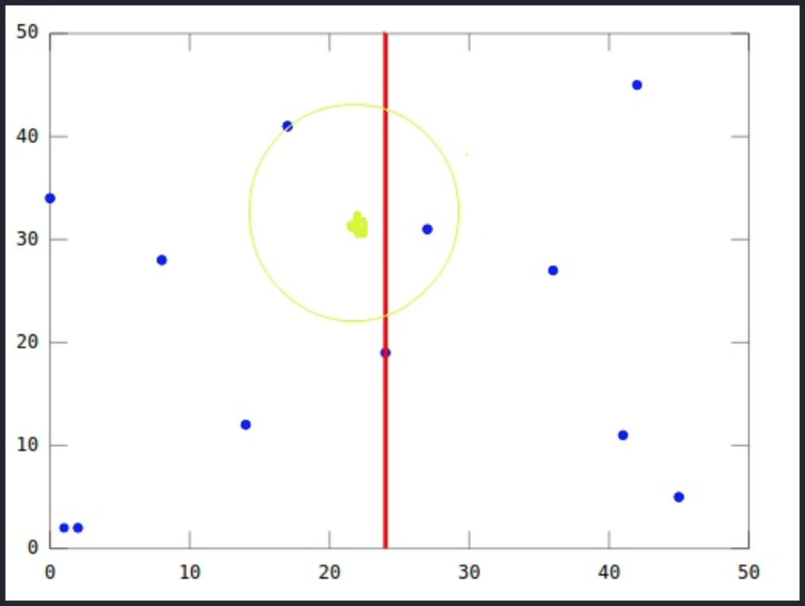
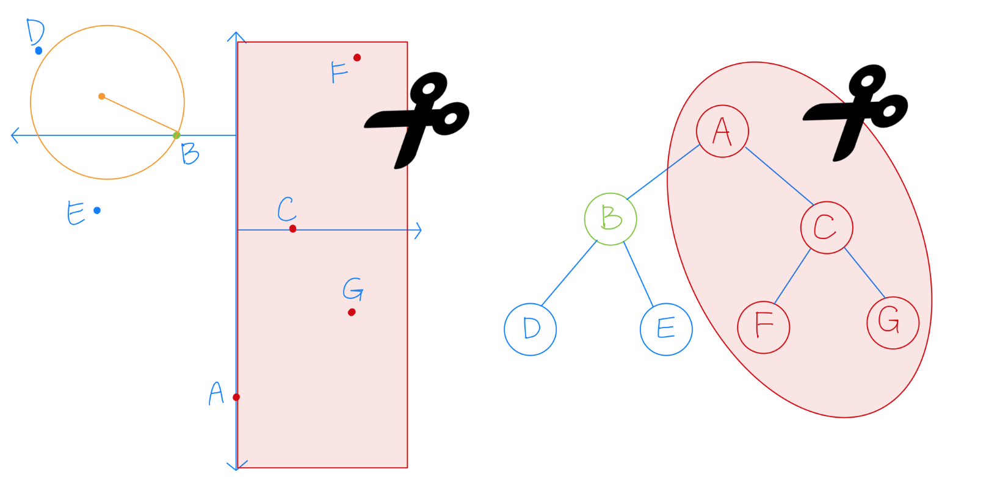
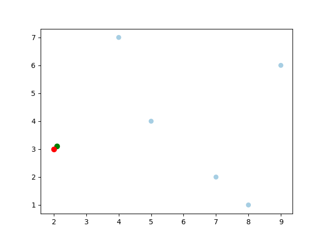

# K-D Tree

`KD Tree` 又稱 `K 維樹 (K-dimensional tree)`，是一種可以對 *K 維資料進行劃分的資料結構*。可以看成`二元搜尋樹的一種延伸`，的對空間中的維度做劃分。主要應用於多維空間關鍵資料的`近鄰查詢(Nearest Neighbor)`和`近似最近鄰查詢(Approximate Nearest Neighbor)`。


https://www.youtube.com/watch?v=Glp7THUpGow

## Introdction of KD Tree

二元搜尋樹就是將資料按造大小來建立樹，規則為:

- 若它的左子樹不為空，則左子樹上所有節點的值均小於它的根節點的值
- 若它的右子樹不為空，則右子樹上所有節點的值均大於它的根節點的值；
- 它的左、右子樹也分別為二元搜尋樹

如下所示:

```
    4
   / \
  2   6
 / \ / \
1  3 5  7
```

但此方法在只有一個維度的時候行的通，當資料超過一個維度的時候，該怎麼對二維以上的陣列進行劃分呢?

```
 一維陣列          二維陣列

    4
   / \
  2   6             ？
 / \ / \
1  3 5  7
```

### Theory

對於多維陣列，我們多了一個以上的維度，因此在劃分時沒有一個劃分依據。
此時我們是`選擇某一個維度(d)來對 K 維資料進行劃分`，這個動作在二維資料內相當於將空間劃分為兩個部分，一邊的值小於另一邊的所有值。如果我們繼續對這兩個空間進行上述劃分，又會得到新的子空間，對新的子空間又繼續劃分，重複以上過程直到每個子空間都不能再劃分為止。以上就是建立 KD 樹的過程。

上述過程中涉及到兩個重要的問題，如下:

1. 每次劃分時，應該選擇哪個維度進行劃分
2. 在某個維度上的進行劃分時，應該選擇哪個節點進行劃分，
   以確保建立的樹盡量地平衡(兩邊節點數量差不多)

   ```
   樹越平衡代表著分割得越平均，搜尋的時間也就是越少
   ```

### 劃分方法 (Splitting Rules)


- `Standard Split`
- `Midpoint Split`
- `Sliding-midpoint Split`

#### 標準分割 (Standard Split)

```
使創建出來的樹盡可能的保持平衡
```

維度選擇有兩種方法:

1. 選擇 `分佈(spread)最大的維度`。即數據集在該維度上，最大值減最小值的結果為所有維度中最大的維度。

    ```
    spread: 最大值和最小值之間的差
    ```

2. 選擇`變異數(variance)最大的維度`。即數據在該維度上，數據分散的比較開的維度，


劃分點選擇:

- 選擇數據集在該維度上的中位數做為劃分點

    ```
    the coordinate median of the points in that dimension.
    ```

##### 優點

- 劃分到左右子樹中數據數量相同（或相差 1），為平衡二元樹。

##### 缺點

- 維度選擇方法一，可能出現細長的 cell，容易增加回溯時遞迴搜尋的範圍。
- 維度選擇方法二，計算最大變異數的時間複雜度要高於計算最大 spread 的時間複雜度。

#### 中點分割 (Midpoint Split)

```
讓分割出的 cells 盡可能的減少產生細長的 cell，
使劃分出的兩個 cells 都是肥胖的。
```

- cell: KD Tree 把空間遞歸地劃分兩個不相交的超矩形(超平面、超立方體)，
        每個超矩形所佔的空間即為一個 cell。


維度選擇:

- cell 中最長邊對應的維度。如果有許多相等長度的邊，則可以首先選擇任何一條

劃分點選擇:

- cell 中最長邊對應的中心。

##### 優點

- 找中心比找中值的時間複雜度更低。

##### 缺點

- 導致數據集劃分不均勻，當數據大量聚集時，存在很多`無用的空間劃分`。

        即劃分時，所有數據都在一個區域，另一個區域沒有數據

#### 滑動中點分割 (Sliding-midpoint Split)

```
Midpoint Split 的改進版，規則大致相同
```

其認為兩種劃分為好的劃分:

1. 平衡的劃分: 使得劃分出的兩個子 cell 都是肥胖的

        Midpoint Split 中的思想。

2. 使得較肥胖的 cell 中含有較少的數據點。

        對無效劃分的處理


維度選擇:

- 選擇超矩形中最長邊對應的維度。同 midpoint split

劃分點的選擇:

- 首先嘗試中點分割
  - 數據點位於分割平面的兩側，則分割平面保留在此處
  - 所以數據點位於分割平面的一側 (`無效劃分`)，通過滑動分割點來消除無效劃分。

    若該維度的中點值為 a:

      - 若所有數據在該維度上都大於 a，則以數據集中最小值來劃分空間，使左子樹區域中有 1 個點，右子樹有 n-1 個點。

      - 若所有數據在該維度上都小於 a，則以數據集中最大值來劃分空間，使左子樹區域中有 n-1 個點，右子樹有 1 個點。

    如下圖所示:

    

    If all the data points lie to one side of the splitting plane, then splitting plane “slides” towards the data points until it encounters the first such point. One child is a leaf cell containing this single point, and the algorithm recurses on the remaining points.

##### 優點

- 可以消除無效的劃分。其可能存在細長的 cell，但其始終伴隨著一個該維度上較寬胖的 cell。

### 資料儲存方法

資料儲存方法有兩種:

1. 將 data 存在`所有節點 (node)`

    記錄下每個子樹中包含的所有資料。

    Example:

    ```
    (2,3), (5,4), (9,6), (4,7), (8,1), (7,2)
    ```

    

2. 僅將 data 存在`葉節點 (leaf node)`: `<k, m>`

    記錄下每個子樹所在的`分割維度k`和`分割值m`
    最後將該子集合中的資料儲存到 leaf node。

    Example:

    ```
    (2,3), (5,4), (9,6), (4,7), (8,1), (7,2)
    ```

    

## Example of Build KD Tree

這裡我們使用 `Standard Split` 方法來建立 KD Tree，且:

- 選則變異數(variance)最大的維度
- 選擇數據集在該維度上的中位數做為劃分點
- 將數據儲存在所有節點

dataset:

```
(2,3), (5,4), (9,6), (4,7), (8,1), (7,2)
```

### 步驟

1. 分別計算 x, y 方向上資料的變異數，得出 x 方向上的變異數最大
2. 根據 x 軸方向的值 (2, 4, 5, 7, 8, 9)，排序選出中位數為 5 和 7，這裡選擇 7 當作分割點，所以該節點中的資料為 (7, 2)。這樣該節點的分割超平面就是通過 (7, 2) 並垂直於 x 軸的直線 x = 7。
3. 確定左子空間和右子空間。以 x = 7 為分割超平面將整個空間分為兩個部分，x <= 7 的部分為左子空間，包含 3 個節點 (2, 3), (4, 7), (5, 4)，另一部分為右子空間，包含2個節點 (8, 1), (9, 6)。
4. 繼續對左子空間和右子空間內的資料重複步驟1~3，如此反覆值到空間中只包含一個資料點。

    ```
    KD Tree 的建立就是一個遞迴的過程
    ```

### 實作

Python: [kdtree.py](kdtree.py)
```python
def build_kdtree(self, points, depth=0):
    if len(points) <= 0:
        return None

    # 1. Select axis based on depth so that axis cycles
    #    through all valid values
    k = len(points[0])
    axis = depth % k # 2d: (x, y, x, y, ...)

    # 2. Sort point list and choose median as pivot element
    sorted_points = sorted(points, key=lambda point: point[axis])
    median = len(sorted_points) // 2

    # 3. Create node and construct subtress
    return {
        'point': sorted_points[median],
        'left': build_kdtree(sorted_points[:median], depth+1),
        'right': build_kdtree(sorted_points[median+1:], depth+1)
    }
```

## Nearest Neighbor Search in KD-Tree

KD Tree 建好之後，接下來就可以使用 KD Tree 對元素搜尋最近點，步驟如下:

- 查詢目標節點: Q
- 當前最佳節點: P

1. 將查詢資料 Q 從根節點開始，按照 Q 與各個節點的比較結果向下訪問Kd-Tree，直至達到葉節點(leaf node)。

    - 根據 Q 在分割維度中是否小於或大於當前節點，向左或向右移動。

2. 一旦算法到達葉節點，該節點被保存為當前最佳節點 P。

3. 取出之前走訪過的節點 C (即`回溯`)，並計算 Q 與 C 的距離

    - 如果 C 比 P 更接近 C ，則更新 P (當前最近鄰點和最小距離)。

4. 檢查在 C 分割面的另一邊是否有比 P 距離更近的節點。

    從概念上來說，以 Q 為中心，以 P 為半徑劃一個超球面，看這個超球面是否穿過了分割平面。
    因為平面都是座標軸對應的，所以只需要簡單比較 `Q` 和`當前節點分割面`的距離是否比 P 距離更小。

    - 如果超球面穿越分割面，那麼分割面的另外一側可能還有最近點。

        所以算法必須從當前節點向下移動樹的另一個分支以尋找更近的點，遵循與整個搜索相同的遞歸過程

    - 如果超球面沒有穿越分割面，則分割面的另外一邊的整個分支會被剪掉，稱為`剪枝`。

        算法繼續沿樹向上走，並消除該節點另一側的整個分支

5. 當算法到達根節點時，搜索就完成了。



如上所示，即使綠點在平面的左側，但最近的節點在平面的右側。
這就是為什麼我們需要通過驗證超球面是否穿過平面來檢查分割平面另一側的點。

### 剪枝概念

KD 演算法的核心技巧在於剪枝，如下圖所示:

在已經搜索到 B 時，發現其到 B 的距離，要比到 A 的右子樹的平面距離還更短，所以整個 A 的右子樹都被剪枝，一下子剪去了一半的點。



### 實作

Python: [kdtree.py](kdtree.py)
```python
def find_nearest(point, root=None, depth=0):
    # 1. 從根節點開始搜尋
    if root is None:
        best = None
        root = tree # generate by build_kdtree

    k = len(point)
    axis = depth % k # 2d: (x, y, x, y, ...)

    # 2. 若不是葉節點，則繼續往下走，直至達到葉節點(leaf node)
    if root['left'] or root['right']:
        if point[axis] < root['point'][axis] and root['left']:
            find_nearest(point, root['left'], depth+1)
        elif root['right']:
            find_nearest(point, root['right'], depth+1)

    # 3. 回溯，計算 target 與當前節點 (root) 之間的距離
    #    並更新當前最佳節點 (best)
    dist = compute_distance(root['point'], point) # np.linalg.norm(x - y, ord=2)
    if best is None or dist < best[0]:
        best = (dist, root['point'])

    # 4. 檢查超球面是否有穿越分割面
    #    超球面有穿越分割面:
    #      比較“目標節點”和“當前節點分割面”的距離是否比最佳節點距離更小
    if abs(point[axis] - root['point'][axis]) < best[0]:
        # 如果 target 位於左子空間，就進右子空間搜尋
        if point[axis] < root['point'][axis] and root['right']:
            find_nearest(point, root['right'], depth+1)
        # 反之亦然
        elif point[axis] >= root['point'][axis] and root['left']:
            find_nearest(point, root['left'], depth+1)

    return best
```

Target: (2.1, 3.1)
Nearest: (2, 3), dist: 0.1414



Target: (2, 4.5)
Nearest: (2, 3), dist: 1.5


## Reference

- [ANN](https://www.cs.umd.edu/~mount/Papers/cgc99-smpack.pdf)
- [KD-Tree 演算法筆記](https://blog.yucheng.me/post/kd-tree/)
- [KD-Tree Nearest Neighbor Data Structure](https://www.youtube.com/watch?v=Glp7THUpGow)
- [KD-Tree,Yasen Hu](https://yasenh.github.io/post/kd-tree/)
