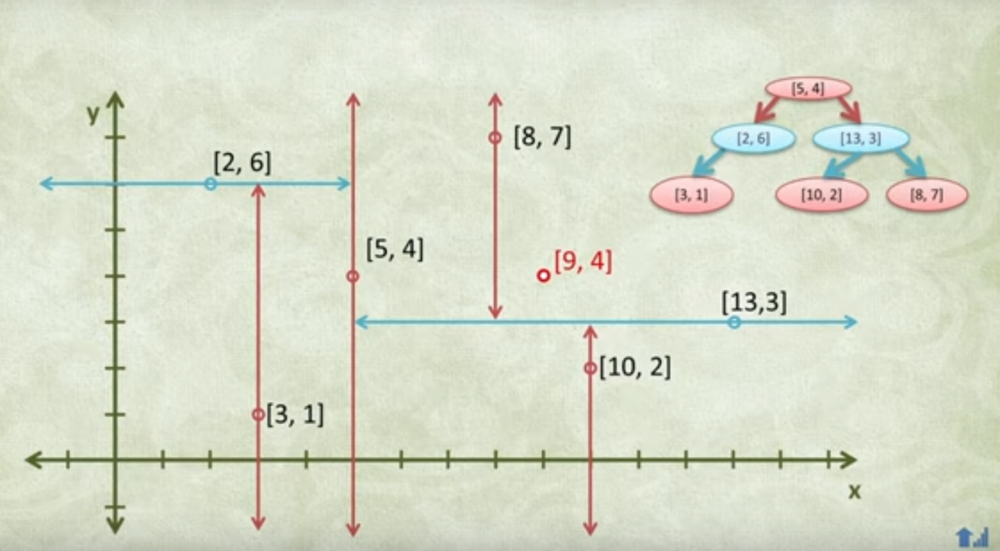
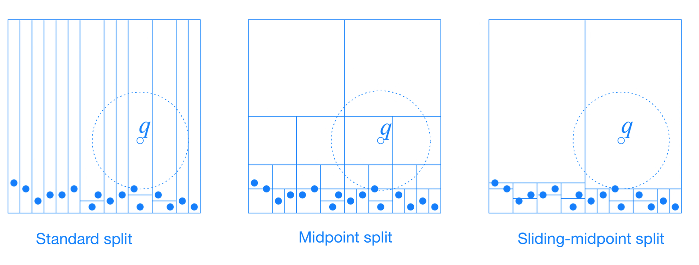
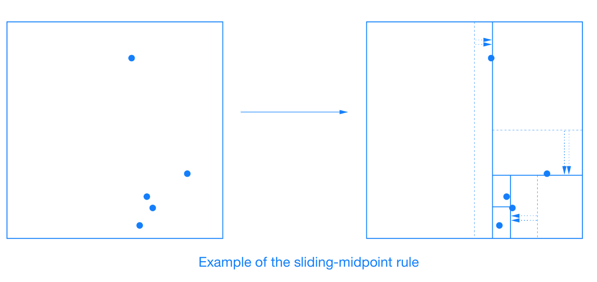
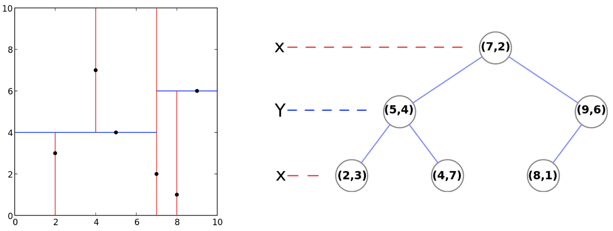
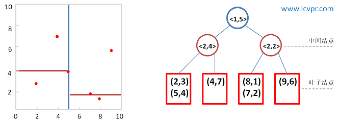

# K-D Tree

`KD Tree` 又稱 `K 維樹 (K-dimensional tree)`，是一種可以對 *K 維資料進行劃分的資料結構*。可以看成`二元搜尋樹的一種延伸`，的對空間中的維度做劃分。主要應用於多維空間關鍵資料的`近鄰查詢(Nearest Neighbor)`和`近似最近鄰查詢(Approximate Nearest Neighbor)`。


https://www.youtube.com/watch?v=Glp7THUpGow

## Introdction of KD Tree

二元搜尋樹就是將資料按造大小來建立樹，規則為:

- 若它的左子樹不為空，則左子樹上所有節點的值均小於它的根節點的值
- 若它的右子樹不為空，則右子樹上所有節點的值均大於它的根節點的值；
- 它的左、右子樹也分別為二元搜尋樹

如下所示:

```
    4
   / \
  2   6
 / \ / \
1  3 5  7
```

但此方法在只有一個維度的時候行的通，當資料超過一個維度的時候，該怎麼對二維以上的陣列進行劃分呢?

```
 一維陣列          二維陣列

    4
   / \
  2   6             ？
 / \ / \
1  3 5  7
```

### Theory

對於多維陣列，我們多了一個以上的維度，因此在劃分時沒有一個劃分依據。
此時我們是`選擇某一個維度(d)來對 K 維資料進行劃分`，這個動作在二維資料內相當於將空間劃分為兩個部分，一邊的值小於另一邊的所有值。如果我們繼續對這兩個空間進行上述劃分，又會得到新的子空間，對新的子空間又繼續劃分，重複以上過程直到每個子空間都不能再劃分為止。以上就是建立 KD 樹的過程。

上述過程中涉及到兩個重要的問題，如下:

1. 每次劃分時，應該選擇哪個維度進行劃分
2. 在某個維度上的進行劃分時，應該選擇哪個節點進行劃分，
   以確保建立的樹盡量地平衡(兩邊節點數量差不多)

   ```
   樹越平衡代表著分割得越平均，搜尋的時間也就是越少
   ```

### 劃分方法 (Splitting Rules)



- `Standard Split`
- `Midpoint Split`
- `Sliding-midpoint Split`

#### 標準分割 (Standard Split)

```
使創建出來的樹盡可能的保持平衡
```

維度選擇有兩種方法:

1. 選擇 `分佈(spread)最大的維度`。即數據集在該維度上，最大值減最小值的結果為所有維度中最大的維度。

    ```
    spread: 最大值和最小值之間的差
    ```

2. 選擇`變異數(variance)最大的維度`。即數據在該維度上，數據分散的比較開的維度，


劃分點選擇:

- 選擇數據集在該維度上的中位數做為劃分點

    ```
    the coordinate median of the points in that dimension.
    ```

##### 優點

- 劃分到左右子樹中數據數量相同（或相差 1），為平衡二元樹。

##### 缺點

- 維度選擇方法一，可能出現細長的 cell，容易增加回溯時遞迴搜尋的範圍。
- 維度選擇方法二，計算最大變異數的時間複雜度要高於計算最大 spread 的時間複雜度。

#### 中點分割 (Midpoint Split)

```
讓分割出的 cells 盡可能的減少產生細長的 cell，
使劃分出的兩個 cells 都是肥胖的。
```

- cell: KD Tree 把空間遞歸地劃分兩個不相交的超矩形(超平面、超立方體)，
        每個超矩形所佔的空間即為一個 cell。


維度選擇:

- cell 中最長邊對應的維度。如果有許多相等長度的邊，則可以首先選擇任何一條

劃分點選擇:

- cell 中最長邊對應的中心。

##### 優點

- 找中心比找中值的時間複雜度更低。

##### 缺點

- 導致數據集劃分不均勻，當數據大量聚集時，存在很多`無用的空間劃分`。

        即劃分時，所有數據都在一個區域，另一個區域沒有數據

#### 滑動中點分割 (Sliding-midpoint Split)

```
Midpoint Split 的改進版，規則大致相同
```

其認為兩種劃分為好的劃分:

1. 平衡的劃分: 使得劃分出的兩個子 cell 都是肥胖的

        Midpoint Split 中的思想。

2. 使得較肥胖的 cell 中含有較少的數據點。

        對無效劃分的處理


維度選擇:

- 選擇超矩形中最長邊對應的維度。同 midpoint split

劃分點的選擇:

- 首先嘗試中點分割
  - 數據點位於分割平面的兩側，則分割平面保留在此處
  - 所以數據點位於分割平面的一側 (`無效劃分`)，通過滑動分割點來消除無效劃分。

    若該維度的中點值為 a:

      - 若所有數據在該維度上都大於 a，則以數據集中最小值來劃分空間，使左子樹區域中有 1 個點，右子樹有 n-1 個點。

      - 若所有數據在該維度上都小於 a，則以數據集中最大值來劃分空間，使左子樹區域中有 n-1 個點，右子樹有 1 個點。

    如下圖所示:

    

    If all the data points lie to one side of the splitting plane, then splitting plane “slides” towards the data points until it encounters the first such point. One child is a leaf cell containing this single point, and the algorithm recurses on the remaining points.

##### 優點

- 可以消除無效的劃分。其可能存在細長的 cell，但其始終伴隨著一個該維度上較寬胖的 cell。

### 資料儲存方法

資料儲存方法有兩種:

1. 將 data 存在`所有節點 (node)`

    記錄下每個子樹中包含的所有資料。

    Example:

    ```
    (2,3), (5,4), (9,6), (4,7), (8,1), (7,2)
    ```

    

2. 僅將 data 存在`葉節點 (leaf node)`: `<k, m>`

    記錄下每個子樹所在的`分割維度k`和`分割值m`
    最後將該子集合中的資料儲存到 leaf node。

    Example:

    ```
    (2,3), (5,4), (9,6), (4,7), (8,1), (7,2)
    ```

    

## Example of Build KD Tree

這裡我們使用 `Standard Split` 方法來建立 KD Tree，且:

- 選則變異數(variance)最大的維度
- 選擇數據集在該維度上的中位數做為劃分點
- 將數據儲存在所有節點

dataset:

```
(2,3), (5,4), (9,6), (4,7), (8,1), (7,2)
```

### 步驟

1. 分別計算 x, y 方向上資料的變異數，得出 x 方向上的變異數最大
2. 根據 x 軸方向的值 (2, 4, 5, 7, 8, 9)，排序選出中位數為 5 和 7，這裡選擇 7 當作分割點，所以該節點中的資料為 (7, 2)。這樣該節點的分割超平面就是通過 (7, 2) 並垂直於 x 軸的直線 x = 7。
3. 確定左子空間和右子空間。以 x = 7 為分割超平面將整個空間分為兩個部分，x <= 7 的部分為左子空間，包含 3 個節點 (2, 3), (4, 7), (5, 4)，另一部分為右子空間，包含2個節點 (8, 1), (9, 6)。
4. 繼續對左子空間和右子空間內的資料重複步驟1~3，如此反覆值到空間中只包含一個資料點。

    ```
    KD Tree 的建立就是一個遞迴的過程
    ```

### 實作

Python: [kdtree.py](kdtree.py)
```python
def build_kdtree(self, points, depth=0):
    if len(points) <= 0:
        return None

    # 1. Select axis based on depth so that axis cycles
    #    through all valid values
    k = len(points[0])
    axis = depth % k # 2d: (x, y, x, y, ...)

    # 2. Sort point list and choose median as pivot element
    sorted_points = sorted(points, key=lambda point: point[axis])
    median = len(sorted_points) // 2

    # 3. Create node and construct subtress
    return {
        'point': sorted_points[median],
        'left': build_kdtree(sorted_points[:median], depth + 1),
        'right': build_kdtree(sorted_points[median+1:], depth + 1)
    }
```

## Reference

- [ANN](https://www.cs.umd.edu/~mount/Papers/cgc99-smpack.pdf)
- [KD-Tree 演算法筆記](https://blog.yucheng.me/post/kd-tree/)
- [KD-Tree Nearest Neighbor Data Structure](https://www.youtube.com/watch?v=Glp7THUpGow)
- [KD-Tree,Yasen Hu](https://yasenh.github.io/post/kd-tree/)
