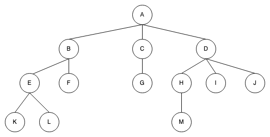
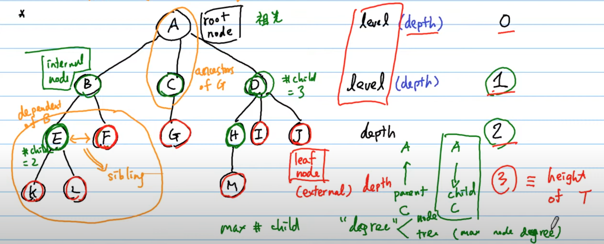
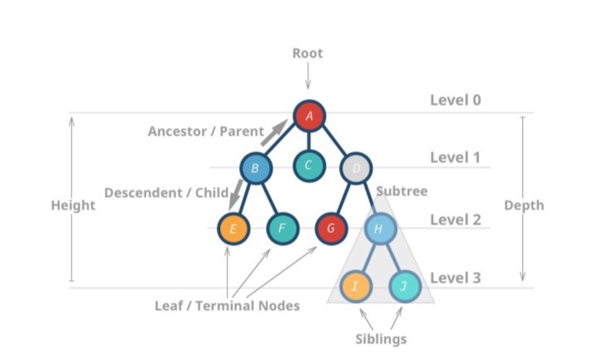
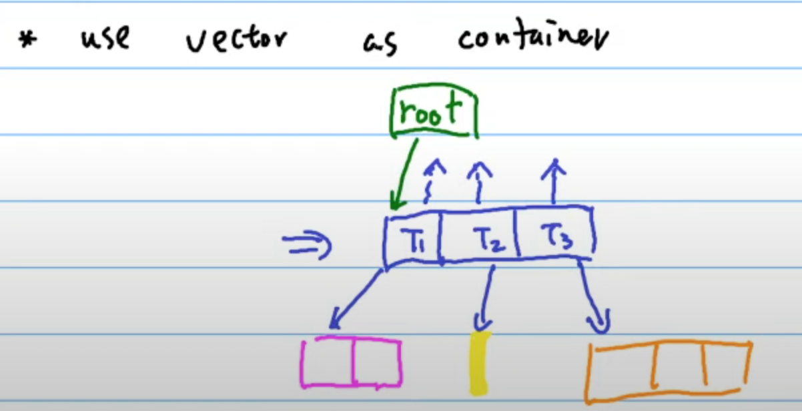
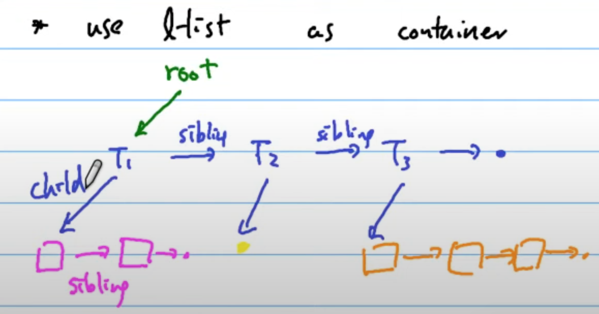
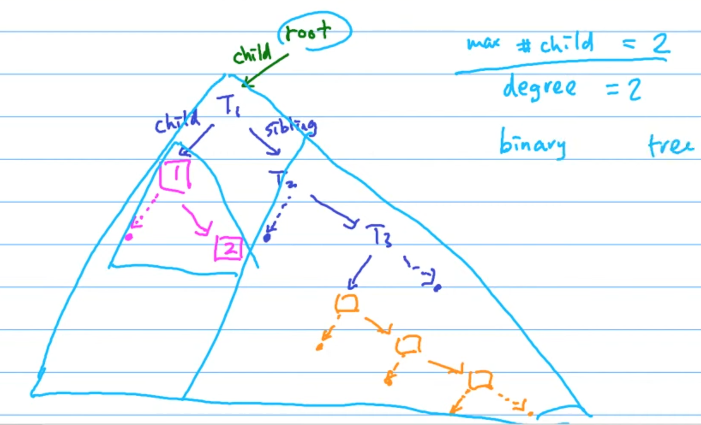

# Tree

樹就是`Hierarchical Access`，樹上的 node 沒有 child 數量限制，如下所示:

> Each node of the tree will have a `root` value and a list of references to other nodes which are called `child nodes`.



其他相關名詞如下圖所示:



- Degree: the total number of children of a node
- Degree of tree: The maximum degree of a node among all the nodes in a tree


精美版:



> From graph view, a tree can also be defined as `a directed acyclic graph` which has `N nodes` and` N-1 edges`.

## Implementation tree

- Use `vector` as container

    

- Use `Linked list` as container

    

    從上圖可知，有兩種小紙條:

    - siblings: 鄰居/兄弟姊妹
    - child: 小孩

    > 每一個 node 最多就兩種紙條

    於是我們可以將它畫成另外一種形式，如下:

    

    每一個 node 最多就是兩個 child，我們稱之為 `Binary Tree`。

    ```
    left-child, right-sibling representation
    of general tree
    ```

## Types of trees

樹的種類如下:

- `Binary Tree`

    A binary tree is a tree data structure in which `each node has at most two children`, which are referred to as the left child and the right child.

- [KD Tree](https://github.com/kaka-lin/Notes/tree/master/DSA/Tree/KD%20Tree)

## Solve Tree Problems Recursively

Typically, we can solve a tree problem `recursively` using a `top-down approach` or using a `bottom-up approach`.

> Recursion is one of the most powerful and frequently used techniques for solving tree problems.

### Top-down approach

"Top-down" means that in each recursive call, we will visit the node first to come up with some values, and pass these values to its children when calling the function recursively. So the `"top-down"` solution can be considered as a kind of `preorder traversal`.

```
從上往下訪問，訪問現在節點，得出某些值，
然後在遞迴函式時將這些值傳給子節點。
所以可以被認為是 preorder
```

To be specific, the recursive function top_down(root, params) works like this:

```
1. return specific value for null node
2. update the answer if needed                      // answer <-- params
3. left_ans = top_down(root.left, left_params)      // left_params <-- root.val, params
4. right_ans = top_down(root.right, right_params)   // right_params <-- root.val, params
5. return the answer if needed                      // answer <-- left_ans, right_ans
```

### Bottom-up approach

`"Bottom-up"` is another recursive solution. In each recursive call, we will firstly call the function recursively for all the children nodes and then come up with the answer according to the returned values and the value of the current node itself. This process can be regarded as a kind of `postorder traversal`.

```
在每次遞迴時，都會先對所有子節點遞歸調用函數，
然後根據返回值和當前節點本身的值得出答案
所以可以看成是是 postorder
```

Typically, a "bottom-up" recursive function bottom_up(root) will be something like this:

```
1. return specific value for null node
2. left_ans = bottom_up(root.left)      // call function recursively for left child
3. right_ans = bottom_up(root.right)    // call function recursively for right child
4. return answers                       // answer <-- left_ans, right_ans, root.val
```

### For example: Maximum Depth

Given a binary tree, find its `maximum depth`.

Solution: [104. Maximum Depth of Binary Tree](https://github.com/kaka-lin/leetcode/blob/main/leetcode/00104_maximum-depth-of-binary-tree/104-maximum-depth-of-binary-tree.py)

#### 1. Top-down

*Preorder Traversal*

```
1. return if root is null
2. if root is a leaf node:
3.     answer = max(answer, depth)         // update the answer if needed
4. maximum_depth(root.left, depth + 1)     // call the function recursively for left child
5. maximum_depth(root.right, depth + 1)    // call the function recursively for right child
```

#### 2. Bottom-up

*Postorder Traversal*

```
1. return 0 if root is null                 // return 0 for null node
2. left_depth = maximum_depth(root.left)
3. right_depth = maximum_depth(root.right)
4. return max(left_depth, right_depth) + 1  // return depth of the subtree rooted at rootr
```

## Traverse a Tree

Binary Tree 的遍歷順序有四種:
  - `Preorder Traversal (前序)` -> `DFS`
  - `Inorder Traversal (中序)` -> `DFS`
  - `Traversal Postorder (後序)` -> `DFS`
  - `Level-order Traversal (層序)` -> `BFS`

但其實可以視為 `DFS` 與 `BFS` 兩種，只不過是更動了節點的輸出順序。

```
    4
   / \
  2   6
 / \ / \
1  3 5  7

Preorder: [4, 2, 1, 3, 6, 5, 7]
Inorder: [1, 2, 3, 4, 5, 6, 7]
Postoder: [1, 3, 2, 5, 7, 6, 4]
Level-order: [4, 2, 6, 1, 3, 5, 7]
```

- `前三種`遍歷方式皆使用 `DFS`
  - 皆可以使用`遞迴 (recursion)` 或 `迭代(iterative)`來實作
- `Level-order Traversal` 使用 `BFS`
  - 使用`迭代(iterative)`來實作比較容易想到

### Preorder Traversal

```
    4
   / \
  2   6
 / \ / \
1  3 5  7
Preorder: [4, 2, 1, 3, 6, 5, 7]

root -> left subtree -> right subtrer
```

遍歷順序是：根、左子樹、右子樹。根排在前面。
即是 `Depth-first Search (DFS)`。

### Inorder Traversal

```
    4
   / \
  2   6
 / \ / \
1  3 5  7
Inorder: [1, 2, 3, 4, 5, 6, 7]

left subtree -> root -> right subtrer
```

遍歷順序是：左子樹、根、右子樹。根排在中間。
實際上是採用 `Depth-first Search (DFS)`，只不過更動了節點的輸出順序。

```
Typically, for binary search tree,
we can retrieve all the data in
"sorted order" using in-order traversal.
```

對`二元搜尋樹(binary search tree, BST)`而言，
`inorder traversal` 就是`由小到大依序遍歷`。

### Postorder Traversal

```
    4
   / \
  2   6
 / \ / \
1  3 5  7
Postoder: [1, 3, 2, 5, 7, 6, 4]

left subtree -> right subtrer -> root
```

遍歷順序是：左子樹、右子樹、根。根排在後面。
實際上是採用 `Depth-first Search (DFS)`，只不過更動了節點的輸出順序。

* It is worth noting that when you `delete nodes` in a tree, deletion process will be in post-order. That is to say, when you delete a node, you will delete its left child and its right child before you delete the node itself.

* Also, post-order is widely use in `mathematical expression`. It is easier to write a program to parse a post-order expression.

### Level-order Traversal

```
    4
   / \
  2   6
 / \ / \
1  3 5  7
Level-order: [4, 2, 6, 1, 3, 5, 7]

first the root, then the child of the root, etc.
```

遍歷順序是：一層一層往下。
即是 `Breadth-first Search (BFS)·。

