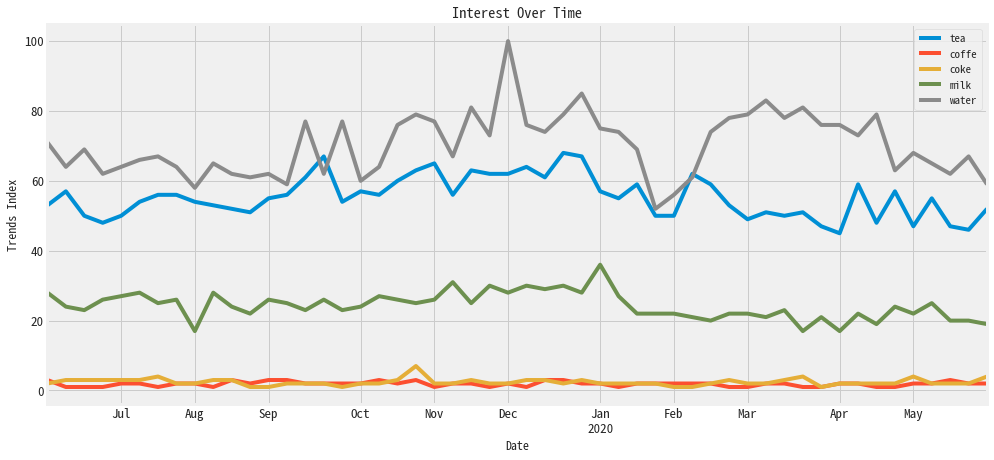
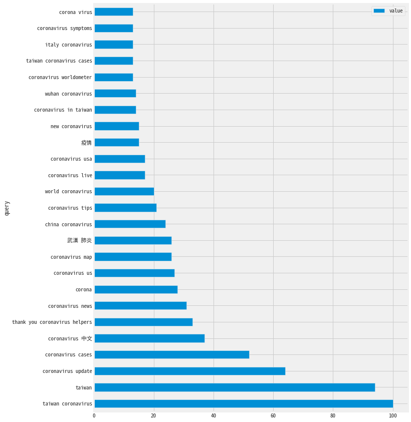
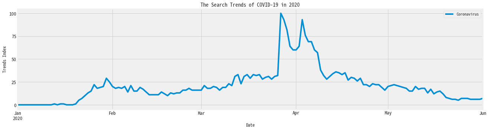

# Get and Analysis the result of Google Trends with Python

[Google Trends (Google搜尋趨勢)](https://trends.google.com/trends/trendingsearches/daily?geo=US)
是由Google 提供的線上搜尋趨勢服務，可以簡單的看出最近哪些`關鍵字`是熱門的。
但大規模分析 `Google Trends` 是很麻煩不切實際的，且有時候連打開網頁都懶，
那麼我們如何才能有夠有效的使用`Google Trends`呢？

- [pytrends](https://github.com/GeneralMills/pytrends):
    
    Unofficial API for Google Trends
    
    ```
    Allows simple interface for automating downloading of reports from Google Trends. 
    Only good until Google changes their backend again :-P. When that happens feel free to contribute!
    ```
    
    這是一個非官方支援的API，允許從`Google Trends`下載資料（爬蟲）
   

## Install `pytrends` package


```python
!pip3 install pytrends
```

    Requirement already satisfied: pytrends in /usr/local/lib/python3.7/site-packages (4.7.3)
    Requirement already satisfied: lxml in /usr/local/lib/python3.7/site-packages (from pytrends) (4.5.1)
    Requirement already satisfied: pandas>=0.25 in /usr/local/lib/python3.7/site-packages (from pytrends) (0.25.3)
    Requirement already satisfied: requests in /usr/local/lib/python3.7/site-packages (from pytrends) (2.22.0)
    Requirement already satisfied: pytz>=2017.2 in /usr/local/lib/python3.7/site-packages (from pandas>=0.25->pytrends) (2019.3)
    Requirement already satisfied: numpy>=1.13.3 in /usr/local/lib/python3.7/site-packages (from pandas>=0.25->pytrends) (1.17.4)
    Requirement already satisfied: python-dateutil>=2.6.1 in /usr/local/lib/python3.7/site-packages (from pandas>=0.25->pytrends) (2.8.1)
    Requirement already satisfied: certifi>=2017.4.17 in /usr/local/lib/python3.7/site-packages (from requests->pytrends) (2019.9.11)
    Requirement already satisfied: urllib3!=1.25.0,!=1.25.1,<1.26,>=1.21.1 in /usr/local/lib/python3.7/site-packages (from requests->pytrends) (1.25.7)
    Requirement already satisfied: chardet<3.1.0,>=3.0.2 in /usr/local/lib/python3.7/site-packages (from requests->pytrends) (3.0.4)
    Requirement already satisfied: idna<2.9,>=2.5 in /usr/local/lib/python3.7/site-packages (from requests->pytrends) (2.8)
    Requirement already satisfied: six>=1.5 in /usr/local/Cellar/protobuf/3.11.4/libexec/lib/python3.7/site-packages (from python-dateutil>=2.6.1->pandas>=0.25->pytrends) (1.14.0)


## Connect to Google

- [Pandas](https://pandas.pydata.org/):
    
    Python Data Analysis Library


```python
import pandas as pd
from pytrends.request import TrendReq

pytrend = TrendReq()
```

## Build Payload 

設定我們想要搜尋的關鍵字、類別、時間區段、地區以及類型

```python
"""Create the payload for related queries, interest over time anf interest by region"""
TrendReq.build_payload(self, kw_list, cat=0, 
                       timeframe='today 5-y', geo='', gprop='')
```

- Parameters:
    - kw_list: 
        - keywords to get data for
        - Up to five terms in a list (最多五個)
    - timeframe: Date to start from
    - cat: Category to narrow resulta
    - geo: Two letter country abbreviation
    - gprop:  What Google property to filter to


```python
kw_list=['tea', 'coffe', 'coke', 'milk', 'water']

# timeframe=today 12-m': one year data
# geo='US': specifying location with U.S.
pytrend.build_payload(kw_list, timeframe='today 12-m', geo='TW')

# gprop=yputube: only want to see Youtube search trends
#pytrend.build_payload(kw_list, timeframe='today 12-m', geo='TW', gprop=youtube)

# cat=71: category
#pytrend.build_payload(kw_list, timeframe='today 12-m', geo='TW', gprop=youtube, cat=71)
```

## Request data (Get results)

- Interest Over Time
- Historical Hourly Interest
- Interest by REgion
- Related Topics
- Related Queries
- Trending Searches
- Top Charts
- Suggestions

### Interest Over Time

```python
"""Request data from Google's Interest Over Time section and return a dataframe"""
TrendReq.interest_over_time(self)
```

- Returns: pandas.Dataframe


```python
interest_over_time_df = pytrend.interest_over_time()
interest_over_time_df.head()
```


<div>
<style scoped>
    .dataframe tbody tr th:only-of-type {
        vertical-align: middle;
    }

    .dataframe tbody tr th {
        vertical-align: top;
    }

    .dataframe thead th {
        text-align: right;
    }
</style>
<table border="1" class="dataframe">
  <thead>
    <tr style="text-align: right;">
      <th></th>
      <th>tea</th>
      <th>coffe</th>
      <th>coke</th>
      <th>milk</th>
      <th>water</th>
      <th>isPartial</th>
    </tr>
    <tr>
      <th>date</th>
      <th></th>
      <th></th>
      <th></th>
      <th></th>
      <th></th>
      <th></th>
    </tr>
  </thead>
  <tbody>
    <tr>
      <th>2019-06-09</th>
      <td>53</td>
      <td>3</td>
      <td>2</td>
      <td>28</td>
      <td>71</td>
      <td>False</td>
    </tr>
    <tr>
      <th>2019-06-16</th>
      <td>57</td>
      <td>1</td>
      <td>3</td>
      <td>24</td>
      <td>64</td>
      <td>False</td>
    </tr>
    <tr>
      <th>2019-06-23</th>
      <td>50</td>
      <td>1</td>
      <td>3</td>
      <td>23</td>
      <td>69</td>
      <td>False</td>
    </tr>
    <tr>
      <th>2019-06-30</th>
      <td>48</td>
      <td>1</td>
      <td>3</td>
      <td>26</td>
      <td>62</td>
      <td>False</td>
    </tr>
    <tr>
      <th>2019-07-07</th>
      <td>50</td>
      <td>2</td>
      <td>3</td>
      <td>27</td>
      <td>64</td>
      <td>False</td>
    </tr>
  </tbody>
</table>
</div>


#### Plot the result

- [Matplotlib](https://matplotlib.org/)
- [seaborn](https://seaborn.pydata.org/)

Matplotlib 顯示中文請參考：[Matplotlib 顯示中文](https://github.com/kaka-lin/Notes/tree/master/Data_Science/matplotlib/show_chinese)


```python
#!pip3 install matplotlib seaborn
```


```python
import matplotlib
import matplotlib.pyplot as plt
import seaborn as sns

sns.set(color_codes=True)
plt.style.use('fivethirtyeight')

# 中文
plt.rcParams['font.sans-serif'] = ['Noto Sans Mono CJK TC', 'sans-serif'] 
plt.rcParams['axes.unicode_minus'] = False

%matplotlib inline
```

##### Make plots of `DataFrame` using `Matplotlib`

- [plot lines](https://pandas.pydata.org/pandas-docs/stable/reference/api/pandas.DataFrame.plot.line.html):

    ```python
    DataFrame.plot.line(self, x=None, y=None, **kwargs)
    ```

    


```python
axes = interest_over_time_df.plot.line(
    figsize=(15,7),
    title='Interest Over Time')
axes.set_xlabel('Date')
axes.set_ylabel('Trends Index')
axes.tick_params(axis='both', which='major', labelsize=13)
```





### Google Keyword Suggestions

Return a list of additional suggested keywords that can be used to refine a trend search.

```python
"""Request data from Google's Keyword Suggestions dropdown and return a dictionary"""
TrendReq.suggestions(self, keyword)
```

- Parameters:
    - `keyword`:
        - keyword to get suggestions for


```python
keywords = pytrend.suggestions(keyword='beer')
keywords_df = pd.DataFrame(keywords)
keywords_df.drop(columns='mid') # This column makes no sense
```


<div>
<style scoped>
    .dataframe tbody tr th:only-of-type {
        vertical-align: middle;
    }

    .dataframe tbody tr th {
        vertical-align: top;
    }

    .dataframe thead th {
        text-align: right;
    }
</style>
<table border="1" class="dataframe">
  <thead>
    <tr style="text-align: right;">
      <th></th>
      <th>title</th>
      <th>type</th>
    </tr>
  </thead>
  <tbody>
    <tr>
      <th>0</th>
      <td>Beer</td>
      <td>Alcoholic drink</td>
    </tr>
    <tr>
      <th>1</th>
      <td>Brewery</td>
      <td>Topic</td>
    </tr>
    <tr>
      <th>2</th>
      <td>Drink coaster</td>
      <td>Topic</td>
    </tr>
    <tr>
      <th>3</th>
      <td>Bears</td>
      <td>Animal</td>
    </tr>
    <tr>
      <th>4</th>
      <td>Brewer's yeast</td>
      <td>Fungus</td>
    </tr>
  </tbody>
</table>
</div>


### Related Queries

當使用者搜尋某個主題時，他們也會搜尋相關的內容

Return data for the related keywords to a provided keyword shown on Google Trends' Related Queries section.

```python
"""Request data from Google's Related Queries section and reutrn a dictionary of dataframe

If not top and/or rising related queries are found, 
the value for the key "top" and/or "rising" will be None
"""
TrendReq.related_queries(self)
```

- Returns: dictionary of pandas.DataFrames


```python
pytrend.build_payload(kw_list=['Coronavirus'])
```


```python
# Related Queries, return a dictionary of dataframe
related_queries = pytrend.related_queries()
related_queries
```


    {'Coronavirus': {'top':                             query  value
      0              taiwan coronavirus    100
      1                          taiwan     94
      2              coronavirus update     64
      3               coronavirus cases     52
      4                  coronavirus 中文     37
      5   thank you coronavirus helpers     33
      6                coronavirus news     31
      7                          corona     28
      8                  coronavirus us     27
      9                 coronavirus map     26
      10                          武漢 肺炎     26
      11              china coronavirus     24
      12               coronavirus tips     21
      13              world coronavirus     20
      14               coronavirus live     17
      15                coronavirus usa     17
      16                             疫情     15
      17                new coronavirus     15
      18          coronavirus in taiwan     14
      19              wuhan coronavirus     14
      20        coronavirus worldometer     13
      21       taiwan coronavirus cases     13
      22              italy coronavirus     13
      23           coronavirus symptoms     13
      24                   corona virus     13,
      'rising':                             query   value
      0              taiwan coronavirus  806850
      1                          taiwan  760150
      2              coronavirus update  520350
      3               coronavirus cases  421850
      4   thank you coronavirus helpers  264250
      5                  coronavirus us  217300
      6                 coronavirus map  210350
      7                           武漢 肺炎  207400
      8               china coronavirus  190500
      9                coronavirus tips  167400
      10              world coronavirus  161150
      11                coronavirus usa  135500
      12                             疫情  121000
      13          coronavirus in taiwan  113550
      14              wuhan coronavirus  111450
      15        coronavirus worldometer  107600
      16       taiwan coronavirus cases  105500
      17              italy coronavirus  104450
      18              coronavirus italy  100450
      19        taiwan news coronavirus   96200
      20                who coronavirus   95600
      21                          covid   94100
      22                    taiwan news   91750
      23                            who   87750
      24                 coronavirus uk   87600}}


```python
COVID_19 = related_queries['Coronavirus']['top']
COVID_19
```


<div>
<style scoped>
    .dataframe tbody tr th:only-of-type {
        vertical-align: middle;
    }

    .dataframe tbody tr th {
        vertical-align: top;
    }

    .dataframe thead th {
        text-align: right;
    }
</style>
<table border="1" class="dataframe">
  <thead>
    <tr style="text-align: right;">
      <th></th>
      <th>query</th>
      <th>value</th>
    </tr>
  </thead>
  <tbody>
    <tr>
      <th>0</th>
      <td>taiwan coronavirus</td>
      <td>100</td>
    </tr>
    <tr>
      <th>1</th>
      <td>taiwan</td>
      <td>94</td>
    </tr>
    <tr>
      <th>2</th>
      <td>coronavirus update</td>
      <td>64</td>
    </tr>
    <tr>
      <th>3</th>
      <td>coronavirus cases</td>
      <td>52</td>
    </tr>
    <tr>
      <th>4</th>
      <td>coronavirus 中文</td>
      <td>37</td>
    </tr>
    <tr>
      <th>5</th>
      <td>thank you coronavirus helpers</td>
      <td>33</td>
    </tr>
    <tr>
      <th>6</th>
      <td>coronavirus news</td>
      <td>31</td>
    </tr>
    <tr>
      <th>7</th>
      <td>corona</td>
      <td>28</td>
    </tr>
    <tr>
      <th>8</th>
      <td>coronavirus us</td>
      <td>27</td>
    </tr>
    <tr>
      <th>9</th>
      <td>coronavirus map</td>
      <td>26</td>
    </tr>
    <tr>
      <th>10</th>
      <td>武漢 肺炎</td>
      <td>26</td>
    </tr>
    <tr>
      <th>11</th>
      <td>china coronavirus</td>
      <td>24</td>
    </tr>
    <tr>
      <th>12</th>
      <td>coronavirus tips</td>
      <td>21</td>
    </tr>
    <tr>
      <th>13</th>
      <td>world coronavirus</td>
      <td>20</td>
    </tr>
    <tr>
      <th>14</th>
      <td>coronavirus live</td>
      <td>17</td>
    </tr>
    <tr>
      <th>15</th>
      <td>coronavirus usa</td>
      <td>17</td>
    </tr>
    <tr>
      <th>16</th>
      <td>疫情</td>
      <td>15</td>
    </tr>
    <tr>
      <th>17</th>
      <td>new coronavirus</td>
      <td>15</td>
    </tr>
    <tr>
      <th>18</th>
      <td>coronavirus in taiwan</td>
      <td>14</td>
    </tr>
    <tr>
      <th>19</th>
      <td>wuhan coronavirus</td>
      <td>14</td>
    </tr>
    <tr>
      <th>20</th>
      <td>coronavirus worldometer</td>
      <td>13</td>
    </tr>
    <tr>
      <th>21</th>
      <td>taiwan coronavirus cases</td>
      <td>13</td>
    </tr>
    <tr>
      <th>22</th>
      <td>italy coronavirus</td>
      <td>13</td>
    </tr>
    <tr>
      <th>23</th>
      <td>coronavirus symptoms</td>
      <td>13</td>
    </tr>
    <tr>
      <th>24</th>
      <td>corona virus</td>
      <td>13</td>
    </tr>
  </tbody>
</table>
</div>


```python
axes = COVID_19.plot.barh(x='query', y='value', figsize=(10,15))
```





## The Search Trends of COVID-19 in 2020


```python
pytrend.build_payload(kw_list=['Coronavirus'], timeframe='2020-01-01 2020-06-04')
covid_19_interest_over_time_df = pytrend.interest_over_time()
covid_19_interest_over_time_df.head()
```


<div>
<style scoped>
    .dataframe tbody tr th:only-of-type {
        vertical-align: middle;
    }

    .dataframe tbody tr th {
        vertical-align: top;
    }

    .dataframe thead th {
        text-align: right;
    }
</style>
<table border="1" class="dataframe">
  <thead>
    <tr style="text-align: right;">
      <th></th>
      <th>Coronavirus</th>
      <th>isPartial</th>
    </tr>
    <tr>
      <th>date</th>
      <th></th>
      <th></th>
    </tr>
  </thead>
  <tbody>
    <tr>
      <th>2020-01-01</th>
      <td>0</td>
      <td>False</td>
    </tr>
    <tr>
      <th>2020-01-02</th>
      <td>0</td>
      <td>False</td>
    </tr>
    <tr>
      <th>2020-01-03</th>
      <td>0</td>
      <td>False</td>
    </tr>
    <tr>
      <th>2020-01-04</th>
      <td>0</td>
      <td>False</td>
    </tr>
    <tr>
      <th>2020-01-05</th>
      <td>0</td>
      <td>False</td>
    </tr>
  </tbody>
</table>
</div>


```python
axes = covid_19_interest_over_time_df.plot.line(
    figsize=(20,5),
    title='The Search Trends of COVID-19 in 2020')
axes.set_yticks([0, 25, 50, 75, 100])
axes.set_xlabel('Date')
axes.set_ylabel('Trends Index')
axes.tick_params(axis='both', which='major', labelsize=13)
```




