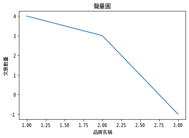

# Matplotlib 中文

Ref: [Text with non-latin glyphs](https://matplotlib.org/3.1.0/tutorials/text/text_props.html#text-with-non-latin-glyphs)

下載思源體 - [source-han-sans](https://github.com/adobe-fonts/source-han-sans)

1. [思源黑體](https://noto-website-2.storage.googleapis.com/pkgs/NotoSansCJKtc-hinted.zip)
    本教學使用此字型
2. [思源宋體](https://noto-website-2.storage.googleapis.com/pkgs/NotoSerifCJKtc-hinted.zip)


```python
# 查看安裝了哪些字型
# windows請忽略這段
# unix系統可以使用下command確認是否安裝成功
!fc-list :lang=zh family
```

    Noto Sans Mono CJK TC,Noto Sans Mono CJK TC Bold
    Noto Sans CJK TC,Noto Sans CJK TC Medium
    Heiti TC,黑體\-繁,黒体\-繁,Heiti\-번체,黑体\-繁
    Noto Sans CJK TC,Noto Sans CJK TC DemiLight
    Noto Sans CJK TC,Noto Sans CJK TC Black
    Noto Sans Mono CJK TC,Noto Sans Mono CJK TC Regular
    STSong
    .PingFang HK,.蘋方\-港,.苹方\-港
    .PingFang SC,.蘋方\-簡,.苹方\-简
    .PingFang TC,.蘋方\-繁,.苹方\-繁
    Noto Sans CJK TC,Noto Sans CJK TC Regular
    PingFang HK,蘋方\-港,苹方\-港
    PingFang SC,蘋方\-簡,苹方\-简
    .LastResort
    PingFang TC,蘋方\-繁,苹方\-繁
    GB18030 Bitmap
    Heiti SC,黑體\-簡,黒体\-簡,Heiti\-간체,黑体\-简
    Noto Sans CJK TC,Noto Sans CJK TC Bold
    .Hiragino Sans GB Interface
    Arial Unicode MS
    Noto Sans CJK TC,Noto Sans CJK TC Light
    Songti TC,宋體\-繁,宋体\-繁
    Songti SC,宋體\-簡,宋体\-简
    Hiragino Sans GB,冬青黑體簡體中文,冬青黑体简体中文,冬青黑體簡體中文 W6,Hiragino Sans GB W6,冬青黑体简体中文 W6
    Hiragino Sans GB,冬青黑體簡體中文,冬青黑体简体中文,冬青黑體簡體中文 W3,Hiragino Sans GB W3,冬青黑体简体中文 W3
    Noto Sans CJK TC,Noto Sans CJK TC Thin


```python
# 重新加載字體
from matplotlib.font_manager import _rebuild
_rebuild()
```


```python
import matplotlib 
import matplotlib.pyplot as plt

# 使用剛剛下載的思源體字型
plt.rcParams['font.sans-serif'] = ['Noto Sans Mono CJK TC', 'sans-serif'] 
plt.rcParams['axes.unicode_minus'] = False

%matplotlib inline
```


```python
plt.figure()
plt.plot((1, 2, 3),(4, 3, -1))
plt.title("聲量圖")
plt.ylabel("文章數量")
plt.xlabel("品牌名稱") 
plt.show()
```




