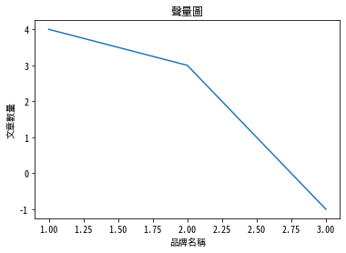

# Matplotlib 中文

Ref: [Text with non-latin glyphs](https://matplotlib.org/3.1.0/tutorials/text/text_props.html#text-with-non-latin-glyphs)

下載思源體 - [source-han-sans](https://github.com/adobe-fonts/source-han-sans)

1. [思源黑體](https://noto-website-2.storage.googleapis.com/pkgs/NotoSansCJKtc-hinted.zip)
    本教學使用此字型
2. [思源宋體](https://noto-website-2.storage.googleapis.com/pkgs/NotoSerifCJKtc-hinted.zip)


```python
# 查看安裝了哪些字型
# windows請忽略這段
# unix系統可以使用下command確認是否安裝成功
!fc-list :lang=zh family
```

    Noto Sans Mono CJK TC,Noto Sans Mono CJK TC Bold
    Noto Sans CJK TC,Noto Sans CJK TC Medium
    Noto Sans CJK TC,Noto Sans CJK TC Black
    Noto Sans Mono CJK TC,Noto Sans Mono CJK TC Regular
    Noto Serif CJK JP
    Noto Serif CJK KR
    AR PL UKai TW MBE
    Noto Serif CJK SC
    Noto Serif CJK TC
    Noto Sans CJK TC,Noto Sans CJK TC Regular
    Noto Sans Mono CJK SC
    Noto Sans Mono CJK TC
    Noto Sans Mono CJK JP
    Noto Sans Mono CJK HK
    Noto Sans Mono CJK KR
    AR PL UKai TW
    AR PL UKai HK
    AR PL UKai CN
    AR PL UMing TW MBE
    AR PL UMing HK
    AR PL UMing CN
    Droid Sans Fallback
    AR PL UMing TW
    Noto Sans CJK TC,Noto Sans CJK TC Light
    Noto Sans CJK HK
    Noto Sans CJK KR
    Noto Sans CJK JP
    Noto Sans CJK SC
    Noto Sans CJK TC
    Noto Sans CJK TC,Noto Sans CJK TC Thin


```python
import matplotlib 
import matplotlib.pyplot as plt

# 使用剛剛下載的思源體字型
plt.rcParams['font.sans-serif'] = ['Noto Sans Mono CJK TC', 'sans-serif'] 
plt.rcParams['axes.unicode_minus'] = False

%matplotlib inline
```


```python
plt.figure()
plt.plot((1, 2, 3),(4, 3, -1))
plt.title("聲量圖")
plt.ylabel("文章數量")
plt.xlabel("品牌名稱") 
plt.show()
```




