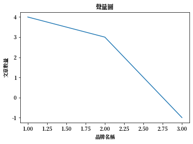

# Matplotlib 中文

Ref: [Text with non-latin glyphs](https://matplotlib.org/3.1.0/tutorials/text/text_props.html#text-with-non-latin-glyphs)

下載思源體（下面兩種任選一種皆可）

1. [思源黑體](https://noto-website-2.storage.googleapis.com/pkgs/NotoSansCJKtc-hinted.zip)
2. [思源宋體](https://noto-website-2.storage.googleapis.com/pkgs/NotoSerifCJKtc-hinted.zip)


```python
# 查看matplotlib套件安裝位置
import matplotlib
print(matplotlib.__file__)
```

    C:\Users\USER\Miniconda3\envs\tensorflow\lib\site-packages\matplotlib\__init__.py


可以得知，`matplotlib`的安裝位置在<font color=03c03c>C:\Users\USER\Miniconda3\envs\tensorflow\lib\site-packages\matplotlib\</font>，每個人的安裝位置會因電腦配置而有所不同。
1. 解開剛剛下載的壓縮檔
2. 任選一個`.otf`檔案，複製到<font color=03c03c>C:\Users\USER\Miniconda3\envs\tensorflow\lib\site-packages\matplotlib\mpl-data\fonts\ttf\</font>資料夾內
3. 刪除這個資料夾內的所有檔案：<font color=03c03c>C:\Users\USER\\.matplotlib\</font>
4. 如果使用的是`思源黑體`，請將底下的`fontType =' '`變更為`fontType ='Noto Sans CJK TC'`
5. 如果使用的是`思源宋體`，請將底下的`fontType =' '`變更為`fontType ='Noto Serif CJK TC'`


```python
import matplotlib.pyplot as plt

fontType = ''

plt.rcParams['font.sans-serif'] = [fontType] 
plt.rcParams['axes.unicode_minus'] = False

%matplotlib inline
```


```python
plt.figure()
plt.plot((1, 2, 3),(4, 3, -1))
plt.title("聲量圖")
plt.ylabel("文章數量")
plt.xlabel("品牌名稱") 
plt.show()
```





## 如果有顯示中文，表示成功!
