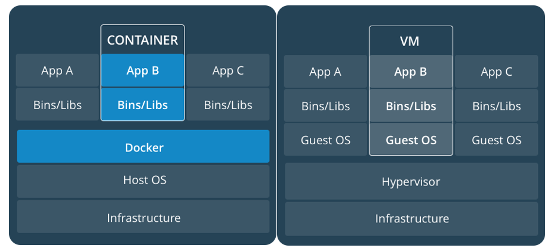
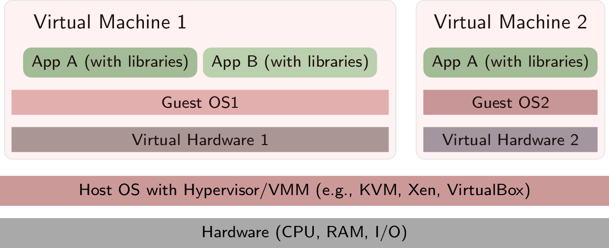
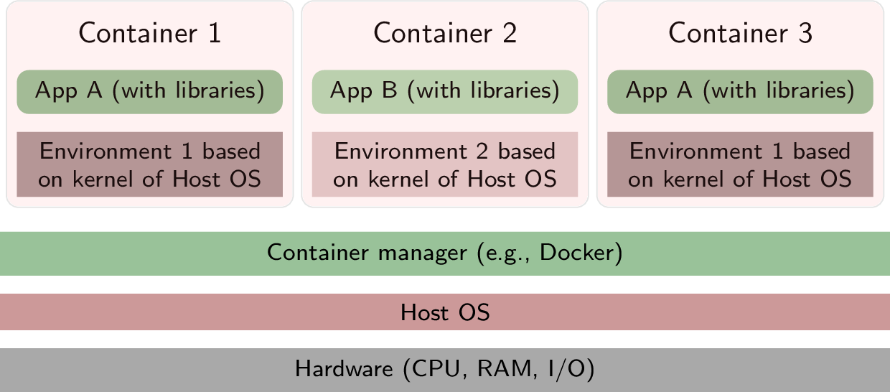

# Docker - 容器與虛擬機



簡單來說:

- `虛擬機 (Virtual Machine) 以作業系統為中心`
- `容器 (Container) 以應用程式為中心`

| Container | VM |
| --------- | -- |
| 應用程式為單位 | 作業系統為單位 |
| 依賴 Host OS 的 kernel | 任意 Guest OS |
| 封裝應用程式與相依性資源的執行環境  | 配置好各種虛擬資源，如: CPU、記憶體與硬碟的作業系統 |
| Container 間是彼此隔離的 | VM 會因版本不同造成環境的衝突 |
| 佔用的硬體資源少 | 佔用的硬體資源多 |
| 微服務 (Microservices) | 較大型的服務 |

## What is Virtual Machine (VM)

#### 虛擬機 (Virtual Machine) 以作業系統為中心`

虛擬化的目標:

    將一個應用程式所需的執行環境打包起來，
    建立一個獨立環境，方便在不同的硬體中移動。

虛擬機器通常簡稱為 VM，是一種特殊的軟體(通常稱作`映像檔`)。其具有專屬的`作業系統`和`應用程式`，也有`獨享的虛擬資源`，包括: `CPU、記憶體、硬碟、網路介面和其他介面`等。實際上，這些資源來自執行虛擬機器的實體主機。

虛擬機又稱`訪客(Guest)`，用來執行的實體機器則稱為`主機(Host)`。
一部主機上可同時存在多個虛擬機，每個虛擬機器都有自己的作業系統 (OS) 和應用程式。
若使用的主機是伺服器，則須透過`虛擬機器監視器`的軟體來管理不同的虛擬機器。商務上，虛擬機器可滿足眾多使用者的運算需求，這就是所謂的`虛擬化`。

虛擬機器無法與實體電腦直接互動，而是需要藉助一個叫做 `Hypervisor` 的輕量型軟體層，在虛擬機器和底層的實體硬體之間進行協調。
Hypervisor 負責將實體運算資源配置給每個虛擬機器。它讓虛擬機器之間相互分開，這樣就不會互相干擾。


https://oer.gitlab.io/oer-on-oer-infrastructure/figures/OS/virtual-machines.png

### VM 的優缺點

優點:

- 安全性較高: 因為硬體層以上都虛擬化，因此安全性會相對較高。
- 系統的選擇較多: 在 VM 可以選擇各種不同的 OS。
- 應用程式不須要被拆分: 不需要降低應用程式內服務的耦合性。

缺點:

- VM 的 Image 較大: 通常為GB以上，較 Container大。
- 啟動速度慢: 通常要花個幾分鐘，因此服務重啟的速度較慢。
- 資源使用較多: 因為不只給應用程式本身，還要將一部分資源分給 Guest OS。

## What is Docker

#### 容器 (Container) 以應用程式為中心

容器化的目標:

    改善虛擬機器因為需要額外裝作業系統 (Guest OS)
    導致啟動慢，佔較大記憶體的問題。

`容器(Container)`是在作業系統層上虛擬化，透過 `Container Manager` 直接將一個應用程式所需的程式碼、函式庫打包，建立資源控管機制隔離各個容器，並分配 Host OS 上的系統資源。透過容器，應用程式不需要再另外安裝作業系統（Guest OS）也可以執行。

```
Container 以應用程式為核心虛擬化，
取代傳統需要 Guest OS 的虛擬化技術
```

Docker 是[開放原始碼專案](https://github.com/moby/moby)，就是幫我們提供`管理容器(Container Manager)`技術的服務，提供「應用層級」的虛擬化技術，可讓您快速地開發、測試和部署(交付, shipping)應用程式。



### Docker 的優缺點

優點:

- 成本更低
- 可攜式性高
- Contianer 的 Image 較小: 通常幾 MB。
- 啟動速度較快: 通常幾秒就能生成一個 Container。
- 效率更高: 因為免去了去在執行一個 Guest OS 的資源。所以能將更多資源運用在跑服務上。
- 更新較為容易: 只需要利用新的 Image 重新啟動就會更新了。

缺點:

- 安全性較 VM 差: 因為環境和硬體都是與本機共用。
- Container通常切分成微服務(Microservices)的方式做部署，在各元件中的網路連結會比較複雜。
