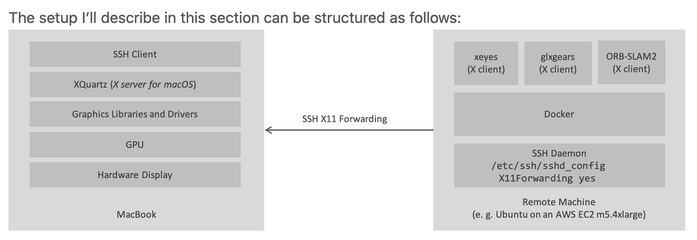

# Running a GUI Application (Qt/QML)

最簡單的方法就是讓 Container 裡的 X Client app 直接接到 local 主機的 X Server 就好了

## Guides

1. [Running the container with GUI application as an X client on the local machine](01_docker_on_local.md)

    ```
    X Server (local machine) <- X Clinet (docker on local machine)
    ```

2. [Running the GUI application in a Docker container on a remote machine via `SSH`](02_docker_on_remote.md)

   ```
   [        remote machine           ]   [          local machine           ]
   應用程式 -> X11 Client -> SSH Server -> SSH Client -> X11 Server -> Display
   ```

    

## Reference

1. [Using GUI's with Docker](http://wiki.ros.org/docker/Tutorials/GUI)
2. [docker容器中跑GUI的最簡單方法](http://blog.lujun9972.win/blog/2018/04/24/docker%E5%AE%B9%E5%99%A8%E4%B8%AD%E8%B7%91gui%E7%9A%84%E6%9C%80%E7%AE%80%E5%8D%95%E6%96%B9%E6%B3%95/index.html)
3. [Running Qt Application using Docker on MacOS X](https://diysar.medium.com/running-qt-application-using-docker-on-macos-x-ad2e9d34532a)
4. [Run X application in a Docker container reliably on a server connected via SSH without "--net host"](https://stackoverflow.com/questions/48235040/run-x-application-in-a-docker-container-reliably-on-a-server-connected-via-ssh-w)
5. [Running an X Server with Indirect GLX Rendering on MacOS for containerized applications with GUIs](https://blog.mkari.de/posts/glx-on-mac/)
6. [ROS: Using Hardware Acceleration with Docker](http://wiki.ros.org/docker/Tutorials/Hardware%20Acceleration)
