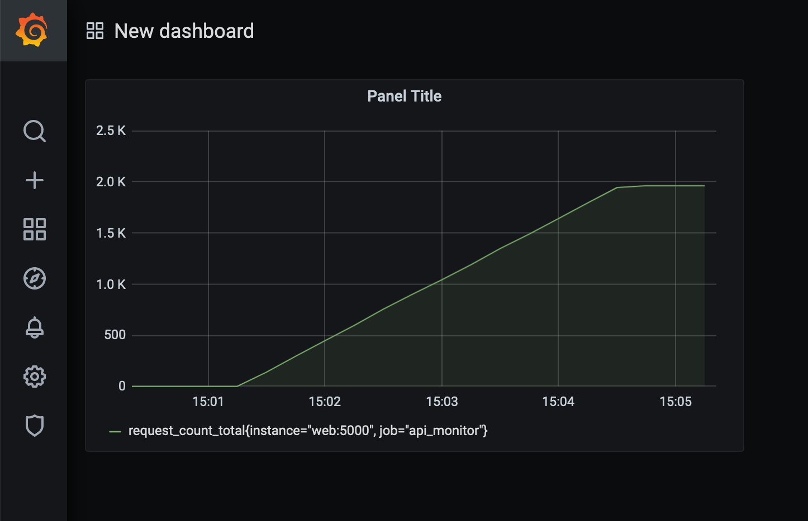
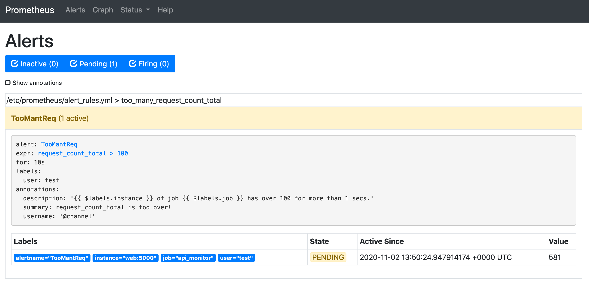
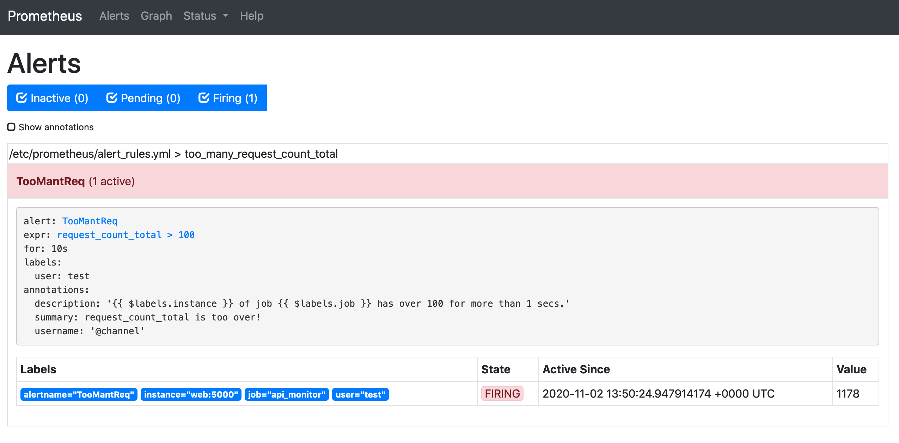
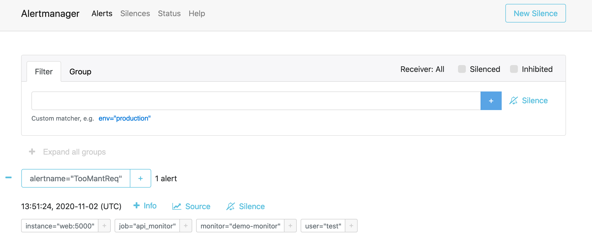
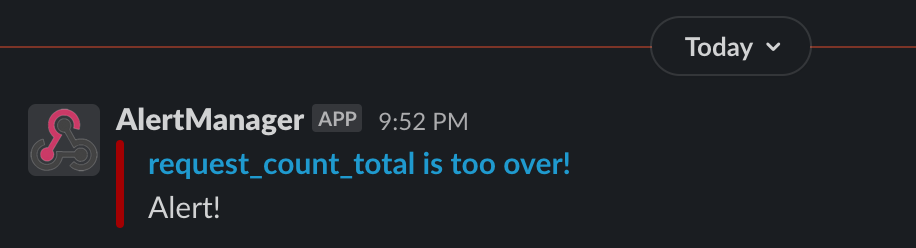

# A Monitor and Warning System with Prometheus and Grafana

Reference: https://blog.techbridge.cc/2019/08/26/how-to-use-prometheus-grafana-in-flask-app/

## Usage

```bash
$ docker-compose up
```

### Load Testing

```python3
$ locust -f locustfile.py -H http://localhost:5000
```

## Result

1. Grafana

    

2. Prometheus

    

    

3. Prometheus: AlertManager

    

4. Slack

    
