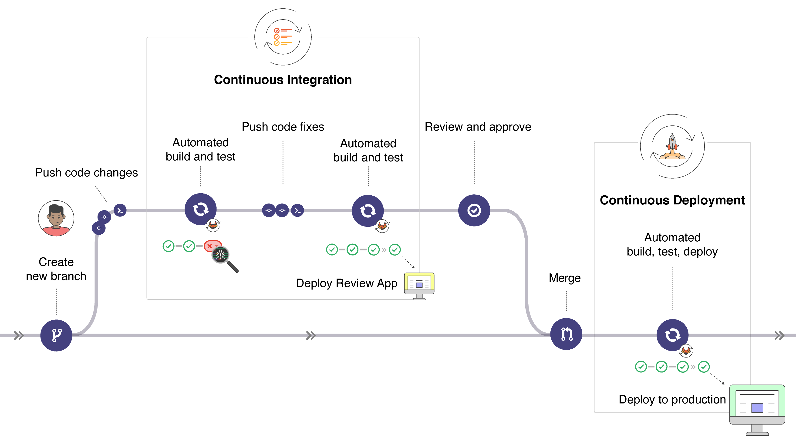
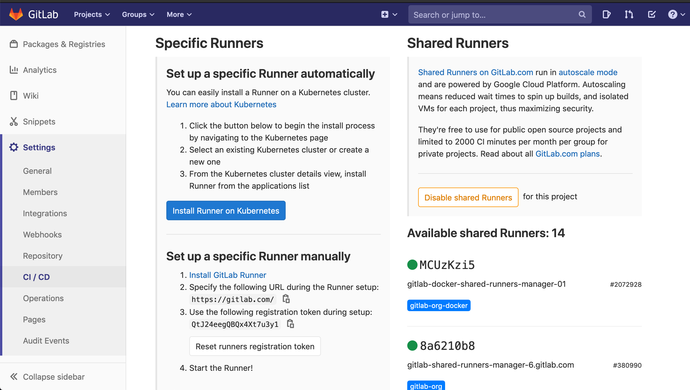
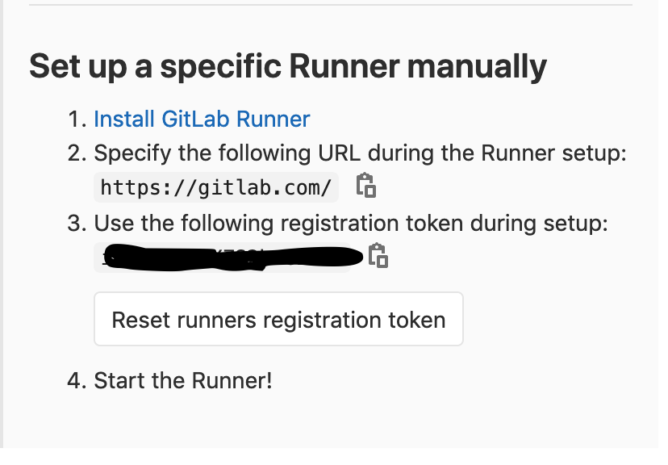
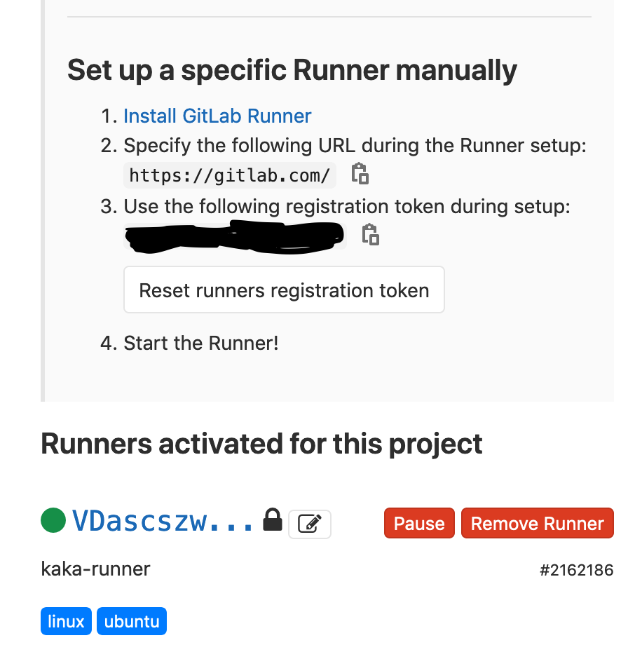
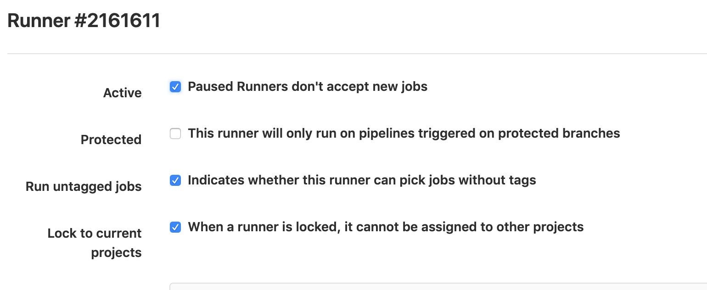
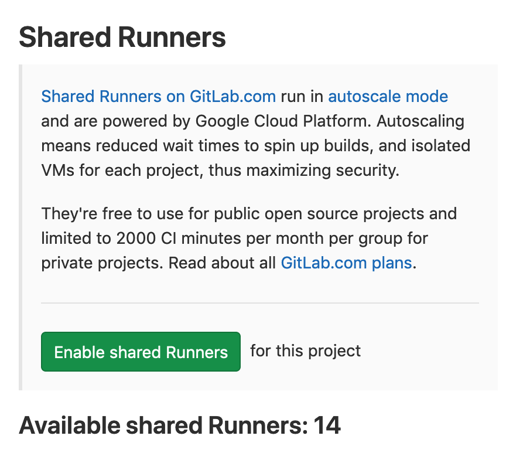
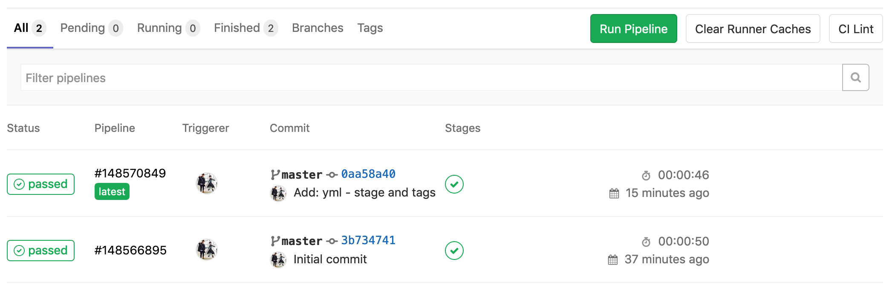
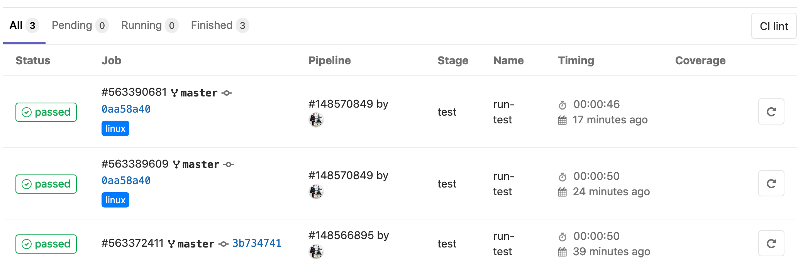
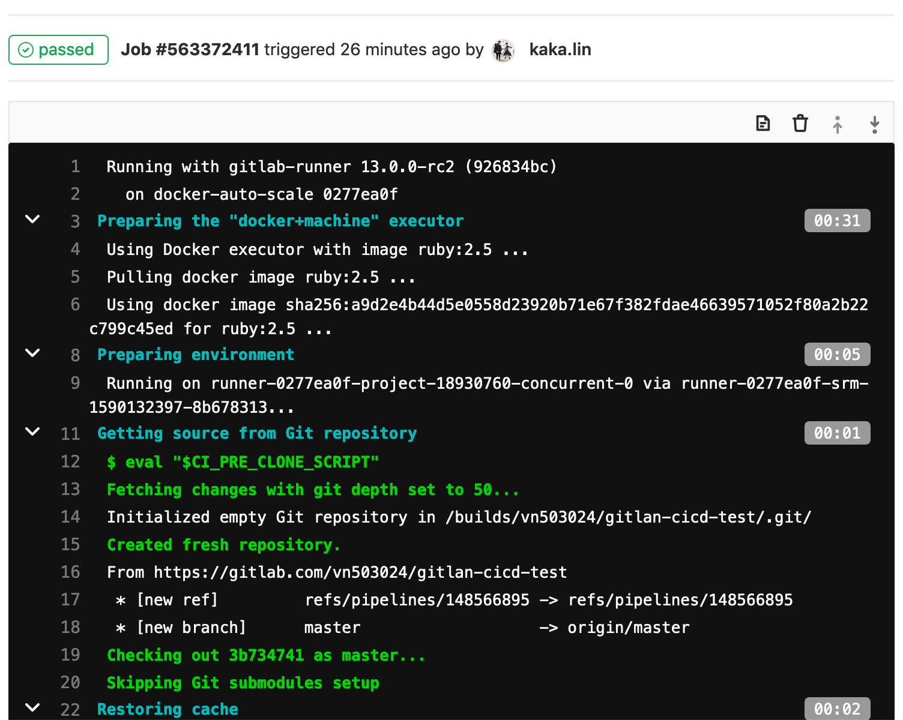
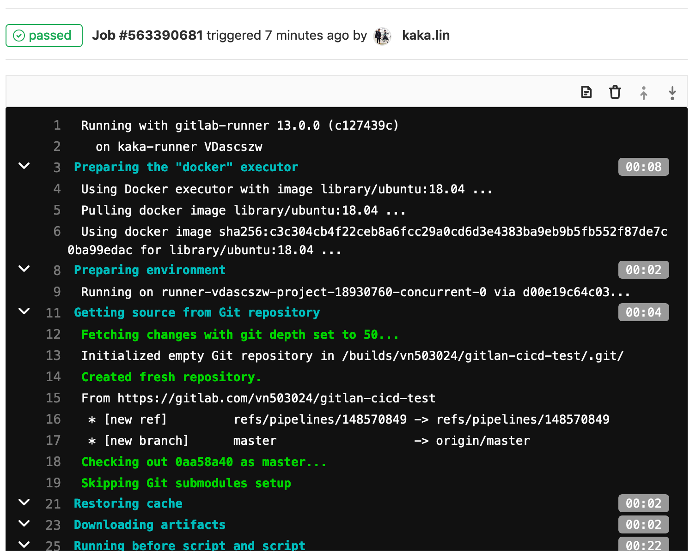

# GitLab CI/CD

- [GitLab CI/CD](#gitlab-cicd)
  - [How GitLab CI/CD works](#how-gitlab-cicd-works)
  - [Getting started with GitLab CI/CD](#getting-started-with-gitlab-cicd)
    - [1. Build a Project](#1-build-a-project)
    - [2. Configuring GitLab Runners](#2-configuring-gitlab-runners)
      - [2-1. Use Shared Runners](#2-1-use-shared-runners)
      - [2-2. Set up a Specific Runners](#2-2-set-up-a-specific-runners)
        - [Exmaple with Docker](#exmaple-with-docker)
      - [2-3. Introduction to Shared, Specific and Group Runners [Optional]](#2-3-introduction-to-shared-specific-and-group-runners-optional)
    - [3. Creating a `.gitlab-ci.yml` file](#3-creating-a-gitlab-ciyml-file)
    - [4. Results](#4-results)

[GitLab CI/CD](https://docs.gitlab.com/ee/ci/README.html) is a powerful tool built into GitLab that allows you to apply all the continuous methods to your software with no third-party application or integration needed.

- Continuous Integration (CI): 持續整合
- Continuous Delivery (CD): 持續交付
- Continuous Deployment (CD): 持續發佈

## How GitLab CI/CD works

GitLab offers a continuous integration service. For each commit or push to trigger your CI pipeline, you must:

- Add a [.gitlab-ci.yml](https://docs.gitlab.com/ee/ci/quick_start/README.html#creating-a-gitlab-ciyml-file) file to your repository's root directory.
- Ensure your project is configured to use a [Runner](https://docs.gitlab.com/runner/).

The `.gitlab-ci.yml` file tells the `GitLab Runner` what to do. For example:

- build stage
- test stage
- deploy stage



## Getting started with GitLab CI/CD

Requirement:

- A working GitLab instance of version 8.0+ or are using [GitLab.com](https://about.gitlab.com/)

### 1. Build a Project

Create a project in GitLab. See the [Example](https://gitlab.com/vn503024/gitlab-cicd-test).

### 2. [Configuring GitLab Runners](https://docs.gitlab.com/ee/ci/runners/README.html)

In GitLab CI/CD, `Runners` run the jobs that you defined in `.gitlab-ci.yml`.

A Runner can be a virtual machine, a VPS, a bare-metal machine, a docker container or even a cluster of containera.

    GitLab and the Runners communicate through an API, so the only requirement is that the Runner's machine has network access to the GitLab server.

There are three types of Runners::

  - [Shared Runners](#shared-runners)
  - [Specific Runners](#specific-runners)
  - [Group Runners](#group-runners)

```
如果只是用來做一般測試，且沒有多餘的機器來當Runner，可以使用GitLab所提供的Shared Runner就好。

但當工作流程需要一些特別的驗證，或是可能需要運行某些套件或library或模組時，建議使用Specific Runners.
    
如果使用Shared Runner，每次在測試前都需要花時間配置所需的套件。
```

#### 2-1. Use Shared Runners

If you use [GitLab.com](https://about.gitlab.com/) you can use the `Shared Runners` provided by GitLab Inc.

  - These are special virtual machines that run on GitLab's infrastructure and can be build any project. 

To enable the `Shared Runners` you have to go to your projects; `Setting -> CI/CD` and click `Enable shared Runners`, as below:



```
Shared Runners are enable by default as of GitLab 8.2, but can be disabled with the Disable shared Runners button which is present under each project's Setting -> CI/CD page.
```

[Read more on Shared Runners](#shared-runners)

#### 2-2. Set up a Specific Runners

If you want to set a `specific Runners`, you need to follow two steps: 

1. [Install GitLab Runner](https://docs.gitlab.com/runner/install/)
    
    `GitLab Runner` can be installed and used on `GNU/Linux, macOS, FreeBSD and Windows`. There are three ways to install it, as below:

      - Repository for rpm/deb packages
      - Binaries for CNU/Linux, maxOS, Windows, FreeBSD
      - Docker or Kubernetes

    ```
    Ideally, the GitLab Runner should not be installed on the same machine as GitLab.
    ```

2. [Configure it](https://docs.gitlab.com/ee/ci/runners/README.html).

##### Exmaple with Docker

1. Install `GitLab Runner Docker image`.

    ```bash
    # docker pull
    $ docker pull gitlab/gitlab-runner:latest

    # docker run on macOS
    $ docker run -d --name gitlab-runner --restart always \
        -v /var/run/docker.sock:/var/run/docker.sock \
        -v /Users/Shared/gitlab-runner/config:/etc/gitlab-runner \
        gitlab/gitlab-runner:latest
    ```

2. [Registering Runners](https://docs.gitlab.com/runner/register/)

    Registering a Runner is the process that binds the Runner with a GitLab instance.

    ```bash
    $ docker run --rm -t -i -v /Users/Shared/gitlab-runner/config:/etc/gitlab-runner gitlab/gitlab-runner register
    ```

   * You need to your repo's URL and token, like:

        

    If registering runner succeeded, you will see the status like:

    

    * Note 1:

        You need to tick the `Run untagged jobs` checkbox for fix the issue of `
        "Job is stuck in the pending state even a runner has been enabled for the project"`.

        
    
    * Note 2:

        Disable shared Runners

        

---

#### 2-3. Introduction to Shared, Specific and Group Runners [Optional]

A Runner can be specific to a certain project or server any project in GitLab CI/CD.

<span id="shared-runners"></span>
- `Shared Runners`:

    Shared Runners are useful for `jobs that have similar requirements, between multiple projects`. 

    - Rather than having multiple Runners idling for many projects, you can have a single or a small number of Runners that handle multiple projects. This makes it easier to maintain and update them.

    - Shared Runners process jobs using a [fair usage queue](https://docs.gitlab.com/ee/ci/runners/README.html#how-shared-runners-pick-jobs). In contrast to specific Runners that use a [FIFO](https://en.wikipedia.org/wiki/FIFO_(computing_and_electronics)) queue, this prevents cases where projects create hundreds of jobs which can lead to eating all available shared Runners resources.

    ```
    A Runner that serves all projects is called a Shared Runner.
    ```

<span id="specific-runners"></span>
- `Specific Runners`:

    Specific Runners are useful for `jobs that have special requirements` or for `projects with a specific demand`. 

    - If a job has certain requirements, you can set up the specific Runner with this in mind, while not having to do this for all Runners.

        ```
        For example, if you want to deploy a certain project, you can set up a specific Runner to have the right credentials for this.
        ```
      - The [usage of tags](https://docs.gitlab.com/ee/ci/runners/README.html#using-tags) may be useful in this case. 
  
    - Specific Runners process jobs using a [FIFO](https://en.wikipedia.org/wiki/FIFO_(computing_and_electronics)) queue.

<span id="group-runners"></span>
- `Group Runners`:

    Group Runners are useful when `you have multiple projects under one group and would like all projects to have access to a set of Runners`. 
    
    - Group Runners process jobs using a [FIFO](https://en.wikipedia.org/wiki/FIFO_(computing_and_electronics)) queue.

### 3. Creating a `.gitlab-ci.yml` file

Creating a file named `.gitlab-ci.yml` in the root directory of your repository, like:

```yaml
before_script:
    - apt-get install python

run-test:
    script:
        - python --version
```

### 4. Results

- `Pipelines`

    

- `Pipelines -> Jobs`

    

- `Log of that job`
  - 1. Shared Runners

        

  - 2. Specific Runners

        


