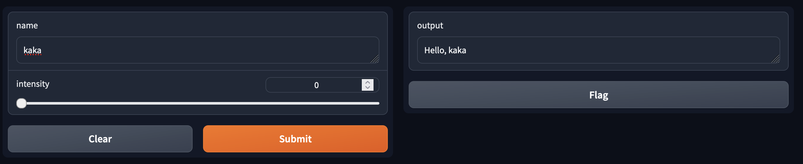

# Building With Blocks: Examples

Just like with `gr.Interface`, you can also add examples for your functions when you are working with `gr.Blocks`.

The constructor of `gr.Examples` takes two required arguments:

- `examples`: a nested list of examples, in which the outer list consists of examples and each inner list consists of an input corresponding to each input component
- `inputs`: the component or list of components that should be populated when the examples are clicked

## Demo

