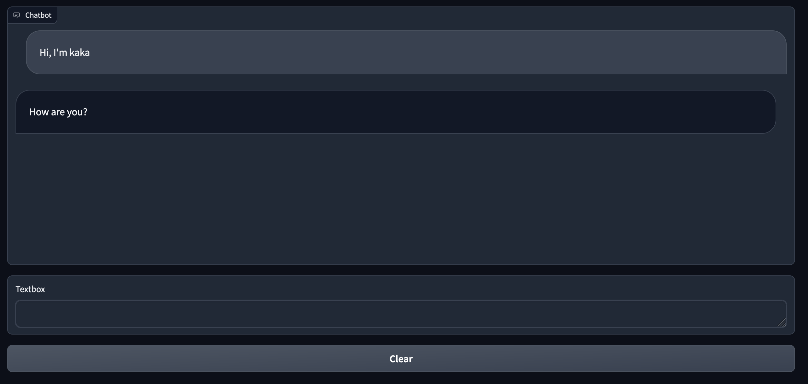

# Building With Blocks: Running Events Consecutively

You can also run events consecutively by using the then method of an event listener. This will run an event after the previous event has finished running. This is useful for running events that update components in multiple steps.

## Demo

