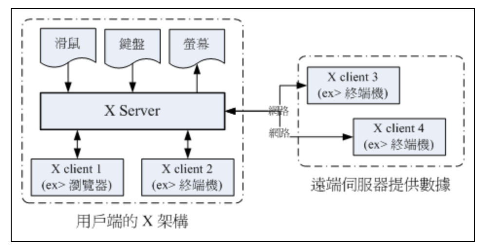

# X Window System

X是一個透過網路進行圖形介面的存取的通訊協定，當前版本為第11版，俗稱`X11`。X協定由`服務端(X Server)`和`客戶端(X Client)`組成，如下：
- `X Server`: 負責圖形顯示，以及將輸入設定（如鍵盤、滑鼠）的動作告知 X Client。
- `X Client`: 根據系統設置的`DISPLAY`環境變數，將圖形顯示請求發送給相應的X Server。

## Reference

- [鳥哥: X Window 設定介紹](https://linux.vbird.org/linux_basic/centos7/0590xwindow.php)
- [平凡備忘錄: x-window](http://blog.gitdns.org/2016/07/12/x-window/)

