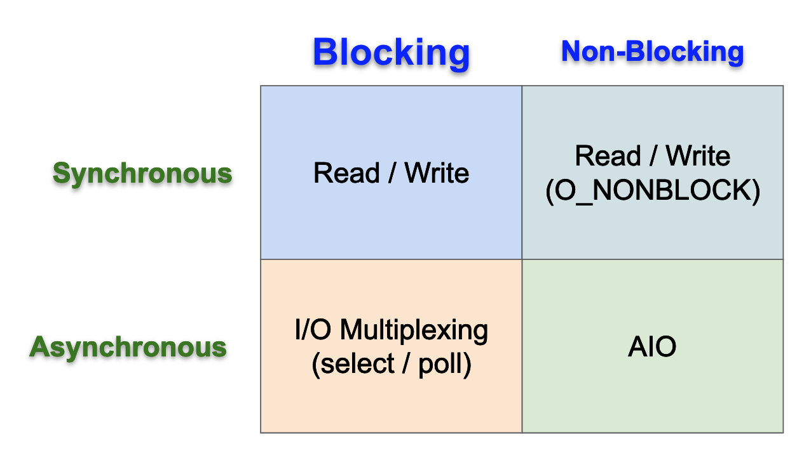
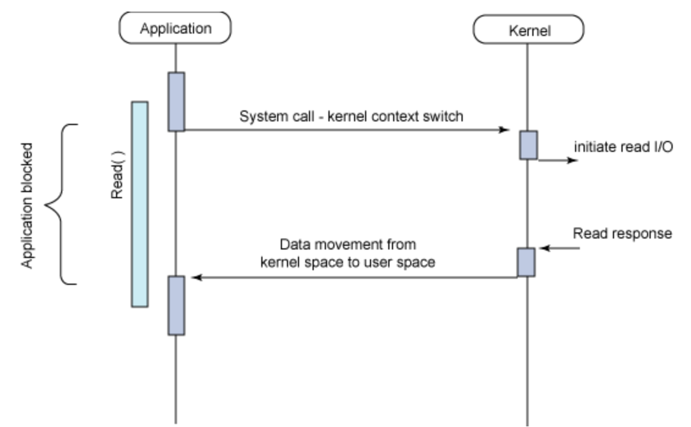
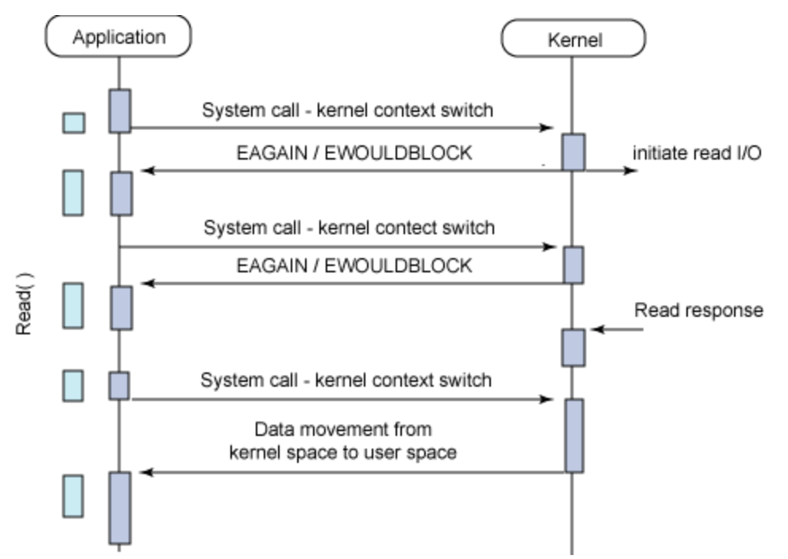
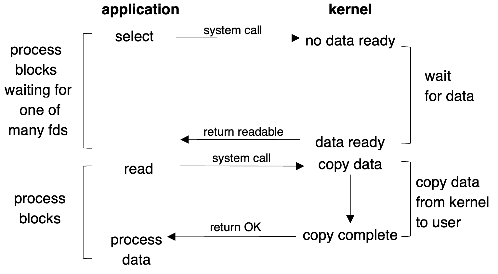
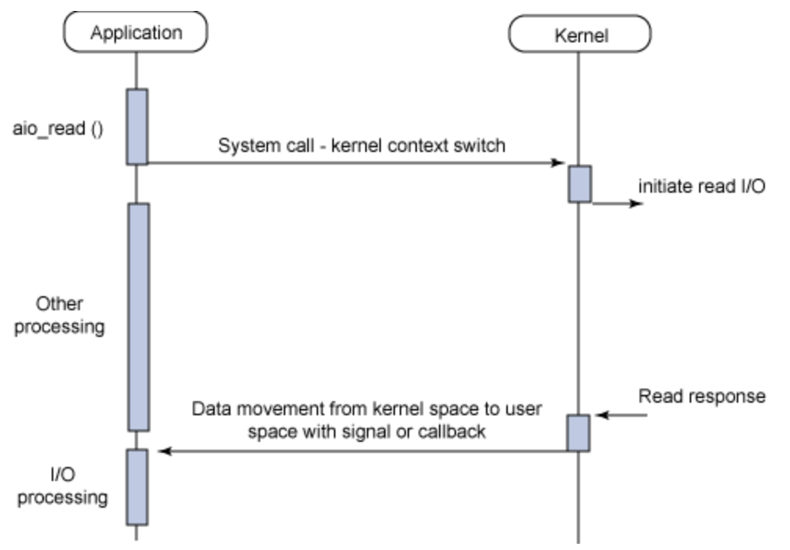

# I/O Models: 同步、非同步、阻塞、非阻塞

在開發I/O相關程式時常常會遇到以下這四種名詞:

- 同步(Synchronous)
- 非同步(Asynchronous)
- 阻塞(Blocking)
- 非阻塞(Non-blocling)

由於常常會將其搞混，於是參考了經典著作[UNIX Network Programming](https://en.wikipedia.org/wiki/UNIX_Network_Programming)與網路上相關文章，整理成以下筆記，以方便自己日後複習。

## 名詞解釋

### 阻塞(Blocking)與非阻塞(Non-blocking)

阻塞與非阻塞關注的是`同一個執行緒發出請求(呼叫)時`在`等待結果時的狀態`。

- 阻塞: 調用方當發出請求後，在獲得結果之前，`調用方會懸(Hang)住不動`，無法回應，直到獲得結果。

- 非阻塞: 調用方當發出請求後，`調用方不會因為等待結果，而懸住不動(Hang住)`。但後續通常`透過輪詢(Polling)機制取得結果`。

### 同步(Synchronous)與非同步(Asynchronous)

同步與非同步關注的是`執行緒之間的通訊模式`。例如:使用者執行緒與Kernel之間的通訊模式。

- 同步: 使用者執行緒發出 I/O 請求後，`要等待結果返回`。

    其中等待結果返回，有兩種方法:

    1. `等待 Kernel 回覆`: `Blocking I/O`
    2. 主動去問，`輪詢(Pooling)`: `Non-blocking I/O`

    ```
    執行緒發出請求後，需要等待或是主動詢問結果 -> 同步
    ```

- 非同步: 或稱`異步`。使用者執行緒發出 I/O 請求後，`不需要等待直接返回，所以沒有返回結果`。當Kernel I/O有結果後，`會通知使用者執行緒`或者呼叫`callback函數`。

    ```
    執行緒發出請求後，就不用管了，另一個執行緒自己會處理，等待處理好之後會通知使用者執行緒 -> 非同步
    ```

### 範例

當你要訂某家很夯的餐廳時，

- 阻塞:

    ```
    在服務生沒跟你說結果時，你會暫停所有動作(懸住不動)，直到服務生你說有沒有訂位成功。
    ```

- 非阻塞:
  
    ```
    不管服務生有沒有跟你說，你自己先去做其他事情了，但你會可能半小時check一下結果。
    ```

- 同步:

    ```
    服務生跟你說，稍等一下，"我查一下"，等查好了告訴你結果(返回結果)
    ```

- 非同步:

    ```
    服務生跟你說，"我查好再打電話給你"，然後就掛電話了(直接返回，但沒有結果)。然後查好之後，他就主動打電話通知你(這邊服務生是透過"回電"這種callback方式來處理)。
    ```

## I/O Models

下圖是 I/O Models的四個象限，我們用Linux上的相關API來介紹。


圖出處: [Study Notes - I/O Models](https://rickhw.github.io/2019/02/27/ComputerScience/IO-Models/)

從上圖我們可以得出四種 I/O model:

1. `Blocking I/O (BIO)`: Synchronous / Blocking
2. `Non-Blocking I/O (NIO)`: Synchronous / Non-Blocking
3. `I/O Multiplexing`: Asynchronous / Blocking
4. `Asynchronous I/O (AIO)`: Asynchronous / Non-Blocking


對於一個 Network I/O 而言，基本上會涉及到兩個系統層面的對象：

1. 呼叫此I/O的Process/Thread
2. 系統Kernel

以`read()`為例：

1. 等待資料準備好(Waiting for the data to be ready.)
2. 把資料從Kernel copy到Process/thread中(Copying the data from the kernel to the process.)

### 1. Blocking I/O (BIO)

```
同步(Synchronous)/阻塞(Blocking)
```

如下圖所示，`Blocking I/O`在呼叫`read()`後，首先使用者執行緒自己被hang住，直到Kernel返回值之後才能繼續下一個動作。



#### Blocking I/O 特性:

- 應用程序不會詢問資料是否準備好了，直到返回結果給應用程式。

### 2. Non-Blocking I/O (NIO)

```
同步(Synchronous)/非阻塞(Non-Blocking)
```

如下圖所示，`Blocking I/O`在呼叫`read()`後，會立即返回`EAGIN` or `EWOULDBLOCK`，就不用卡在那邊等待。

站在使用者執行緒角度來看，當發現回傳的值是error時就知道資料還沒準備好，當kernel準備好資料，且又再次收到使用者call `read()`時，kernel就可以把資料copy到user process中，然後回傳結果。

所以其實`NIO`就是不斷的去問kernel說資料好了沒，基本上就是用一個loop一直去call read()，這其實就是`輪詢(polling)`。

`NIO`其實`效率很差，很浪費CPU Time`，但還算是蠻常見的。



#### Non-Blocking I/O 特性:

- 應用程序會不斷的詢問資料是否準備好了。

### 3. I/O Multiplexing (多工 or 多路複用)

```
非同步(Asynchronous)/阻塞(Blocking)
```

所謂的`I/O Multiplexing`，其實就是`select/poll/epoll`，有些地方也稱這種I/O方式為`event drive I/O`。

如下圖所示，以select為例，當程式呼叫了select時，整個process就會被block，同時kernel會去"監視"所有由select負責的[檔案描述符](https://zh.wikipedia.org/wiki/%E6%96%87%E4%BB%B6%E6%8F%8F%E8%BF%B0%E7%AC%A6)(ex: socket)，一但有任一`檔案描述符`準備好了，select就會立刻return。此時在呼叫read將資料copy至application buffer中。



#### I/O Multiplexing vs Blocking I/O

看起來 I/O Multiplexing 好像和 Blocking I/O 沒有太大不同，但事實上還是有差:

1. `I/O Multiplexing`使用了`兩次system call` (select/read)，而`Blocking I/O只需要一次system call` (read)。

2. `I/O Multiplexing可同時處理多個connection`，但`Blocking I/O一次只能處理一個`。


如果I/O Multiplexing要處理的數量沒有很多的話，效能不一定比Blocking I/O的Multi-Thread好，甚至有可能有比較高的`latency`。

#### I/O Multiplexing的優勢

```
不是對單個連接處理會更快，而是可以在只使用單個process/thread的情況下，監視/處理更多的connection。
```

### 4. Asynchronous I/O

```
非同步(Asynchronous)/非阻塞(Non-Blocking)
```

如下圖所示:

1. 應用程式告訴Kernel做一個操作(Operation)，不等Kernel回覆，程序繼續執行(這樣就不會讓user process產生block)。
2. Kernel完成整個操作(包含取得資料、複製到Buffer)之後，會向user process發送一個訊號，通知說這個讀取操作已完成，且這個訊號是由`aio_read`指定的(deliver signal specified in aio_read)。



## 生活中的I/O Model

以剛剛的訂某家很夯的餐廳為例，當你打去訂位時，
`Blocking代表你的狀態`，`Sync代表服務生的處理方式`。

- `Blocking I/O (BIO)`:
    - Blocking: 你只能在電話那頭等待
    - Synchronous: 服務生查完之後，跟你說有沒有訂位成功

- `Non-Blocking I/O (NIO)`:
    - Non-Blocking: 你可以繼續做其他事情，如跟朋友聊天
    - Synchronous: 但服務生不會主動通知你，你要主動去問有沒有訂位成功
  
- `I/O Multiplexing`:
    - Blocking: 你不能做其他事情，只能等待
    - Asynchronous: 服務生查完會主動打電話通知你

- `Asynchronous I/O (AIO)`:
    - Non-Blocking: 你打完電話就繼續做其他事情
    - Asynchronous: 服務生查完會主動打電話通知你

## 程式範例

待更新～
