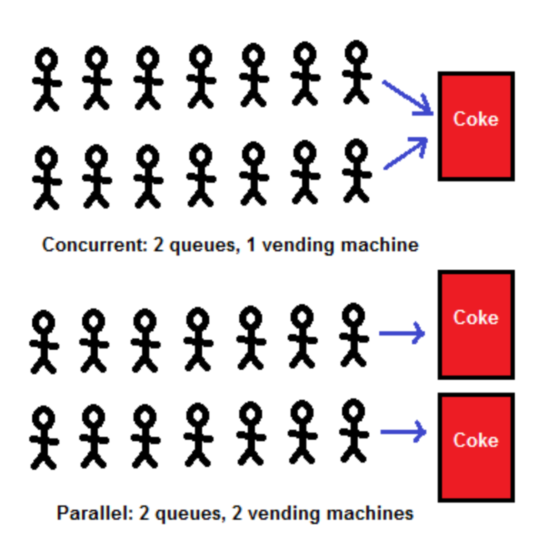
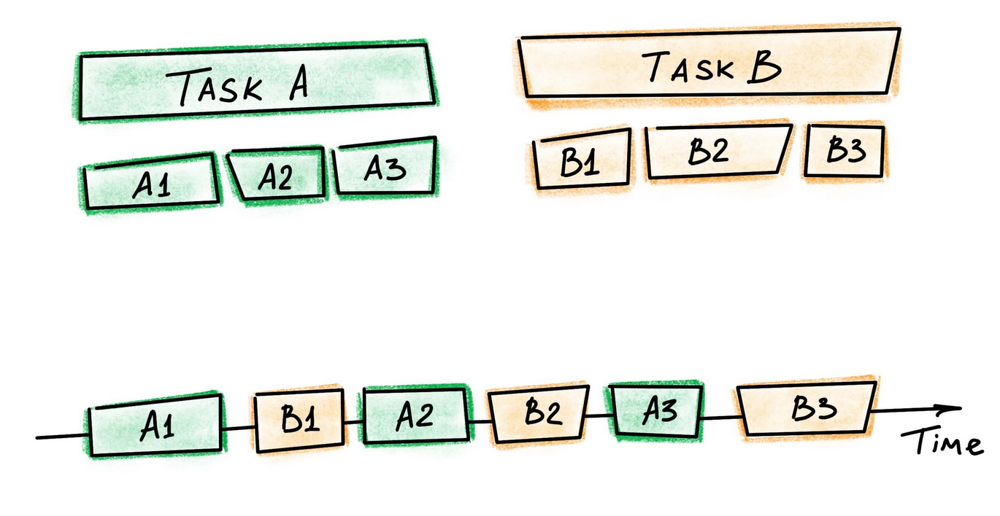
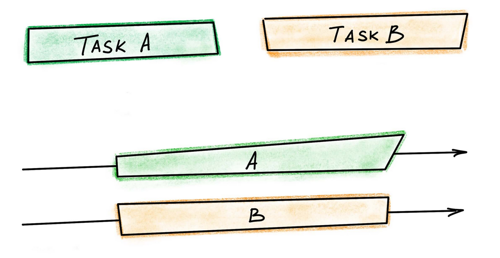
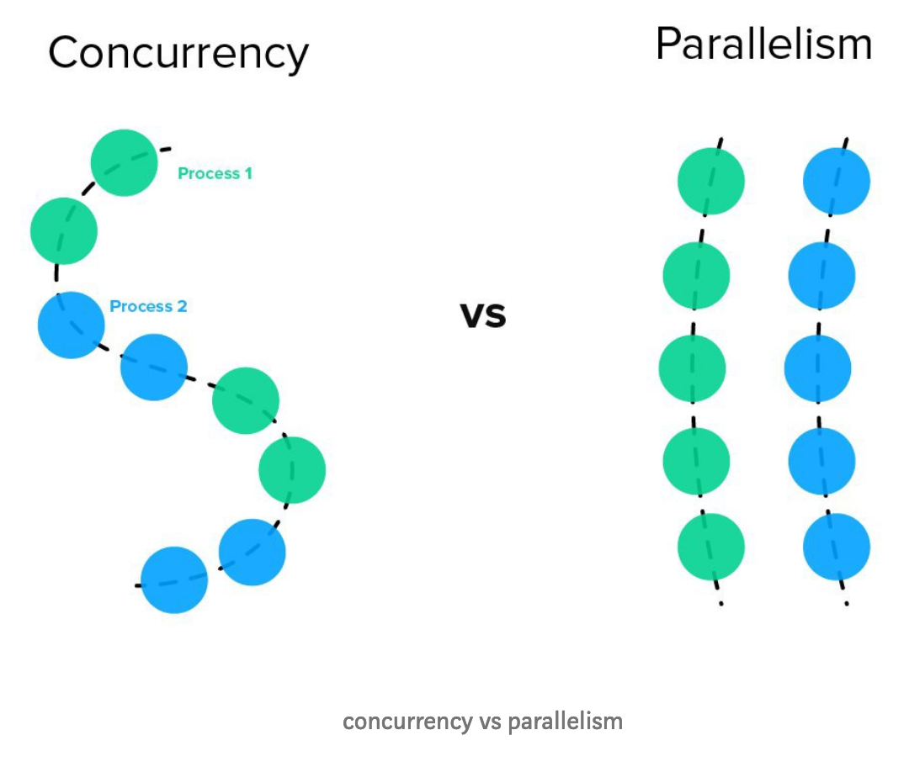

# Concurrency(並行) 與 Parallelism(平行)

## 前言

最近在研究`Asynchronous Model`，[上一篇](../IO_Models/io_models.md)介紹了`同步、非同步、Blocking、Non-Blocking`的觀念及`Linux的I/O Model`，本篇則要來介紹`Concurrency`與`Parallelism`，那就讓我們開始吧。

## Concurrency is not Parallelism

```
"Concurrency is about dealing with lots of things at once. Parallelism is about doing lots of things at once". - Rob Pike
```

上面這段話是`Rob Pike`(Golang的開發者之一)在2012年的一個talk時提出來的，他的標題就是[Concurrency is not Parallelism](https://www.youtube.com/watch?v=cN_DpYBzKso) ([Slide](https://talks.golang.org/2012/waza.slide#1))。

- Concurrency(並行):

    ```
    在同一時間能完成很多事情
    ```

    以做菜為例，就算只有一個廚師，他還是可以在同時間完成
    切菜，準備醬料，主菜等等工作，他會在中間切換來切換去，而不會等到一盤菜好了，再去準備下一排菜。

- Parallelism(平行):

    ```
    同時間有很多Worker做差不多的事情
    ```

    有兩個廚師分別做自己負責的菜。

如下圖所示:


圖出處: [Concurrency vs Parallelism](https://medium.com/@deepshig/concurrency-vs-parallelism-4a99abe9efb8)

### 更多例子

假設現在有兩個任務，

- Concurrency: 一個CPU中兩個任務交互執行

    
    圖出處: [[Python] General concepts: concurrency, parallelism, threads and processes](https://blog.taiker.space/linus-general-concepts-concurrency-parallelism-threads-and-processes/)

- Parallelism: 有兩個CPU，兩個任務個分配到其中之一同時執行

    
    圖出處: [[Python] General concepts: concurrency, parallelism, threads and processes](https://blog.taiker.space/linus-general-concepts-concurrency-parallelism-threads-and-processes/)


Concurrency vs Parallelism


圖出處: [Concurrency is not Parallelism](https://medium.com/@k.wahome/concurrency-is-not-parallelism-a5451d1cde8d)

## Reference

1. [淺談Asynchronous Programming](https://kkc.github.io/2017/09/01/asynchronous-programming/)
2. [Concurrency is not Parallelism](https://medium.com/@k.wahome/concurrency-is-not-parallelism-a5451d1cde8d)
3. [[Python] General concepts: concurrency, parallelism, threads and processes](https://blog.taiker.space/linus-general-concepts-concurrency-parallelism-threads-and-processes/)
4. [Concurrency vs Parallelism](https://medium.com/@deepshig/concurrency-vs-parallelism-4a99abe9efb8)
