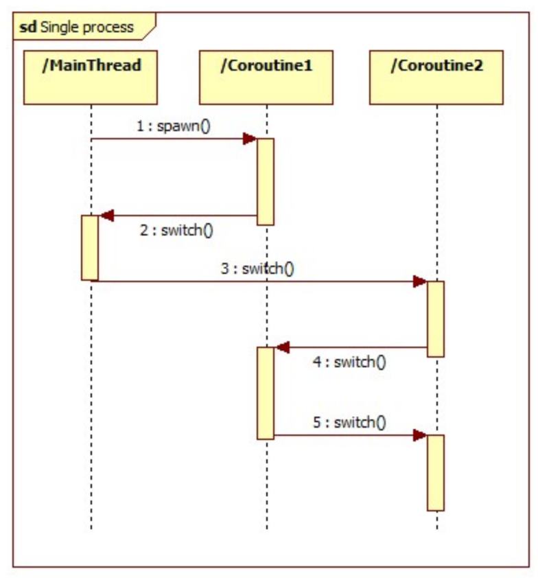

# Coroutine (協程)

先來看一下Wiki上關於Coroutine的解釋:

```
Coroutines are computer program components that generalize subroutines for non-preemptive multitasking (協同運作多工), by allowing execution to be suspended and resumed.
```

簡單來說，Coroutine就是一個可以`暫時中斷(suspend)`之後`再繼續執性(resumed)`的程序，並且可以多次的進行這樣的切換。如下圖所示


圖出處: [淺談coroutine與gevent](http://blog.ez2learn.com/2010/07/17/talk-about-coroutine-and-gevent/)

## Coroutine 與 Process/Thread

說到這可能會有人問，他與Process/Thread差在哪？

1. 搶佔式多工(Preemptive multitasking )/協同式多工(Non-preemptive multitasking)

   - `Thread: 搶佔式多工`

        ```
        程式會"定期"放棄已佔有的執行資源，讓其他程式可以執行。
        ```

   - `Coroutine: 協同式多工`

        ```
        程式有各自的優先權，作業系統會去排成。
        ```

2. 上下文切換(Context switch)

   - `Process/Thread`: 
        是透過`OS/thread library來排程(Scheduling)`決定是否進行上下文切換

   -  `Coroutine`: 由應用程式來做排程

    ```
    Process/Thread: 執行結果不可預期
    Coroutine:      執行結果可預期
    ```

3. Coroutine is Micro-Thread/Light-weight Thread
   
   Coroutine其實就是在單一Thread裡不同的Coroutine之間互相切換，本質上和Thread很像，所以也有些Coroutine叫做`微執行緒(Micro-Thread)`或是`輕量化的執行緒(Light-weight Thread)`。

4. 切換成本
   
   Coroutine之間切換的成本比Thread低。因為Coroutine的切換是由現在正在執行的Coroutine`主動`讓出執行權的(藉此可以達到`並行(concurrency)`運做)。 

5. Call Stack
   
   跟Process/Thread一樣，每個`coroutine也有自己的call stack`，由應用程式決定何時suspend/resumed。
   
6. Race Conditions
   
   跟Process/Thread一樣，Coroutine也會有`Race Conditions`的問題。
   
7. `Process/Thread`適合`CPU bound`的程式，`Coroutine`適合`I/O bound`的程式。

## Coroutine 常見用例

- [狀態機(State machines)](https://en.wikipedia.org/wiki/Finite-state_machine)
- [生成器(Generators)](https://en.wikipedia.org/wiki/Generator_(computer_programming))
- [Communicating sequential processes](https://en.wikipedia.org/wiki/Communicating_sequential_processes)
- [Actor model of concurrency](https://en.wikipedia.org/wiki/Actor_model)

## Coroutine 與 Concurrency

- Concurrency (並行):
    
    同一時間能完成很多事情

- Coroutine (協程):
    
    可以中斷及繼續執行的程序，會主動讓執行權。

藉由Coroutine的suspend/resumed特性，我們可以達到邏輯上的並行(Concurrency)。

```
於是我們可以用Coroutine實現出Concurrency程式。
```

### Concurrency的實現方法

除了用Coroutine實現Concurrency以外，我們也可以用以下方法來實現:

1. Multi-threading
2. Multi-processing

## Reference

1. [Wiki: Coroutine](https://en.wikipedia.org/wiki/Coroutine)
2. [concurrency and coroutine 的目前了解](https://blogger.godfat.org/2011/12/concurrency-and-coroutine.html)
3. [淺談coroutine與gevent](http://blog.ez2learn.com/2010/07/17/talk-about-coroutine-and-gevent/)
4. [Coroutine: 入門篇 ](https://electronic.blue/blog/2012/06/11-coroutine-an-introduction/)
5. [Kotlin Coroutines: 入門概念 Coroutine vs Thread](https://medium.com/gogolook-tech/kotlin-coroutines-%E5%85%A5%E9%96%80%E6%A6%82%E5%BF%B5-coroutine-vs-thread-e7d112b0d8ba)
